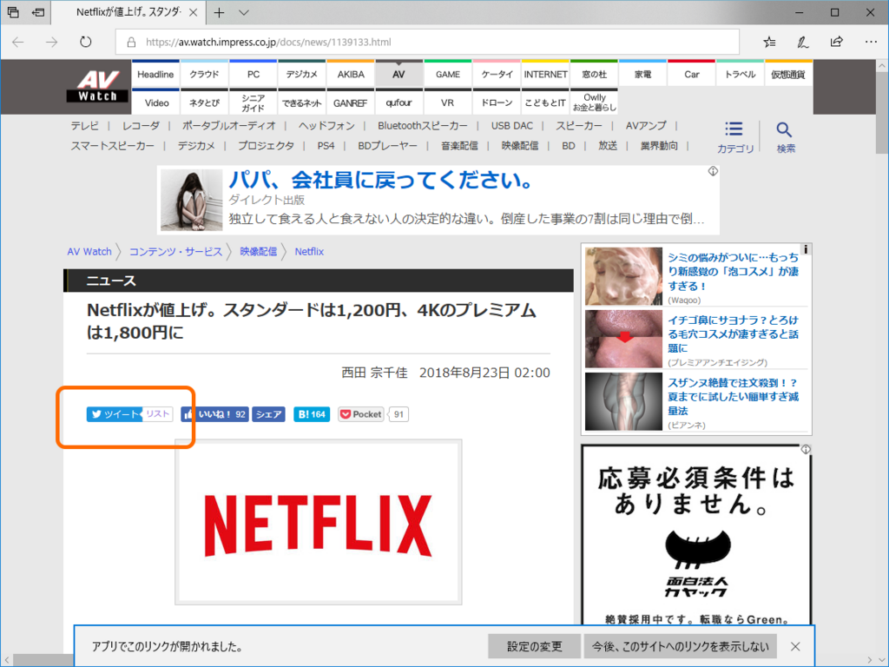
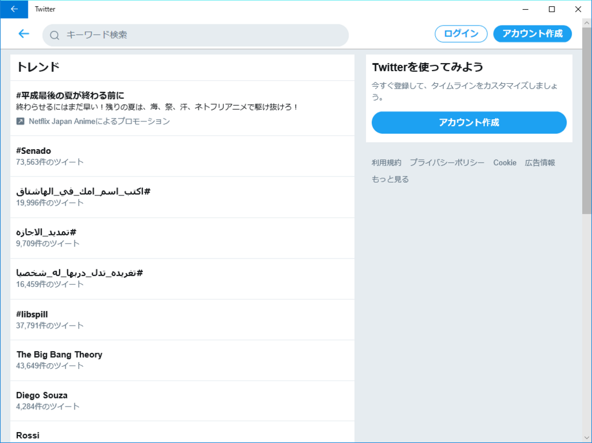
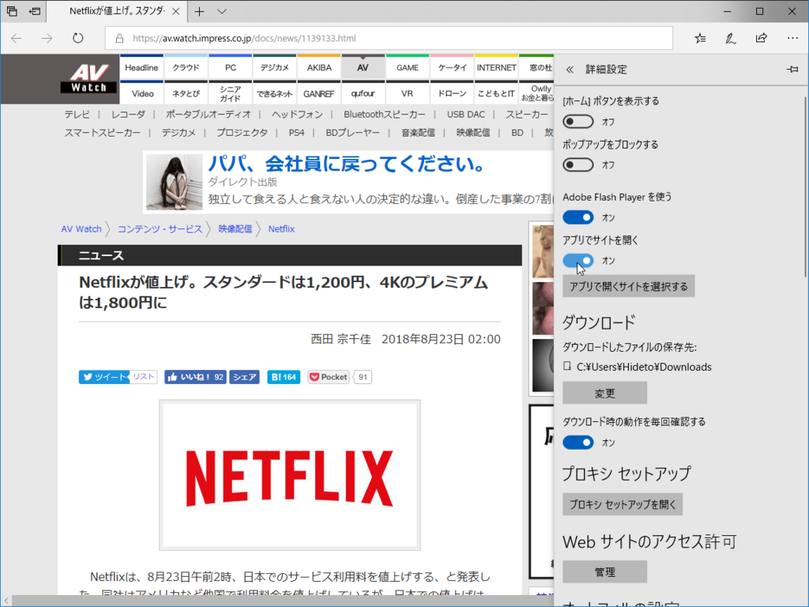

AV Watch<a href="#f-8d6846c4" name="fn-8d6846c4" title="よく誤解されるがエッチなサイトではけっしてなく、AV 機器関連のニュースサイト">*1</a>に誤植があったので Twitter アカウントにメンションしてあげようかなって思ったんだけど、報告がかぶったら相手もウザいであろうと、まず Twitter のリストをのぞいてみた。

すると、Microsoft Edge のリンクから Twitter アプリが開くではないか。

しかも、全然関係ないページが（死

そういえばこの前、PWA 版 Twitter（Twitter Lite）がアップデートされて URL のハンドリングが行えるようになったんだね。

<iframe src="https://hatenablog-parts.com/embed?url=https%3A%2F%2Fforest.watch.impress.co.jp%2Fdocs%2Fnews%2F1138885.html" title="PWA版「Twitter」で最大15MBのビデオの添付がサポート、写真の説明文も追加可能に／Windows 10版は“タスク ビュー”のタイムライン機能にも対応" class="embed-card embed-webcard" scrolling="no" frameborder="0" style="display: block; width: 100%; height: 155px; max-width: 500px; margin: 10px 0px;"></iframe><cite class="hatena-citation"><a href="https://forest.watch.impress.co.jp/docs/news/1138885.html">forest.watch.impress.co.jp</a></cite>

でも、残念ながらこの機能はオフだ。ちゃんと動かないんだから仕方ない。Edge の画面下部に出てくるバーで［設定の変更］ボタンをクリックし、［設定］パネルで機能を無効化する。ちなみにこのあまりイケていない［設定］パネルは、次期バージョン Windows 10 RS5<a href="#f-795a8962" name="fn-795a8962" title="最近“バージョン 1809”になることが明らかになった">*2</a>で多少マシになる予定だ。

ちなみに、URL ハンドリング関連の設定は「設定」アプリの［アプリ］ー［Web サイト用のアプリ］セクションにまとめられている。本来は有用なはずなので活用されてほしいのだけど……Progressive Web Apps のちょっといい機能ってヤツじゃん？

関係ないけど、一番上の share.microsoft.com ってなんだろ。何かに使えそうな予感する。

<h3>今回の教訓</h3>

新しい便利機能も不具合があったら即無効化されてしまう（ヒトのこと言えないけど

<h3>追記（2018/08/23 23:30）</h3>

<blockquote class="twitter-tweet">
URL ハンドリングもうやめて <a href="https://t.co/CMTAiiE9Iu">pic.twitter.com/CMTAiiE9Iu</a>
&mdash; だるやなぎ准将 (@daruyanagi) <a href="https://twitter.com/daruyanagi/status/1032631559050813441?ref_src=twsrc%5Etfw">August 23, 2018</a></blockquote>  

ログインしてないとダメみたい。いろいろテスト不足だな。

<a href="#fn-8d6846c4" name="f-8d6846c4" class="footnote-number">*1</a>:よく誤解されるがエッチなサイトではけっしてなく、AV 機器関連のニュースサイト

<a href="#fn-795a8962" name="f-795a8962" class="footnote-number">*2</a>:最近“バージョン 1809”になることが明らかになった

