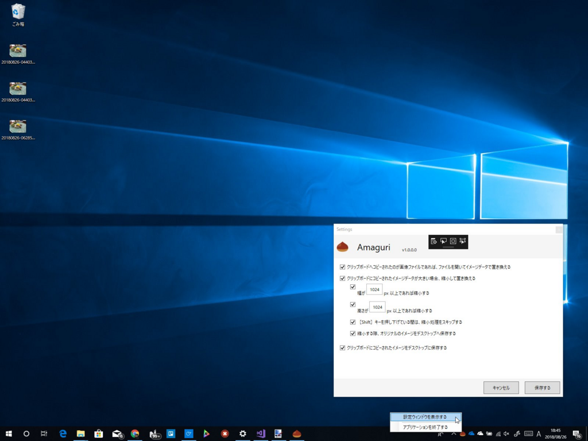

はてなブログ<a href="#f-6aee8d1c" name="fn-6aee8d1c" title="フォトライフ？">*1</a>ってクリップボードから張り付けて画像をアップロードできるけど、ファイルサイズに制限があるじゃないですか<a href="#f-f12fe5a9" name="fn-f12fe5a9" title="エラーメッセージをちゃんと出してくれないから気づかないけど">*2</a>。いちいち縮小するのが面倒だったので、クリップボードに格納された画像のサイズが大きい場合は勝手に縮小するアプリを作りました。縮小したくないときは［Shift］キーを押すと、一時的に機能を止めることができます。

あと、ついでなのでデスクトップへ保存する機能も付けました。たとえば［PrintScreen］キーを押すとスクリーンショットが自動でデスクトップに保存されます。そう、Mac みたいにね。デスクトップをキャプチャーするとき、あの機能って邪魔だと思うんだけど、確かに便利なことも多いので……もちろん、設定画面で無効化できます。

<iframe src="https://hatenablog-parts.com/embed?url=https%3A%2F%2Fgithub.com%2Fdaruyanagi%2FAmaguri%2Freleases%2Ftag%2Fv1.0.0.0" title="daruyanagi/Amaguri" class="embed-card embed-webcard" scrolling="no" frameborder="0" style="display: block; width: 100%; height: 155px; max-width: 500px; margin: 10px 0px;"></iframe><cite class="hatena-citation"><a href="https://github.com/daruyanagi/Amaguri/releases/tag/v1.0.0.0">github.com</a></cite>

WPF なので TransformedBitmap で縮小をしていたんですけど、Winsnap というスクショツールで取得した画像をコピーするとなぜか全体が黒くなってしまう？　調べたけどよくわからなかったので、System.Drawing.Bitmap に変換して縮小しました。一通り動くまでは一瞬だったけど、この原因調査に半日消えちゃったよ！

ちなみに、名前は「クリップボード、クリップボード、クリッ……そういえばそろそろクリの季節だなー、甘栗食べたいなー」と思ってつけました。

<a href="#fn-6aee8d1c" name="f-6aee8d1c" class="footnote-number">*1</a>:フォトライフ？

<a href="#fn-f12fe5a9" name="f-f12fe5a9" class="footnote-number">*2</a>:エラーメッセージをちゃんと出してくれないから気づかないけど

