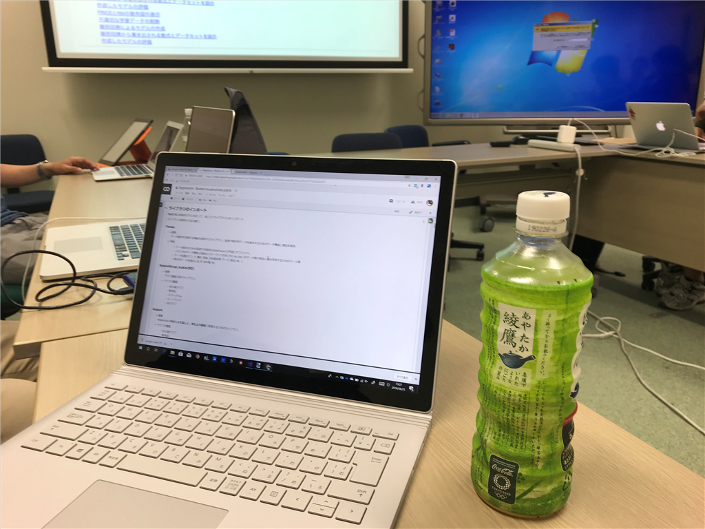
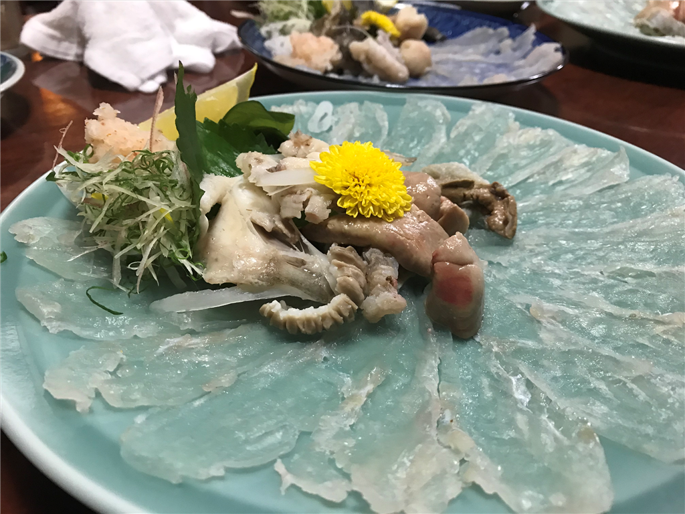

<iframe src="https://hatenablog-parts.com/embed?url=https%3A%2F%2Fconnpass.com%2Fevent%2F96396%2F" title="Google Colaboratoryで学ぶAIの基礎と正体 (2018/08/25 13:00〜)" class="embed-card embed-webcard" scrolling="no" frameborder="0" style="display: block; width: 100%; height: 155px; max-width: 500px; margin: 10px 0px;"></iframe><cite class="hatena-citation"><a href="https://connpass.com/event/96396/">connpass.com</a></cite>

前の日、少し夜更かししてしまって、その日は午前10時起床。13時開始の勉強会まで少し時間があるので、<a href="https://blog.daruyanagi.jp/entry/2018/08/26/224927">&#x81EA;&#x4F5C;&#x30A2;&#x30D7;&#x30EA;</a>の UI 周りと作ったりしていたのですが、そのまま時間を忘れてしまい……結局、遅刻しました。<i>めっちゃごめんなさい！</i>シャワー浴びながらわしゃわしゃっと歯を磨いて家を飛び出たので、ほっぺたに歯磨き粉がついたままだったよ／(^o^)＼（メガネないから見えないんだよなぁ……15分遅れでついたけど、最初の座学には参加できませんでした orz

勉強会はハンズオン形式で――といっても、Jupyter Notebook？Google Colaboratory？で資料が配布されて、実行ボタンをプチプチするだけでサンプルコードの結果を見られるというお手軽さであまり手を動かした感じはないんですが！！――さっくさく進みました。ほんとはライブラリ入れて環境作って、Python でコード書いて、可視化してみてっていう過程でいっぱいドツボがあるんでしょうけど、そういうの一切抜きで流れがわかったのはいいなーと思いました。参加者も、最初は AI のお勉強っていうよりも Jupyter Notebook に感心しきりで、これを使いこなすための勉強会というか、集まりなんかもよさそうだなって思いました。

参加者のほとんどは AI の勉強会は初めてなのかな？　AI と聞いて想像する「機械がなんでもやってくれるんでしょ」という印象と人間の手が介在する実際――アルゴリズムの選定やデータの飼いならし――のギャップに戸惑うというか、あまり納得がいかない人が多い印象でした。自分は手こそ動かしたことはなかったけれど、日頃の耳学問、資料あさりが多少予習になったらしくて、そこにはあまり疑問は感じなかったのですが（← なので、自分は手を多少なりとも動かせたのが収穫かな？）、さもありなんって感じはします。

普通のプログラミングって、

<ul>
<li>「Function() を考える」（人間の責務） → 「Function(Input) → Output を使う」（機械任せ）</li>
</ul>
って感じだけど、AI って

<ul>
<li>「膨大な Output から Function() を構成する」（ここでアルゴリズムを考える：人間の責務） →   「Function(Input) → Output の精度が要求以上か検証して or だめならデータを手なずけてやり直し」（人間の責務、教師なしってのもあるけど）「使う」（機械任せ）</li>
</ul>
みたいな感じで、人間の責務が入ってくるポイントが多いというか。「あれ？　なんでもかんでも機械がやってくれるんじゃなかったんだ？」っていう思い込み（があれば）をまず壊さないといけないのかな。あと、「理屈（手続き）の組み合わせでは難しいことを、ある程度精度を犠牲によしなにやってくれるブラックボックス（調教の必要あり）」なんだよっていうのがわかってないと、ビジネスに突っ込んだときに失敗するよなーという話をしました。

とまぁ、そんな感じで割とカジュアルにわからない点を披露して検討する雰囲気になったおかげか、想定以上に時間を食ったみたい。余った時間はもくもくすることになっていたのですが、17時半ぐらいまでなんだかんだと議論が続き、それぞれが疑問を解消・課題を持って帰ることができたようです。僕は最後の方がちょっと微に入り過ぎかなって感じたので、そこは耳だけ向けて、あとはツールのブラッシュアップなんぞをやってました。それはそれで有意義でした。

懇親会は、愛媛大学のそばにある「銀の鶏」で。なんだかんだで初めてだったけど、自分は楽しめました。まさかそのあと三津にいき、街に戻って朝の5時まで飲むとは思わなかったけど……酔う、酔わない以前に、体力を使い果たした！　もう若くないんだなー、とちょっと悲しくなったけど（そういえばこの前、人生で初めて上野駅で寝てたしな……）結構楽しかったです。水爆っていうなんかビールの顔をした危ないお酒を飲んだ記憶があるけど、あとはそうだなー、バーで最初に飲んだモモのカクテルがとてもモモだったなーとか、そんな感じ。

次回があれば、もう少し難しいことにも挑戦したいです。

