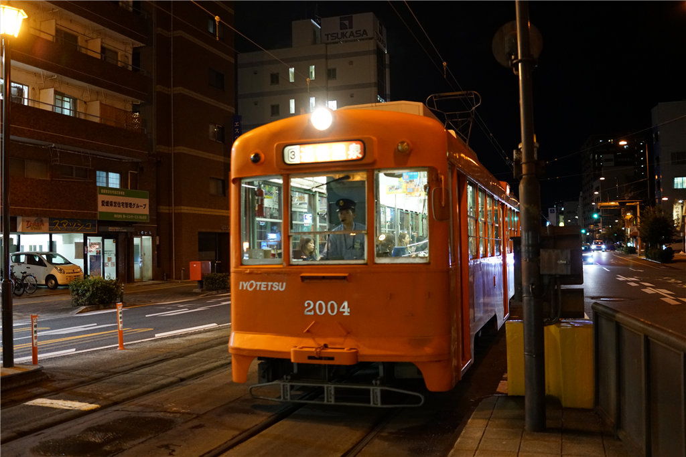

台風が迫る木曜日、親方（と呼んでおこう）から連絡があって「松山を観光するならどこがいい」。松山なら「だるやなぎ」見物一択だろうと思いつつも、松山城や石手寺をおすすめしておいたのだけど、結局、道後に泊まるというので、近くで少し飲もうよという話になった。

7時半ごろ、RX1-MR2 をもって市内電車に乗る。

ちなみに、RX1-MR2 で写真を撮ると初期設定で 7,952×5,304 ピクセル、サイズにして1枚 12MB ほどになる。当然はてなブログにはそのままアップロードできないので、この前作ったツールが大変役に立つ。っていうか、このためだけに作った。最初は PC に写真を吸いだしたらリサイズしてはてなフォトライフと同期するようにしようかなって思ったのだけど、すべての写真を使うわけでもないし、クリップボードを介してアップロードした方が何かと小回りが利くと思う。

<iframe src="https://hatenablog-parts.com/embed?url=https%3A%2F%2Fblog.daruyanagi.jp%2Fentry%2F2018%2F08%2F26%2F224927" title="「Amaguri」v1.0.0.0 - だるろぐ" class="embed-card embed-blogcard" scrolling="no" frameborder="0" style="display: block; width: 100%; height: 190px; max-width: 500px; margin: 10px 0px;"></iframe><cite class="hatena-citation"><a href="https://blog.daruyanagi.jp/entry/2018/08/26/224927">blog.daruyanagi.jp</a></cite>

宣伝はここまで。

RX1-MR2 は割と雑に、たとえばカバンにカラビナでぶら下げて歩いていたりするのだけど、露出ダイヤルの設定がちょっと変わりやすい？　知らない間に +2 とかになってしまってて、あとで見て失敗っていうケースがたまにあった。

そんなわけで、何十枚か撮ったうちのほとんどが役に立たなかったけど、それでも、ホテルで晩飯をドカ食いしてる親方を待ちながらあちこち散策しているうちに、いろいろ慣れてきたかも。

今のままだと完全に宝の持ち腐れだし、だれか詳しい人に教えてもらいたいもんだ。題材のセンスが悪いのは仕方ないとしても、もう少しダイヤルのこねくり方をマスターしておきたい。

そうこうするうちに写真を撮るのにも飽き、さすがに待ちくたびれてきた。生ぬるい風が勢いを増し、いまにも雨が降ってきそうだ。親方には悪いが、さきにどこか店に潜り込んで待とうと画策する。

しかし、台風を控えているせいか、道後はあまり店が開いていない。まだ8時半過ぎなのに、地ビール屋も寿司屋も閉まっている。これはこまった、やはり街に行くしかないかなと思いながら、あまり期待せずに飛鳥の湯の方に歩くと、なんと道後地ビールの別館があいているではないか。本館は閉まってるのに！　立ち飲み屋なのは少しあれだけど、もはや贅沢は言ってられない。カウンターに陣取り、地ビールをホイホイ吸収し始めた。

店には結構珍しいビール、それに日本酒、焼酎がいっぱいあって、つまみの種類があまりないのを除けば、悪くはなかった。そうこうするうちに親方が――急な雨と一緒に！――やってきて、その日は近況報告と、最近のセキュリティ業界についていろいろ話を聞いた。

次はだれがくるかな？　まぁ、こういう酒ぐらいならいつでも奢るで。

