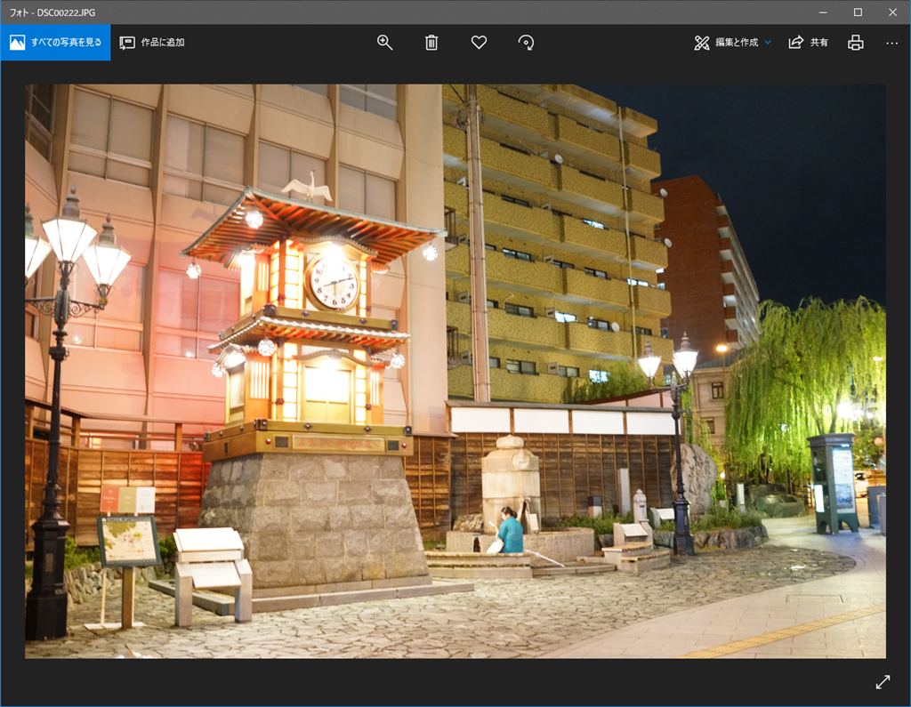
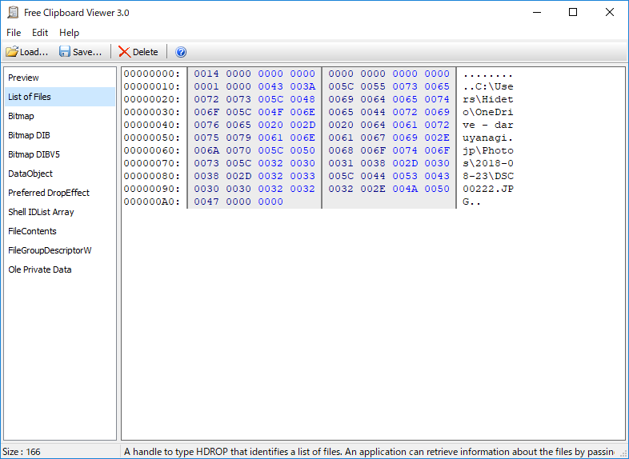

なんか「フォト」でコピーすると OutOfMemory エラーが発生するので調査したんだけど――

画像をコピーすると、ファイルリストと一緒にイメージもクリップボードに格納してくれるみたい<a href="#f-384b75a0" name="fn-384b75a0" title="クリップボードのデータは複数の形式を同時に持てる。例：プレーンテキストと書式付きテキスト、HTML">*1</a>。「ペイント」で張り付ければイメージに、「エクスプローラー」で張り付けると画像ファイルになって便利なんだけど、そのあたりをちゃんと考えてなかった。ちゃんと条件分岐を増やして不要な処理を減らす。

あと、高速に［Ctrl］＋［C］キーを押しまくったりするとたまにエラーが発生するので、それもちゃんとトラップしてバルーンで警告するようにした。他にも少しエラー処理を足したので、アプリのクラッシュは減ったはず。

それでもデカいファイルを扱う場合などに連続処理が発生するとあまりよろしくないので、ファイルの保存時に警告音を再生するオプションを付けた。音が鳴るまでは次のコピーを控えてもらえると、余計なエラーが発生しない。

<iframe src="https://hatenablog-parts.com/embed?url=https%3A%2F%2Fgithub.com%2Fdaruyanagi%2FAmaguri%2Freleases%2Ftag%2Fv1.1.0.0" title="daruyanagi/Amaguri" class="embed-card embed-webcard" scrolling="no" frameborder="0" style="display: block; width: 100%; height: 155px; max-width: 500px; margin: 10px 0px;"></iframe><cite class="hatena-citation"><a href="https://github.com/daruyanagi/Amaguri/releases/tag/v1.1.0.0">github.com</a></cite>

もう少し使って、まぁまぁ、だいじょうぶになったらストア向けのパッケージも作る。前回の経験でいえば、申請から公開まで1カ月以上はかかると思う。

<a href="#fn-384b75a0" name="f-384b75a0" class="footnote-number">*1</a>:クリップボードのデータは複数の形式を同時に持てる。例：プレーンテキストと書式付きテキスト、HTML

