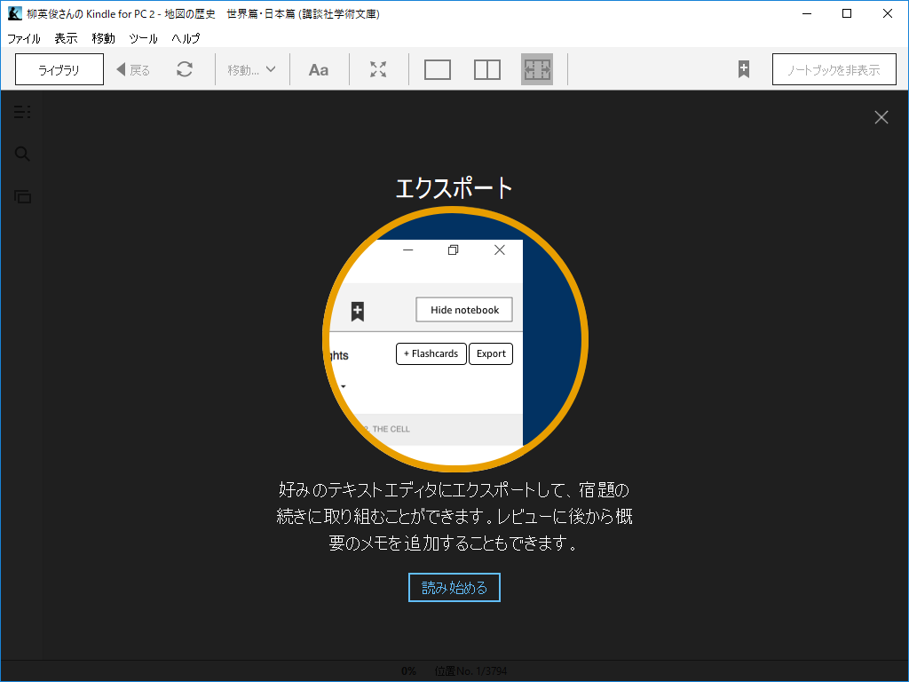

久しぶりに「Kindle for PC」を起動――というより、PC をリフレッシュしてから初めて使うので、Amazon からダウンロードして起動――したらいろいろ変わってたのでメモ。

ちなみに、ダークモードは前からだっけ……あんまり覚えていない。窓の杜で扱った最終バージョンは 1.23.1 だったが、スクリーンショットを見る限りそのときにはすでにあったっぽい。個人的にあまりダークモードには興味がないので、チェックしていなかった……

<iframe src="https://hatenablog-parts.com/embed?url=https%3A%2F%2Fforest.watch.impress.co.jp%2Fdocs%2Fnews%2F1118226.html" title="Amazon、「Kindle for PC」v1.23.1を公開 ～列の自動調整などの新機能を追加／ページ幅とフォントのサイズに応じて列の数を動的に変更" class="embed-card embed-webcard" scrolling="no" frameborder="0" style="display: block; width: 100%; height: 155px; max-width: 500px; margin: 10px 0px;"></iframe><cite class="hatena-citation"><a href="https://forest.watch.impress.co.jp/docs/news/1118226.html">forest.watch.impress.co.jp</a></cite> 

<h3>最新機能</h3>

チュートリアルが追加されている。

 

<h3>雑感</h3>

ハイライトとメモは個人的に役立ちそう。ノートブックはそんなに使わないのだけど、こういう見せ方だったらタブレットで読むときにもっと活用していいなと感じる。んー、でも、専用リーダーだとテキストを入力するのが面倒だから、いいとこハイライトしか使わないんだよなぁ……。色の違いも判らんし。

フラッシュカードはイマイチ、ピンとこなかった。使い方がわからんが、なんか受験生の使う暗記カードみたいなノリだな。必要な人から見ればなかなかいい機能なのかもしれないけれど、こういう勉強を久しくやってないのであまりよくわからん。

<h3>追伸</h3>

リリースノートがどこかにまとまってりゃいいのになぁ……。ググってみると 1.24.2 が 6 月ぐらいにリリースされていたという情報があったけど、毎日使ってないとわかんねーよな（「タスク スケジューラ」には登録がなかったし、バックグラウンドプロセスもないようだから、起動時にチェックしてるんだろうと思う）。

