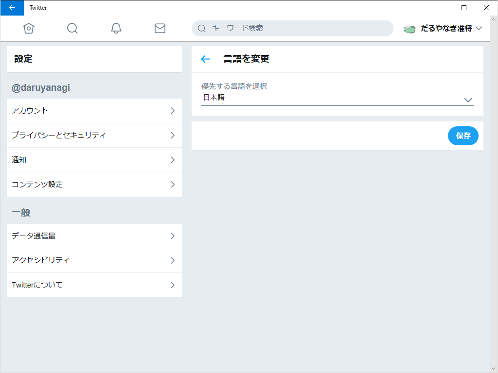

関西弁（ja-ks）もサポートしてください。

<blockquote>

September 4th 2018

<ul>
<li>On mobile web, we use the language setting of your device. On desktop site, we've let users set their language independently. We're adding language selection to mobile web too. Some users will see their site switch to the language they chose on desktop. Update your language in settings. </li>
<li>Windows: Swipe keyboard should no longer crash when composing a Tweet. </li>
<li>Screen reader support: Confirmations and errors will now be read out (e.g. Your Tweet was sent). </li>
</ul>
</blockquote>
