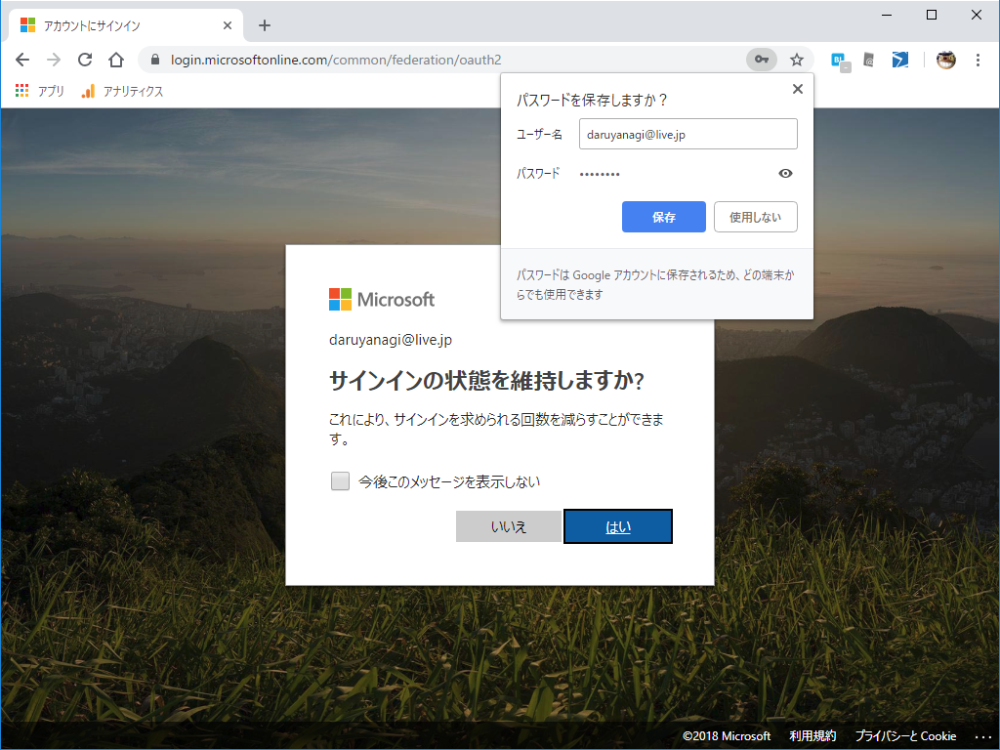
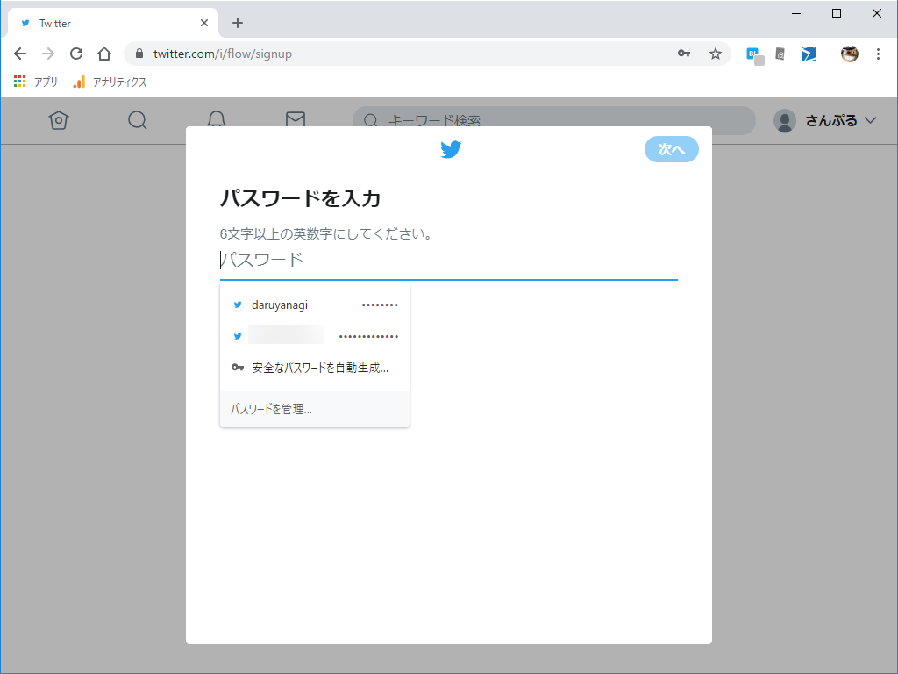
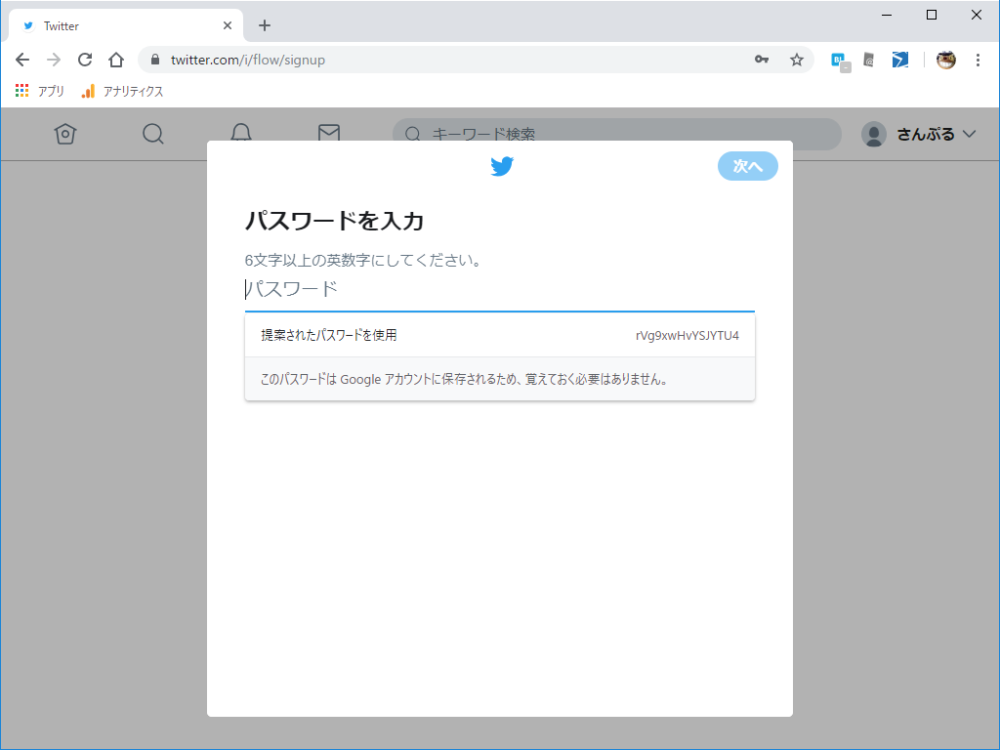
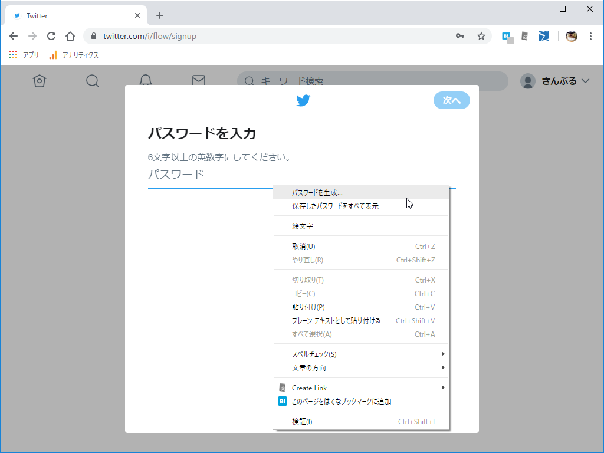
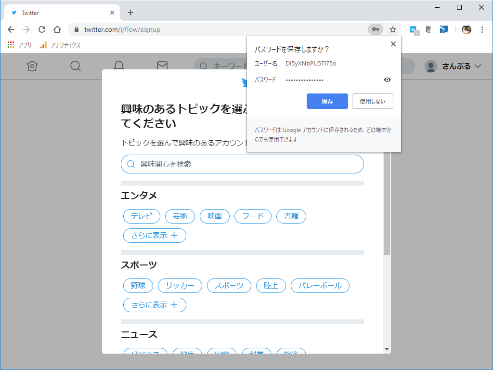
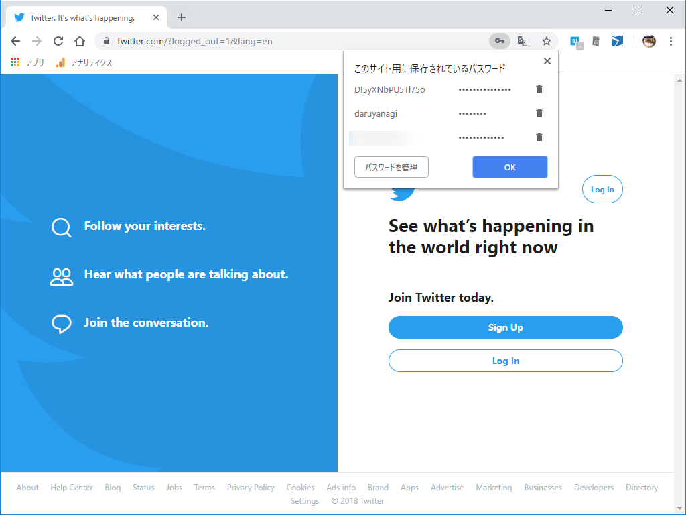
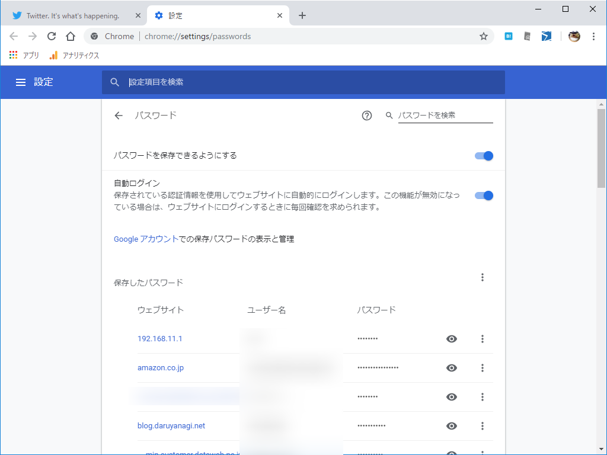
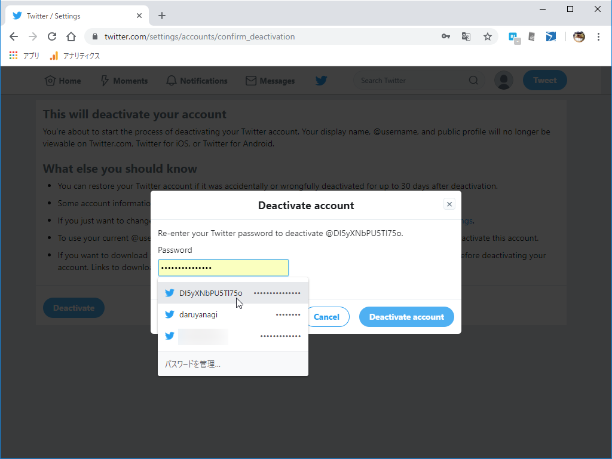
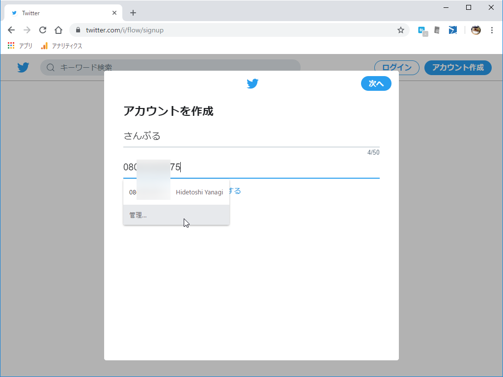
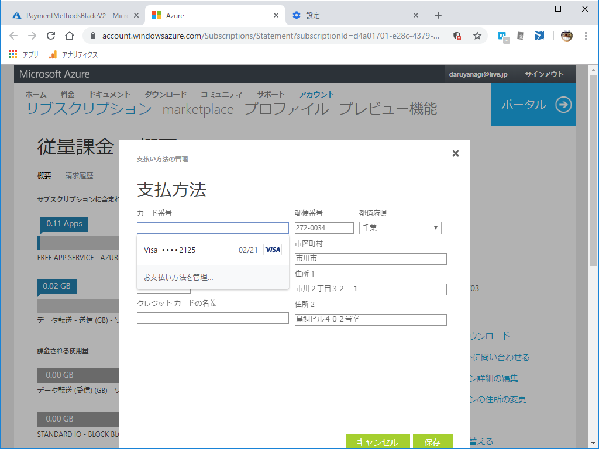

Google Chrome 69 がリリースされました。10歳の誕生日らしいですね、おめでとう！

<iframe src="https://hatenablog-parts.com/embed?url=https%3A%2F%2Fforest.watch.impress.co.jp%2Fdocs%2Fnews%2F1141539.html" title="「Google Chrome」から10周年、新デザインをまとった「Google Chrome 69」が正式公開／HTTPSサイトで表示されていた“保護された通信”ラベルは撤去。40件の脆弱性も修正" class="embed-card embed-webcard" scrolling="no" frameborder="0" style="display: block; width: 100%; height: 155px; max-width: 500px; margin: 10px 0px;"></iframe><cite class="hatena-citation"><a href="https://forest.watch.impress.co.jp/docs/news/1141539.html">forest.watch.impress.co.jp</a></cite>

公式ブログにある「新規タブページに好みの背景を設定する」機能は確認できなかったのですが、新しいパスワードマネージャーは確認できたので、一通り使ってみました。

<h3>Twitter で新規アカウントの作成</h3>

パスワードの入力欄を検出すると、当該サイトに紐づけられたアカウントのパスワードが一覧できます。クリックすれば、そのまま自動入力。らくちんらくちん！

安全なパスワードを自動生成することもできます。ちなみに（パスワードマネージャーそのものもそうですが）この機能は以前からあったのですが、より使いやすくなった感じですかね。

コンテキストメニューからも使えます。

アカウントの新規作成が終了すると、オムニバー右側に鍵アイコンが現れ、パスワードを保存するかどうかを尋ねるポップアップが現れます。ここれパスワードをマネージャーにちゃんと保存しないと、自動生成したパスワードを失ってしまうので注意……。

 

<h3>パスワードの管理</h3>

パスワードの管理は従来通り chrome://settings/passwords で。Windows のパスワードが必要になりますが、暗号化・保存されたパスワードを復号してみることもできます。エクスポートもできるぜ。

<h3>アカウントの削除</h3>

というわけで、作成したアカウントは消しておきました。アカウントを削除するときはパスワードが必要になるのですが、それもちゃんとサジェストされます。らくちん！　アカウントを消した後はパスワードも消しておきましょう。

<h3>個人情報の自動挿入</h3>

ちなみに、このパスワードマネージャーは個人情報の管理・自動入力にも対応しています。

住所・電話番号・クレジットカードを Chrome に登録しておけば、さくさく入力できて便利。でも、これ関係の入力フォームはちゃんと標準化して、パスワードマネージャーにやさしいフォームになってくれたらうれしいなー。ときどきうまくいかなくてイラっとするからね。

