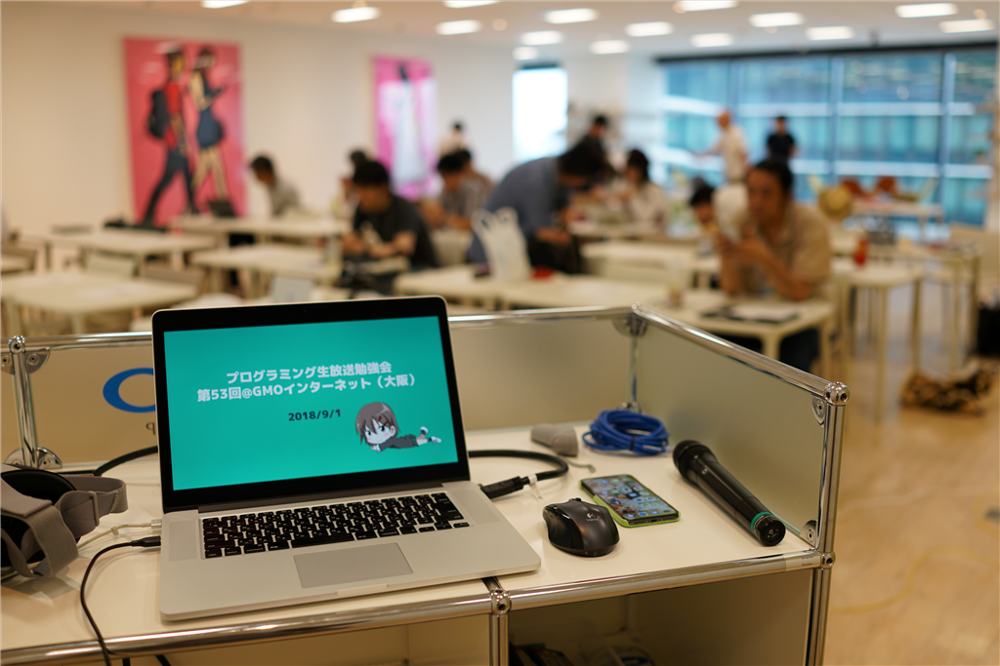
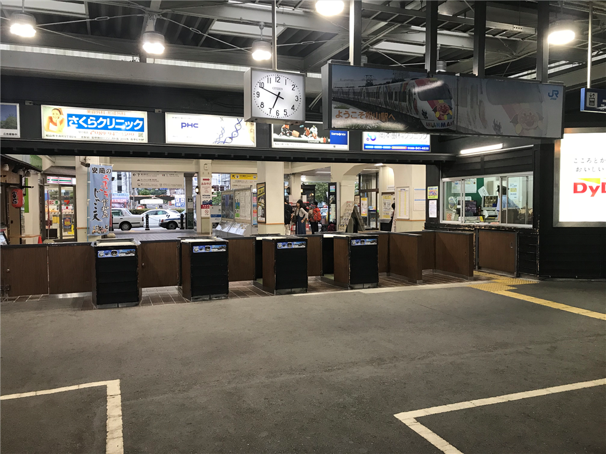
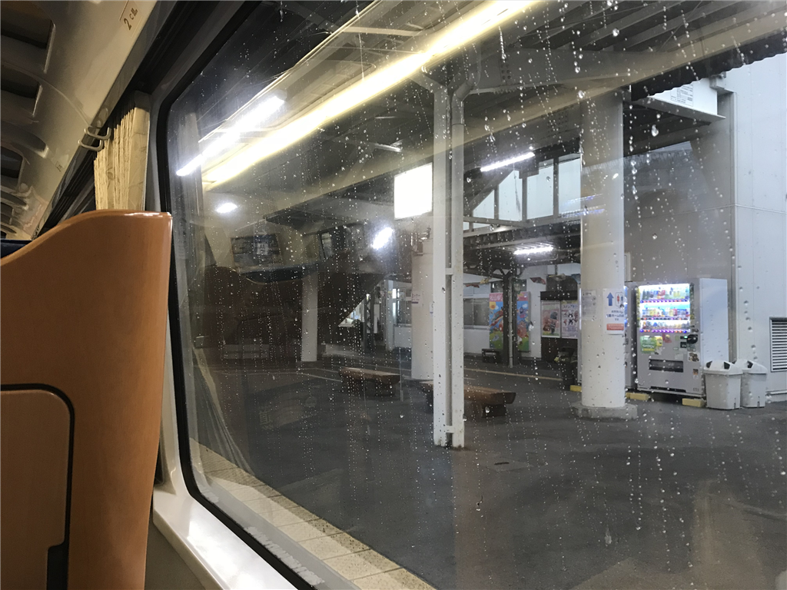
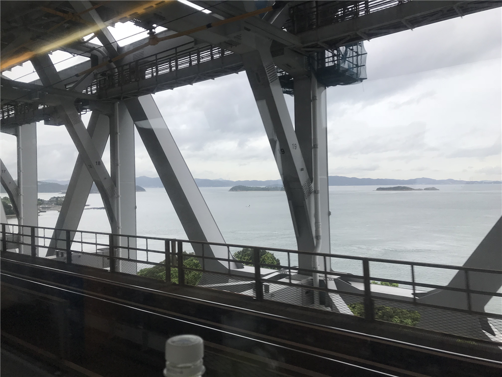
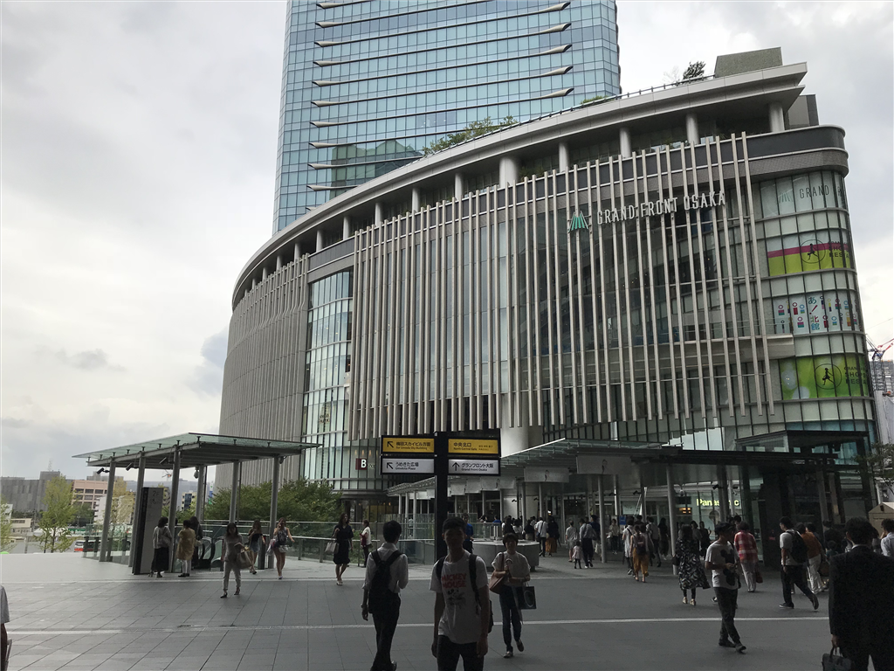
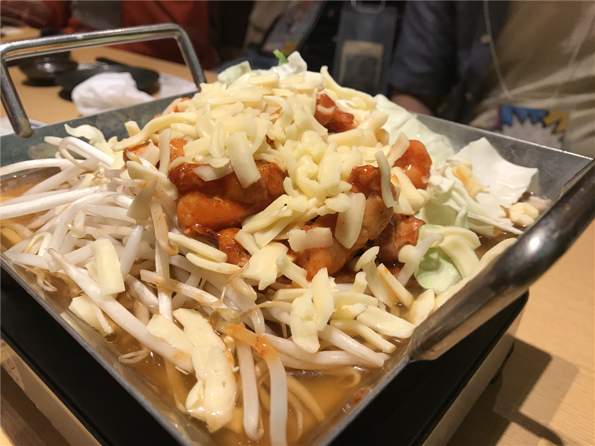

先週末はプロ生勉強会 第53回＠GMOインターネット（大阪）に参加してきました。

<iframe src="https://hatenablog-parts.com/embed?url=https%3A%2F%2Fpronama.jp%2F2018%2F09%2F03%2Fpronama-53-at-osaka-report%2F" title="プロ生勉強会 第53回＠GMOインターネット（大阪）終了！" class="embed-card embed-webcard" scrolling="no" frameborder="0" style="display: block; width: 100%; height: 155px; max-width: 500px; margin: 10px 0px;"></iframe><cite class="hatena-citation"><a href="https://pronama.jp/2018/09/03/pronama-53-at-osaka-report/">pronama.jp</a></cite>

個人的にはクリーンアーキテクチャーの話が面白かったかも？　こういうのって大規模なお仕事してないとなかなかフィードバック得られないだろうし……個人が作るツールだとほぼ関係ないもんね。あと、Ｙｏｕ＆Ｉさんの時刻の話は今流行りのサマータイムを考えるうえで知っておくべきことをおさらいできてよかったです。わいも1秒の定義がさらっといえるクールな男になりたい。

<iframe src="https://hatenablog-parts.com/embed?url=https%3A%2F%2Fyoutu.be%2FbtJPK3TaJMg" title="プログラミング生放送勉強会 第53回＠GMOインターネット" class="embed-card embed-webcard" scrolling="no" frameborder="0" style="display: block; width: 100%; height: 155px; max-width: 500px; margin: 10px 0px;"></iframe><cite class="hatena-citation"><a href="https://youtu.be/btJPK3TaJMg">youtu.be</a></cite>

動画もあるので、興味のある方はどうぞ。以下は個人的な動向についてです。

<h3>朝ごはんのレベル低下が著しい松山駅</h3>

（四国最大の街の玄関口でありながら、かたくなに人力改札の伝統を守り続ける JR 松山駅）

6:30、スーツケースをゴロゴロさせながら近所のタクシー会社まであるき、JR 松山駅まで一台お願いする。最寄りの伊予鉄の電停は7時が始発なので、それにのっても 7:30 ぐらいの特急しおかぜには乗れるのだけど、その日は何となくせかせか動くのがだるかった。本当を言うと、8月にあちこち行き過ぎたせいか、あまり体調が思わしくなく（風邪、とかじゃなくて、単に体が重い）、最悪休もうかなーと思ってたけど、一部、自分から参加をお誘いしたメンバーがいることもあり、体力を振り絞って家を這い出たのだ。

その代わりといっては何だけど、今回はグリーン車の一列シートを奮発した。大阪まで、約 15,000 円。幅広のシートに身を沈めると、大粒の雨が一斉に落ちてきて、窓を打った。JR 松山駅のホームからお弁当屋さんがなくなって初めての大阪行き。いつもは松山鮨なんぞを楽しんでいたのに、今回はコンビニで買った助六弁当だった。松山にきてこれほど文化水準の低下を実感したことはかつてない。

<h3>梅田わからん</h3>

松山を出て約4時間。瀬戸大橋を渡って、大都会・岡山で新幹線へ乗り継ぎ、大阪へ向かう。今朝の大阪は雷雨だったそうだけど、四国を脱するころには去っていたらしい。折り畳み傘は用意していたが、松山でも大阪でも雨に降られず、大変運のよいことだ。

今回の勉強会の会場である GMO インターネット（会場を貸していただき、ありがとうございます！）は、梅田のグランフロント大阪にある。初めて行ったので勝手がわからず、大阪駅で変な出口に出てしまい閉口したが、「要するに、人の流れに沿って北の方へ行けばいい」とざっくり把握していたおかげで、それほど迷わずに行けた。

そもそも、梅田ってようわからん。一応、自分だって大阪生まれの端くれだけど、難波以南に住んでると梅田まで行かないんだよな。千葉に住んでるやつが錦糸町・秋葉原より先にいかないのと一緒。おかげで、難波の地下は頭に入っているのに、梅田の地理はとんとわからない。北に向かって阪急が右で、JR が真ん中で、阪神はどうでもいいってことぐらいしかわからん。

<h3>勉強会と懇親会</h3>

LT 参加者がいないというので、勉強会ではセッションを聞きながら内職。「WPF アプリ（Tonjiru）をストアに出してみたよ」っていう LT を少しだけした。

UWP アプリってできないことがいろいろあって面倒っていうイメージがあるけど、それはだいたいリソースとセキュリティのためなんだよね。なので、なんでもできる WPF を UWP にパッケージングすると（パッケージング自体は最近の改善でとても簡単になった）ちょっと躓いたりすると思うけど、それはだいたいにおいて、自分の WPF のお作法があまりよろしくないのだ。UWP パッケージングはそれを知り、よいお作法を身につけるキッカケととらえるとよいと個人的には思う。

まぁ、そういう話はともかく。

会場はビルの上の方で見晴らしがよく、とくに夕方はなかなかよかった。最近はこういうオシャレな会社が多く、今の子は選択肢が多くていいなって思った。

懇親会は2次会（＋エクストラ）まで参加した。淀屋橋の東横インに日付が変わるころチェックイン。かなり疲れた……。かなはるちゃん、きのこ先生とあわせて「コスプレ3人衆」とか呼ばれたけど（着物で行ったのでｗｗｗ）、結構楽しかった。

その日はまぁ、そんな感じ。次回は10月の熊本に参加するつもりです。

