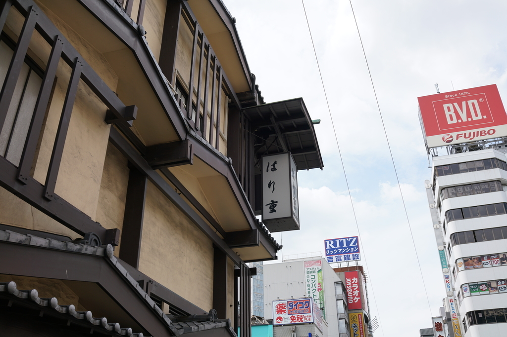
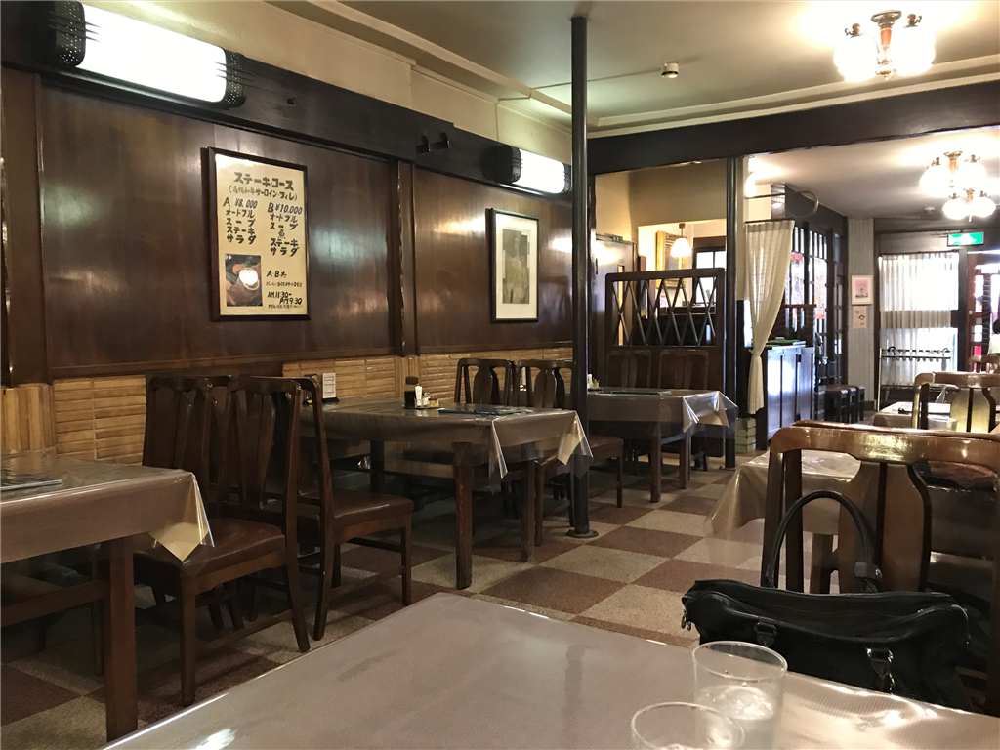
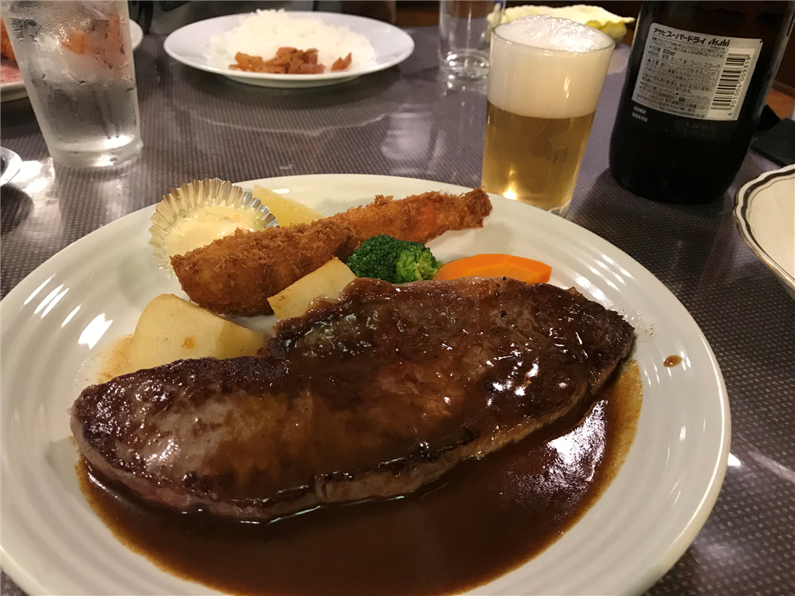
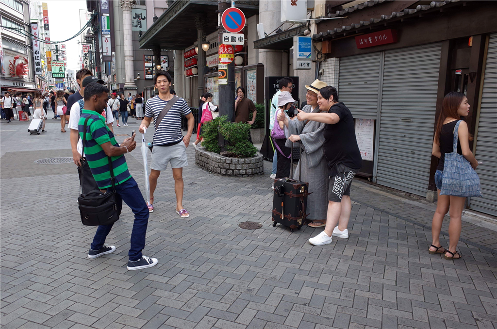
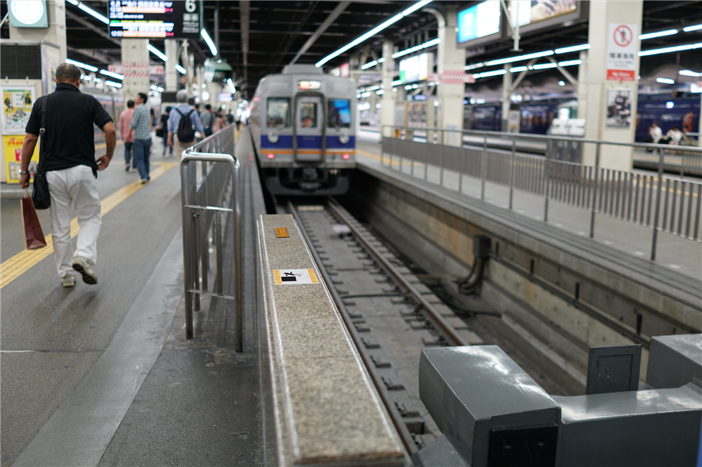

大阪・梅田で勉強会に参加した翌日。旧友に連絡を取ったら、ミナミで飯を食おうということになった。10時に淀屋橋の東横インをでて、御堂筋線に乗り、難波で降りて適当にカフェで時間をつぶす。今年は高校野球が面白かったってのもあり、ついつい『ダイヤのエース』（2部）を Kinoppy で衝動買いしてしまい、それを iPad mini でペラペラと読んでいた。まぁ、割とよくありそうな「甲子園を目指すぜ！」系のスポコン漫画だけど、地に足がついた感じ（≒魔球とかない）なのにキャラが立ってて、第一部は結構面白かった。なんか50巻近くあるので、全部購入した後に「あ、二部は絶対買わんとこ」と思ってたんだが――ついうっかり手が滑ってしまった。

<a href="http://www.amazon.co.jp/exec/obidos/ASIN/B017NDDCH4/bestylesnet-22/">ダイヤのＡ　ａｃｔ２（１） (週刊少年マガジンコミックス)</a>
<ul><li>作者: 寺嶋裕二</li><li>出版社/メーカー: 講談社</li><li>発売日: 2015/11/17</li><li>メディア: Kindle版</li><li><a href="http://d.hatena.ne.jp/asin/B017NDDCH4/bestylesnet-22" target="_blank">この商品を含むブログを見る</a></li></ul>

個人的には金丸みたいな男に肩入れしてしまう。主人公・沢村の世代ではキャプテンの器だと思うし、ちゃんとレギュラーに定着してほしいんだけど。あと、二部になって新一年生がはいってきた。野球はうまいんだろうけど、なんというか、割と胡散臭い奴らなのであまり好みではない。続きを買うかどうかは……まぁ、新刊を逐一は買わんが、ふとしたキッカケでまた大人買いしてしまうんだろうな。

それはさておき。

しばらくして、アイスコーヒーの残りも少なくなってきたころ、H 君があらわれた。連れだって地下から空の下に出て、道頓堀へ向かう。

今日行った「はり重」はすき焼きだか何だかのお店かな？　昔なにかの機会に一度行ったことがあるのだけど（接待だったのかなぁ……？）、高かったなーっていうのしか覚えていない。今回はもうちょっとリーズナブルな洋食の方に行ってみた。こういうときでもないと、わざわざこんなところで食べないしな。

内装は古き良き――って感じかな。なんか懐かしい感じがする。昭和っていうか。接客も行き届いていて、悪くないな、と感じた。

メニューは……なに食べていいのかわからんかったので、とりあえずスペシャルランチを頼んでみた。ランチにしてはそこそこの値段だったけど、東京価格に比べたらそれほどでもない。お肉よりエビフライの方が気に入ったので、もし今度行く機会があればエビフライがいっぱい入ったやつにする。もっと洋食、洋食した……たとえばオムライス的なものを頼んだ方がよかったかもしれない。

あと、なぜかスリランカ人のカップルにつかまって、一緒に記念写真を撮らされた。たぶん、「キモノ」を着ていたのが珍しかったのだと思う。「へーぃ」「ぃえーぃ」と誼をかわし、撮った写真を「ないすぴくちゃー」と褒めて別れた。とくにお金持ちって感じでもなかったんだけど、ああいう層の人にとっても日本旅行って身近になっているんだろうか。なんか素直に日本を楽しんでくれているみたいで、ちょっとくすぐったい感じがある。来てもらってばかりでは申し訳ないし、いつかは自分もスリランカに行きたいものだ。

H 君とは南海の難波駅でお別れした。ラピートに乗って関空へ向かう。難波駅の窓口はかなり賢くて、適当に「1時5分のラピートください」というだけで、1時5分発のラピートアルファのチケットが、関空までの乗車券付きで買えた。最近流行りなる AI も、ここまでコミュ障の意図を完璧には汲めまい。

粉浜育ちのくせに南海はあまり乗ったことないのだけど、昼の1時から缶ビール片手にしたおっさんがホームを徘徊してたりして、民度の高さを感じた。ただ、くし型ホームの端っこにあるラピートの乗り場だけはそういう空気から隔絶されていて、きれいなお姉さんが検札をしてくれる。大変心地よい体験なので、近鉄にも取り入れてほしい。

関空での出来事は、特筆すべきことは何もない。沖縄便の客が優先だとか何とかで、手荷物の預け入れに1時間待たされたぐらいだ。よくもまぁ、あんなオペレーションで乗客が乗り遅れないなと思うのだけど、保安検査がスムーズで乗り場もそれほど遠くないから、ここさえパスすれば案外サクッと乗り場まで行けるんだな。機内持ち込みにできるカバンにしておけば、ほとんどストレスないと思う。まぁ、機内にあんまりごちゃごちゃ持ち込みたくないんだけど……。

この2日後、台風で関空が沈むとはこのとき思いもしなかったから、もう少し写真撮っといてもよかったなと思った。

