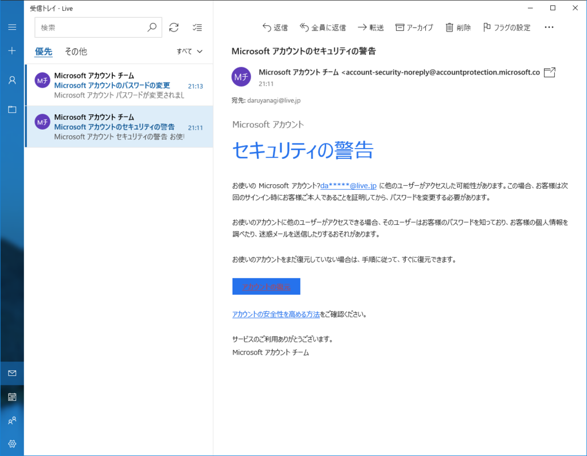
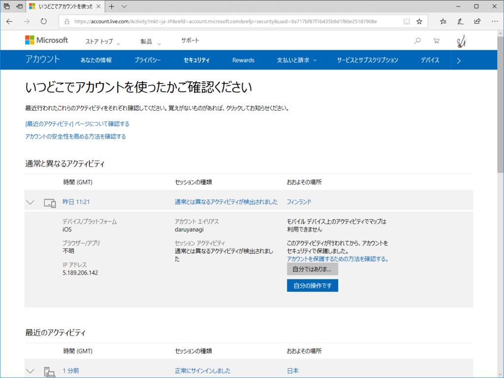
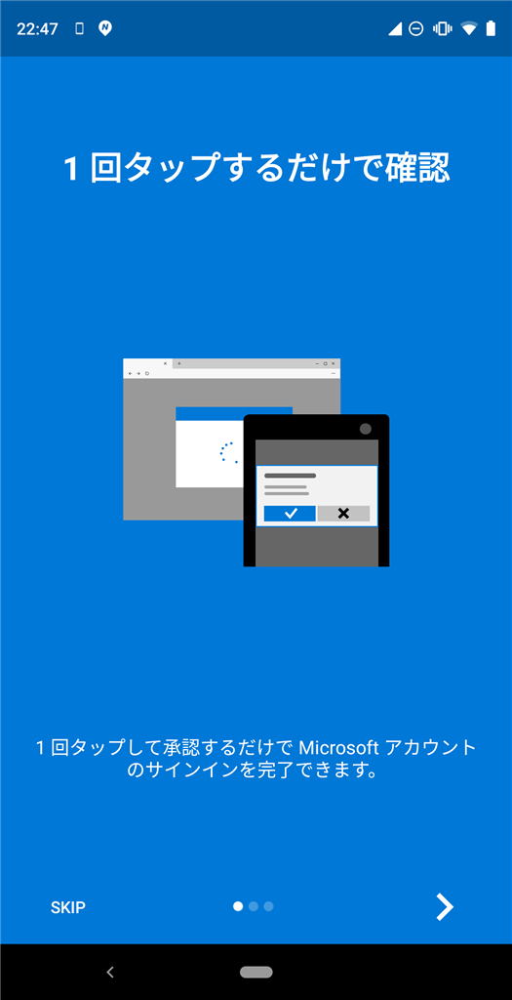
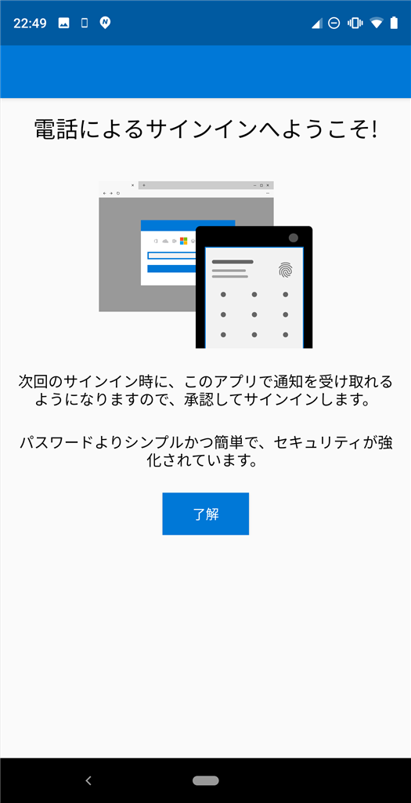

やーん！　URL をよく確認してリンクを踏み、パスワードを変更。Google アカウントでは何回かこういうのがあったけど、Microsoft アカウントは初めてだな（ちょっとだけ Google を擁護するならば、Gmail をメインの ID に使ってるから、攻撃を受ける可能性は Google の方が高いと思う）。

フィンランドからのアクセスって何だろう？　Nokia のサービスからのアクセスかなーとか思ったんだけど……まぁ、よくわかんない場合は遮断しておくに限る。

それはそうと、今年の春ぐらいから 1Password を導入（課金）しました。まだあんまり使いこなせてないし、ぶっちゃけ面倒くさいけど、ぶっこ抜かれてから泣いても仕方ないしね……。

<h3>追記</h3>

  

ついでに Microsoft Authenticator を Android にセットアップしておいた（iOS にはもう入れてたけど）。強いパスワードにしたら、当然それを手で入力するのは厳しくなるわけで……こういうツールで簡単にしておかないとやってられない。

<ul>
<li><a href="https://www.microsoft.com/ja-jp/account/authenticator">Microsoft Authenticator &ndash; &#x30AA;&#x30F3;&#x30E9;&#x30A4;&#x30F3; &#x30A2;&#x30AB;&#x30A6;&#x30F3;&#x30C8;&#x306E;&#x5B89;&#x5168;&#x306A;&#x30A2;&#x30AF;&#x30BB;&#x30B9;&#x3068;&#x7BA1;&#x7406;</a></li>
</ul>

