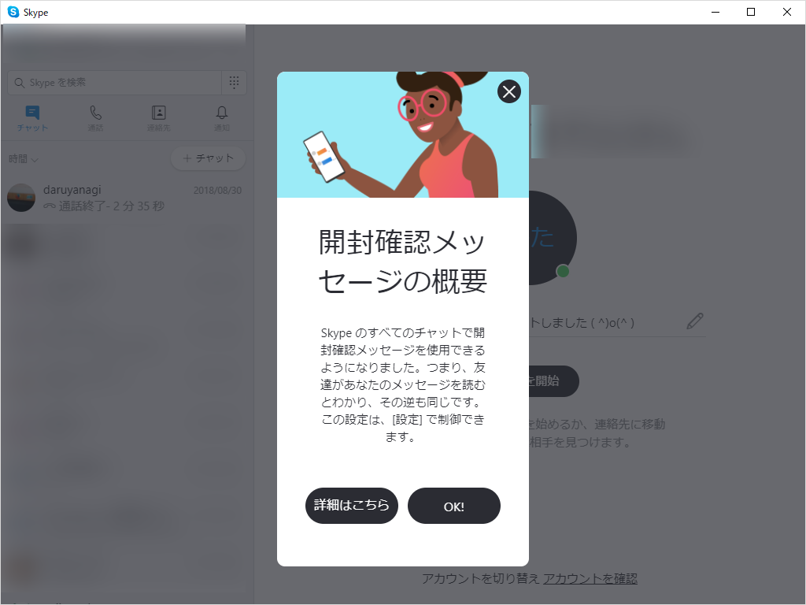

 

<blockquote cite="https://support.skype.com/ja/faq/FA34852/skype-denokai-feng-que-ren-nogai-yao-wojiao-etekudasai">

開封確認は、Android (6.0 以降)、Android タブレット、iPhone、iPad、およびデスクトップ用の Skype バージョン 8 で利用することができます。

開封確認により、誰がメッセージを読んだのかがリアルタイムで正確にわかります。 他のユーザーが既に読んだ会話の地点のすぐ下に、小さくなった連絡先のアバターが表示されます。 その小さいアバターのいずれかを選択すると、会話を読んだユーザーが誰であるかの情報が完全に表示されます。 

開封確認は既定で有効になっており、1 対 1 の会話または参加者が 20 人未満のグループで利用できます。 

<cite><a href="https://support.skype.com/ja/faq/FA34852/skype-denokai-feng-que-ren-nogai-yao-wojiao-etekudasai">Skype &#x3067;&#x306E;&#x958B;&#x5C01;&#x78BA;&#x8A8D;&#x306E;&#x6982;&#x8981;&#x3092;&#x6559;&#x3048;&#x3066;&#x304F;&#x3060;&#x3055;&#x3044;&#x3002; | Skype &#x30B5;&#x30DD;&#x30FC;&#x30C8;</a></cite>
</blockquote>

8.29.0.50 で確認。リリースノートはまだ更新されていなかった。

関係ないけど、URL 末尾の"skype-denokai-feng-que-ren-nogai-yao-wojiao-etekudasai"はちょっとウケる。中国語だかなんだかの読み方混じってる？

<ul>
<li>開封確認＝kai-feng-que-ren</li>
<li>概要＝gai-yao</li>
<li>教＝jiao</li>
</ul>
"<a href="https://support.skype.com/ja/faq/FA34852/">https://support.skype.com/ja/faq/FA34852/</a>" があればアクセスできるので、無理してくっつけなくてもいいのにって思うんだけど、最近はこういう URL をたまに見かけるし、SEO だかなんだかで流行っているのかもしれない。

