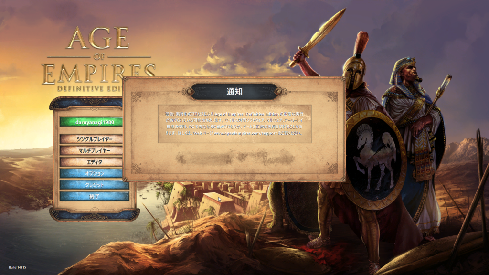

ゲームを起動して、2人目の村人ができあがるぐらいのタイミングで、Age of Empires:HD がクラッシュし、オープニング画面に戻されてしまう。この OP 画面ではシングルプレイ・マルチプレイともにグレーアウトされてしまい、ゲームを開始できない。

ウイルスバスター クラウド 15.0 を導入したばかりだったので、これが問題かと思いアンインストールすると、案の定解決された。

<iframe src="https://hatenablog-parts.com/embed?url=https%3A%2F%2Fpc.watch.impress.co.jp%2Fdocs%2Fnews%2F1141837.html" title="トレンドマイクロ、AIスキャンを強化した「ウイルスバスター」シリーズ最新版  ～「決済保護ブラウザ」機能なども新搭載" class="embed-card embed-webcard" scrolling="no" frameborder="0" style="display: block; width: 100%; height: 155px; max-width: 500px; margin: 10px 0px;"></iframe><cite class="hatena-citation"><a href="https://pc.watch.impress.co.jp/docs/news/1141837.html">pc.watch.impress.co.jp</a></cite> 

<blockquote>

今回の新バージョンでは、新たにファイルの特徴とふるまいの特徴を組み合わせて照合し、ファイルが実行される前にふるまいを予測する機能が搭載され、ファイルの特徴をもとにした静的な解析と、ファイルの特徴からふるまいを予測する解析を実行前に組み合わせた「ハイブリッドモデル」により、防御力の向上を図ったとしている。

</blockquote>

このハイブリッドモデル？とやらが効きすぎているのかもしれない。それにしても AoE:DE ってゲームプロセスは別だったりするのかな。なかなかこういう挙動をするゲームって少ない気がする。あんまりゲームしないからわからんが、普通はクラッシュして終わり、って感じなんじゃないかな。

