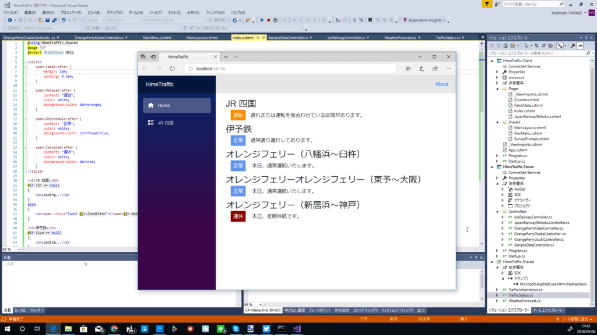

追加の無職の仕事を請け負ったので、この週末はお仕事モード。その合間、気晴らしに、昨日から取り組んでいる Blazor のサイトをちまちまと作ってた。

実は以前にもやったことがあるので、要領は得ている。

<iframe src="https://hatenablog-parts.com/embed?url=https%3A%2F%2Fblog.daruyanagi.jp%2Fentry%2F2015%2F01%2F20%2F033210" title="あちこちスクレイピングして、松山の鉄道・船・飛行機の運行状況をまとめるサイトを作ってみた - だるろぐ" class="embed-card embed-blogcard" scrolling="no" frameborder="0" style="display: block; width: 100%; height: 190px; max-width: 500px; margin: 10px 0px;"></iframe><cite class="hatena-citation"><a href="https://blog.daruyanagi.jp/entry/2015/01/20/033210">blog.daruyanagi.jp</a></cite>

ただ、当時のコードが残ってなかったのと、3年もあれば変わるところもあるので、そこら辺の調査に手間取った。

<h3>JR 四国</h3>

遅延情報は公式の運行情報ページからとれる。うちのサイトにも路線図入れたいけど、Canvas に描いて、遅延路線をスタイルしていくのが汎用的だろうか。

<iframe src="https://hatenablog-parts.com/embed?url=http%3A%2F%2Fwww.jr-shikoku.co.jp%2Finfo%2F" title="列車運行情報 - JR四国" class="embed-card embed-webcard" scrolling="no" frameborder="0" style="display: block; width: 100%; height: 155px; max-width: 500px; margin: 10px 0px;"></iframe><cite class="hatena-citation"><a href="http://www.jr-shikoku.co.jp/info/">www.jr-shikoku.co.jp</a></cite> 

<h3>伊予鉄</h3>

遅延情報は公式の運行情報ページからとれる。

<iframe src="https://hatenablog-parts.com/embed?url=http%3A%2F%2Fwww.iyotetsu.co.jp%2Fkinkyu%2F" title="電車・バス情報 | 伊予鉄" class="embed-card embed-webcard" scrolling="no" frameborder="0" style="display: block; width: 100%; height: 155px; max-width: 500px; margin: 10px 0px;"></iframe><cite class="hatena-citation"><a href="http://www.iyotetsu.co.jp/kinkyu/">www.iyotetsu.co.jp</a></cite>

遅延・運休があると路線ごとにテーブルで情報が掲載されるので、まずはテーブルのあるなしを判定するとよさげ。

テーブルの解釈は多少面倒くさいけど、隣接セレクタ― <code>"th.rail3 + td"</code> なんかを使えばいけるかと。

今日は大雨のおかげであちこちに遅延が出てくれて、たくさんデータが取れてよかった( *´艸｀)

<h3>フェリー</h3>

防予フェリーだけ UTF-8 じゃなくてつらかった。そのほかの各航路は、単純に公式ページからスクレイピングするだけ。オレンジフェリーのサイトだけ少し重く、うちの環境でベンチマークをとると取得から解析まで2秒ぐらいかかった。

<h3>ANA</h3>

公式の運行状況ページで便名を指定して検索。

<iframe src="https://hatenablog-parts.com/embed?url=https%3A%2F%2Fwww.ana.co.jp%2Ffs%2Fdom%2Fjp%2F" title="国内線運航状況のご案内サービス│航空券│ANA SKY WEB" class="embed-card embed-webcard" scrolling="no" frameborder="0" style="display: block; width: 100%; height: 155px; max-width: 500px; margin: 10px 0px;"></iframe><cite class="hatena-citation"><a href="https://www.ana.co.jp/fs/dom/jp/">www.ana.co.jp</a></cite>

裏で JSONP API を使っているので、それをそのまま使えばよい……が、情報過多なので解釈が少しつらい。

ちなみに JSON  → C# への変換は、 <a href="https://quicktype.io/">https://quicktype.io/</a> が激しくお勧め。シリアライズ・デシリアライズするメソッド付きで C# 型へとコンバートしてくれる。

<h3>JAL/JAC</h3>

<a href="http://www.jal.co.jp/cms/other/ja/weather_info_dom.html">JAL - &#x904B;&#x822A;&#x72B6;&#x6CC1;&#x306E;&#x3054;&#x6848;&#x5185;&#xFF08;&#x56FD;&#x5185;&#x7DDA;&#xFF09;</a> で便名を検索。あまりセンスのないテーブルをガリガリと解釈する必要があってすごくつらい。セレクターでやると <code>body > table > tbody > tr:nth-child(2) > td:nth-child(3)</code>みたいな感じ……ファック！

あと、JAL と JAC は別で、airlineCode を間違えるとエラーになる。

<h3>Jet Star</h3>

PC サイトは ASP.NET かな？　POST すると HTML が返ってきて……みたいな感じでつらい。でも、モバイル版サイトの裏には GET で簡単にとれる API<a href="#f-357aa3b2" name="fn-357aa3b2" title="https://m.jetstar.com/Ink.API/api/flightstatus?origin=myj&destination=nrt">*1</a>があるみたい。JSON でデータをとれるし、ちょっと簡潔すぎるきらいはあるけど、データの見通しもいい。

<h3>Peach</h3>

公式サイトで便名のほかに出発地（！）、到着地（！？）まで厳密に入力して検索すると、POST で HTML をとってくる。あとはテーブルを解釈……。

<iframe src="https://hatenablog-parts.com/embed?url=https%3A%2F%2Fwww.flypeach.com%2Fpc%2Fjp%2Flm%2Fflightstatus%2Fsearch%2F2462" title="運航状況のご案内" class="embed-card embed-webcard" scrolling="no" frameborder="0" style="display: block; width: 100%; height: 155px; max-width: 500px; margin: 10px 0px;"></iframe><cite class="hatena-citation"><a href="https://www.flypeach.com/pc/jp/lm/flightstatus/search/2462">www.flypeach.com</a></cite>

昔のメモには API があると書いてあるんだが、どこなんだろう。なくなったのかな。

<a href="#fn-357aa3b2" name="f-357aa3b2" class="footnote-number">*1</a>:<a href="https://m.jetstar.com/Ink.API/api/flightstatus?origin=myj&destination=nrt">https://m.jetstar.com/Ink.API/api/flightstatus?origin=myj&destination=nrt</a>

