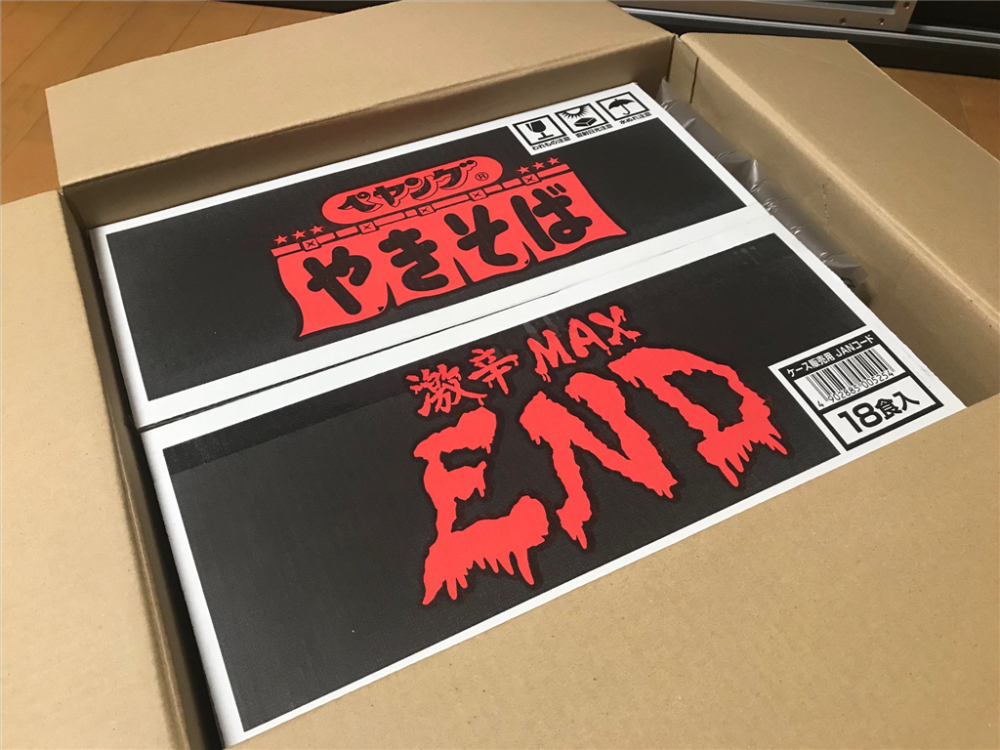

11日火曜日は、いつも晩御飯を作ってくれる父ちゃんが東京に出かけていなかったので、晩御飯は行きつけの居酒屋で食べた。羽を伸ばしたともいう。居酒屋ではいつもは静かに本を読んでいる（その日は東洋文庫の『世界最古の物語』でギルガメシュが冥界へ行くところを読んでいた）のだけど、その日はカウンターがにぎやかで、話に巻き込まれるうちにちょっと楽しくなってしまい、つい飲み過ごしてしまった。――そして、翌日ダウン。

最初は「二日酔いかなぁ」などと思っていたのだけど、ジョッキで6杯ぐらいしか飲んでないし、よっぽど弱ってでもない限りそんなはずはない。いろいろ自己診断してみるに、どうやら熱があるらしく、風邪かなにかのようだ。体が重くて、力が際限なく重力に吸い取られていく気がする。

参ったなぁ――しかし、無職＜フリーランス＞だから仕事に穴をあけるのは信用に関わる。頑張って最低限の仕事だけして、その日は昼間から寝た。平日のど真ん中に体調を崩したのは、無職になって初めてかもしれない。数時間ずつ、うつらうつらとしては、寝汗を拭き、ゴロゴロと本を読んで過ごした。こういう時に限って一人だし、だるいし、つらい。

翌々日、13日の明け方、少し気分がよくなったので、短時間で集中して無職の仕事を片付けた。量的にはいつも以上に頑張ったし、あとの突発的なことは全部任せて寝た。本調子でないのにしゃしゃり出ても迷惑になるだけだしね。前の日にあまり熟睡できなかったせいか、この日は明け方から夕方5時までぶっ通しで寝てしまった（気持ちよかった！

完全に昼夜が逆転してしまい、これはこれでピンチなのだけど、今週を乗り切る目途が立ってよかった。

でもな、目が覚めたら悪意の塊が届いててすべて台無し。

<blockquote class="twitter-tweet" data-conversation="none">
はよ
&mdash; しばやん (@shibayan) <a href="https://twitter.com/shibayan/status/1040286202383884288?ref_src=twsrc%5Etfw">September 13, 2018</a></blockquote>  

Twitter のタイムラインから食レポの圧力を感じるけど、さすがに今食べたら死に至る可能性が微レ存なので、週末に食べることをお約束して段ボールに再び封をした。

