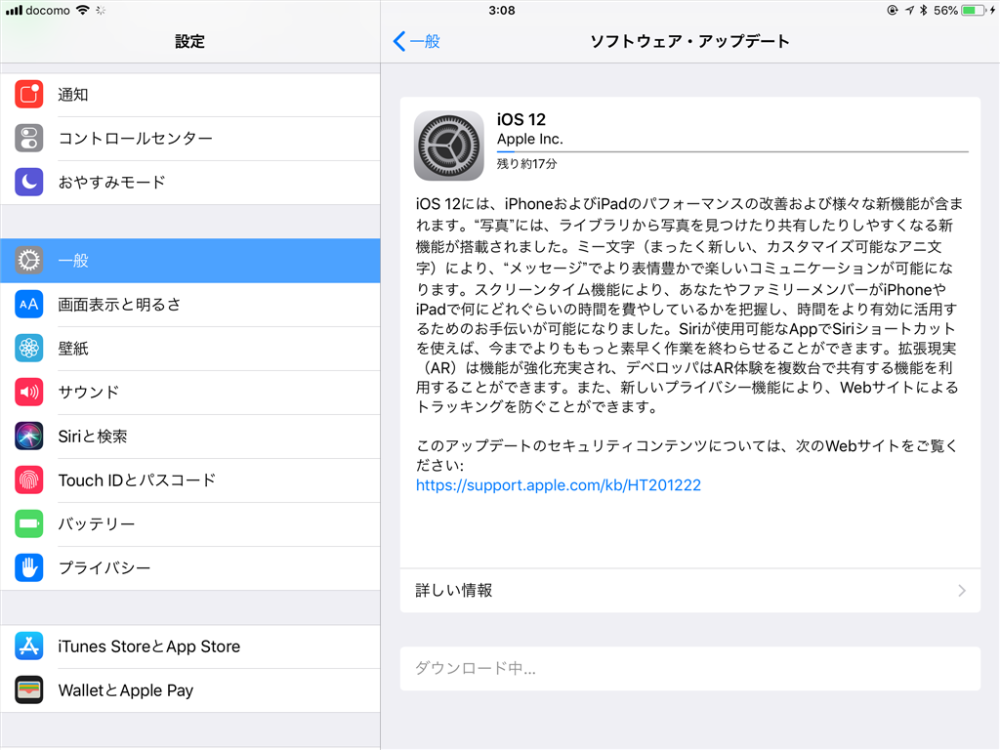
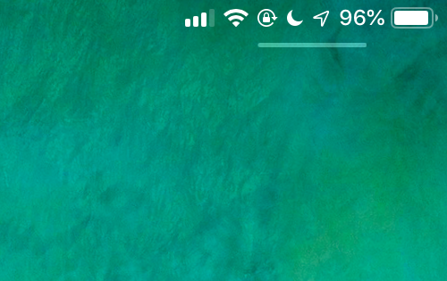
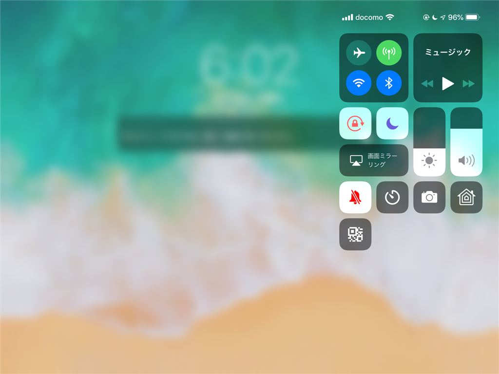
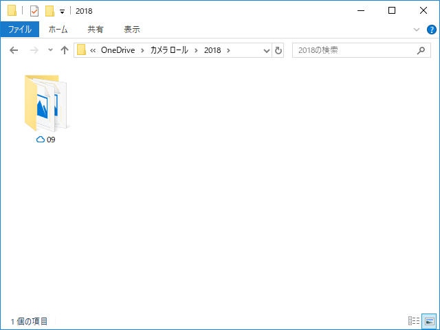
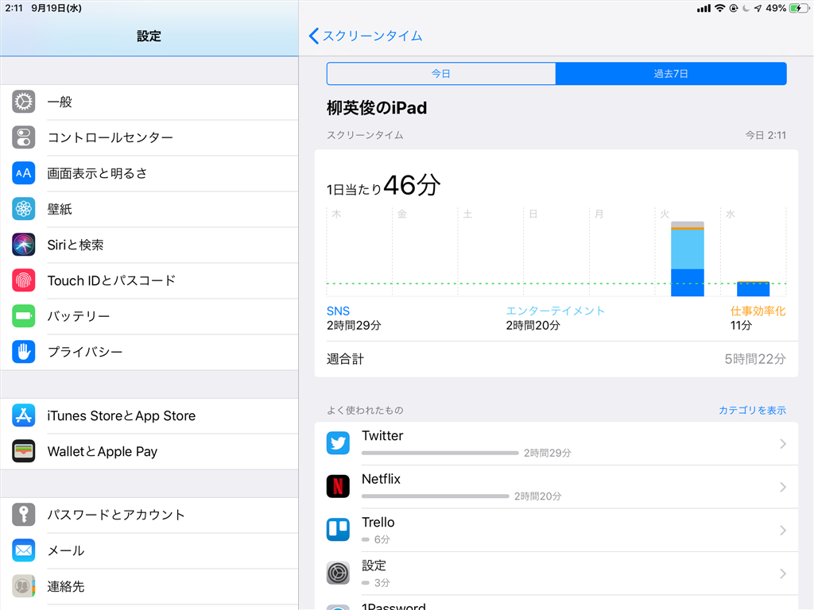
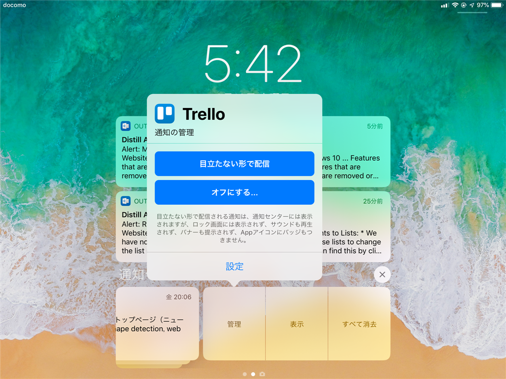

昨日の朝3時ごろ、ちょっと仕事をしながらガチャガチャと iPad mini 4 をいじってると、iOS 12 が降ってきた。早速導入してみた。

<iframe src="https://hatenablog-parts.com/embed?url=https%3A%2F%2Fforest.watch.impress.co.jp%2Fdocs%2Fnews%2F1143390.html" title="Apple、「iOS 12」を一般公開 ～パフォーマンスの大幅向上で古い端末でも快適に動作／通知の管理や拡張現実を強化。利用統計機能“スクリーンタイム”などの新機能も" class="embed-card embed-webcard" scrolling="no" frameborder="0" style="display: block; width: 100%; height: 155px; max-width: 500px; margin: 10px 0px;"></iframe><cite class="hatena-citation"><a href="https://forest.watch.impress.co.jp/docs/news/1143390.html">forest.watch.impress.co.jp</a></cite>

新機能うんぬんは他所でどうぞ。うちは自分が気が付いたことだけ。

<h3>iPad mini 4 でアプリが機能しなくなった</h3>

再起動で解決。動作は早くなったらしいけど、体感はないかな……ま、遅くなってなけりゃ別に。

<h3>コントロール センターがでない？</h3>

iPad mini 4 でコントロール センターがでない。一瞬「廃止されたのか？」と思ったけど（そんな馬鹿な！　こんなダサい機能を Apple が廃止するわけがない！！）、iPhone の方は普通に出せる。

理由は簡単で、自分が情弱なだけだった。

右上の方をスワイプしなきゃいけないんだな。前からこうだったっけ……最近、タイプミスは増えるわ、シソーラスを引く機会は増えるわ、老いを感じることが多くなってきた。

この謎のバーが以前からあったのかどうかも記憶が定かではないんだけど、もしかしたらコントロール センターのためのアフォーダンス（← だっけ？）なのかな？　いつもかならずあるわけじゃないみたいだけど、これからコントロール センターを使うときはここんところを引っ張るようにしてみる。

 

<h3>OneDrive の写真同期でフォルダー構造が変わった</h3>

iPhone の写真は OneDrive アプリでクラウドと同期しているのだろうけど、カメラロール フォルダーへフラットに展開されるのではなく、年月日でフォルダーわけされるようになった。一覧性は低下するけど、大量の写真がある場合のファイルブラウジングパフォーマンスは若干改善される。

もっとも、この変更が iOS 12 によるものなのか、OneDrive のアップデートによるものなのかは知らない。たまたまタイミングがかぶっただけかもしれないが、手元にはもう iOS 11 端末がないので検証できない。

<h3>気に入った新機能</h3>

利用統計機能 スクリーンタイム はかなり気に入った。1日で2時間も Twitter してたとか、マジでヤバい。

 

あと、目立たない形で配信っていう機能も気に入ったかな。おもに Kindle Unlimited の通知消すために使いたい（

<h3>watchOS 5</h3>

<blockquote class="twitter-tweet">
<a href="https://twitter.com/daruyanagi?ref_src=twsrc%5Etfw">@daruyanagi</a> <a href="https://t.co/TMhPLP1mnp">pic.twitter.com/TMhPLP1mnp</a>
&mdash; しばやん (@shibayan) <a href="https://twitter.com/shibayan/status/1042019888481484800?ref_src=twsrc%5Etfw">September 18, 2018</a></blockquote>  

これは面倒くさいので明日やる。いま OS のアップデート中……

