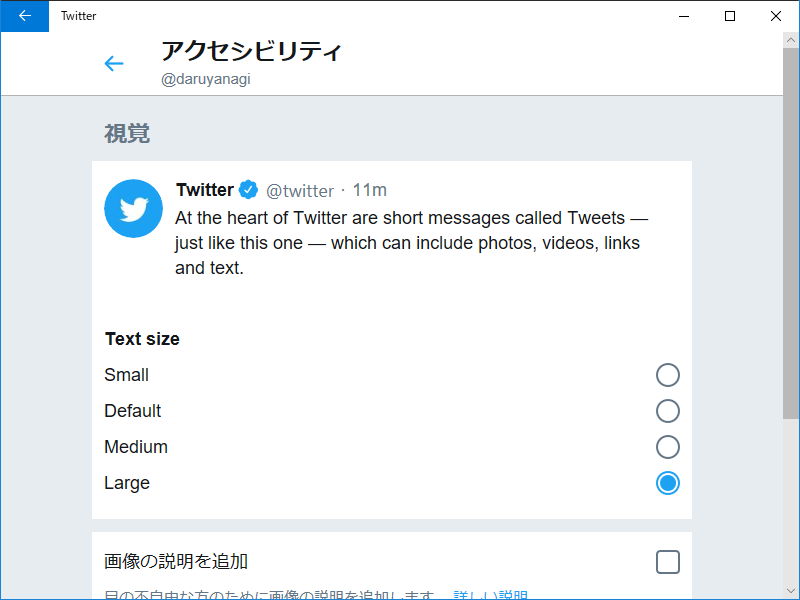

こういうのいいけど、OS の設定とバッティングしないのかなーってちょっと気になったりもする。

<blockquote>

We have added a text-size option to the accessibility settings screen, allowing you to make the text larger and more readable, or smaller and more dense.

We added some improvements to Lists:

<ul>
<li>We have now added a List info screen that allows people who use lists to change the list name, privacy settings and subscribe to lists. You can find this by clicking on the "i" icon on the top right of a list.</li>
<li>We have also added the ability to add/remove people to/from multiple lists at once. To do so, click/tap on the gear icon in a user's profile and click/tap on the option "Add or remove from Lists" from the dropdown menu.</li>
<li>You can access your lists by clicking/tapping your profile image and clicking/tapping on the "Lists" option in the dropdown menu. You can always view other lists by going to a user's profile, clicking/tapping on the gear icon and clicking/tapping on "View Lists" from the dropdown menu.</li>
</ul>
We also made a few bug fixes this week: 

<ul>
<li>Fixed drag and drop into media compose.</li>
<li>Fixed overflow of long hashtags.</li>
<li>Fixed media gallery display in RTL languages.</li>
<li>Fixed Tweet translations for Traditional Chinese and Norwegian.</li>
<li>Fixed a bug where Direct Messages were frequently not marked as read. </li>
<li>Fixed a bug where elements appeared on top of full screen videos in iOS. </li>
</ul>
</blockquote>
