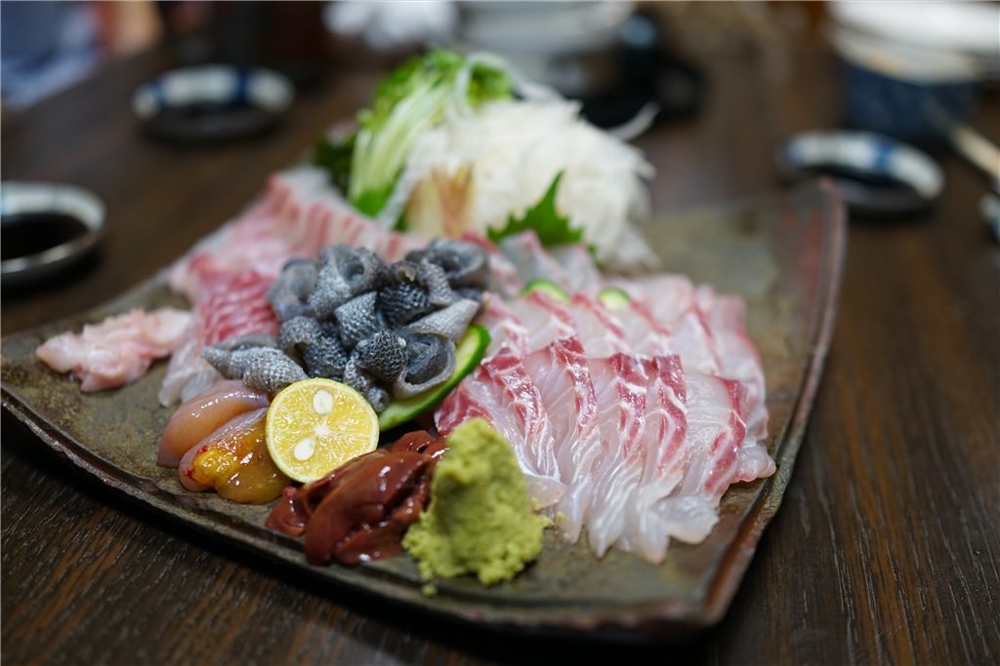
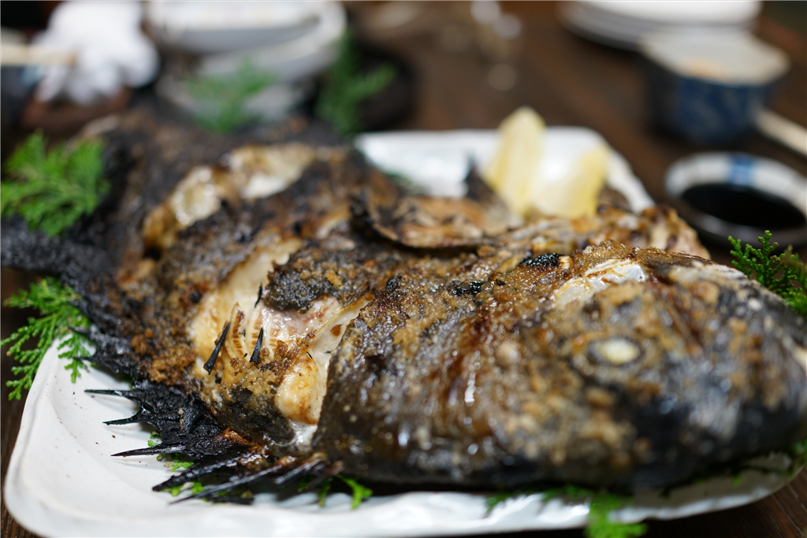
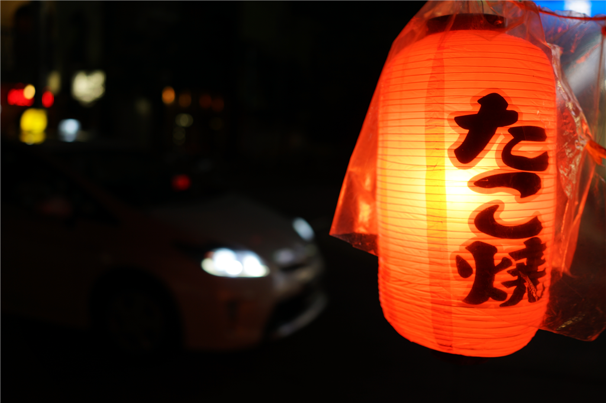

久しぶりに @nakaji 先生が登場するというので、街で飲み会をセッティングした。場所は K さんが教えてくれた「まつだ」というお店。こじんまりしてるけど、お魚がおいしいらしい。

<a href="https://r.gnavi.co.jp/rsd79mc90000/#basicInfo">居酒屋 まつだ</a>

〒790-0002 愛媛県松山市二番町2-2-8 

<a href="tel:089-934-2588">089-934-2588</a>

<a href="https://r.gnavi.co.jp/rsd79mc90000/#basicInfo">地図や店舗情報を見る</a>

<a href="https://www.gnavi.co.jp/">Powered by ぐるなび</a>

<cite class="hatena-citation"><a href="https://r.gnavi.co.jp/rsd79mc90000/">r.gnavi.co.jp</a></cite>

行ってみたけど、実際すごかった。その日は石鯛がお勧めというので頼んだけど――

スゴかった。僕は石鯛だけで結構おなか一杯になってしまった。若い子たち（5人で行ったのかな？）は他のものも頼んでいたみたいだけど、ぶっちゃけ覚えていない。

飲み会では @nakaji 先生の話を聞こうと思っていたのだけど、やっぱり僕がべらべらとしゃべってしまい、なんかいつも通りになってしまった。なんだかね、楽しくなるとしゃべりまくってしまうんだよな。黙っていられなくなる。正直、自分のそういうところはあまり好きじゃないんだけど、まぁ、もって生まれたものだから仕方ない。

もって生まれたものと言えば、僕の酒癖の悪さも話題になった。以前、結構迷惑をかけたっぽいんだけど、何をしたのかさっぱり覚えてないんだよな。みんな「（殴ったりはしないから）大丈夫」って口をそろえて言ってくれるんだけど、なんか目に憐みの情だかうっすらとした笑いが浮かんでいて、自分は何をしでかしたんだと恐れおののく。まぁ、たぶん抱き着いたりとかしたんだろうな……この前も気が付いたら上野駅で寝てたし、若いころのような体力がないのを自覚して、お酒はほどほどにしないと身を亡ぼすと思った。

そのあとはなんかこじゃれたバーに連れてってもらったりした。3次会で切り上げてたこ焼きを買って帰ったのだけど、あまりおいしくなかった（まずい、というか味が足りない感じ？）。前に買ったところはそんなにまずくない、というか普通に美味しかったので、場所によるのかもしれぬ。いつも手近なところで買っちゃうので、どこで買ったのかはさっぱり覚えてないんだが。

