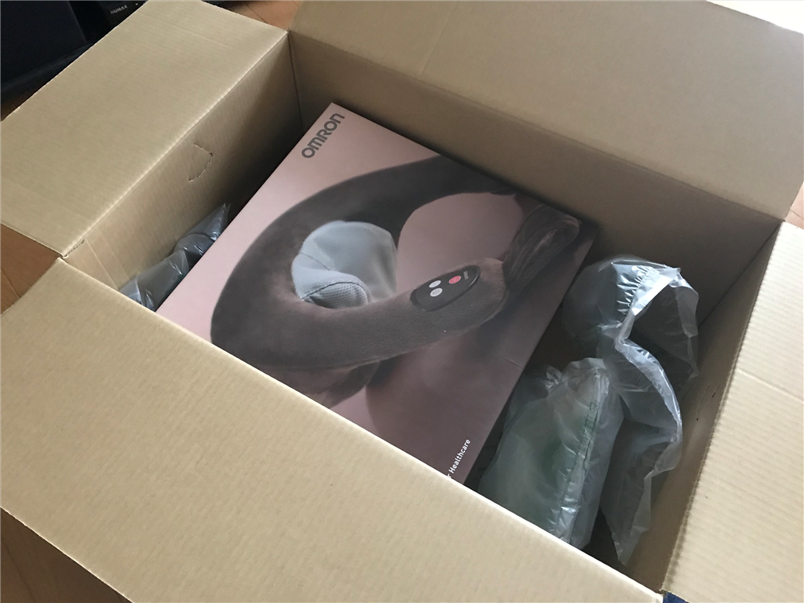
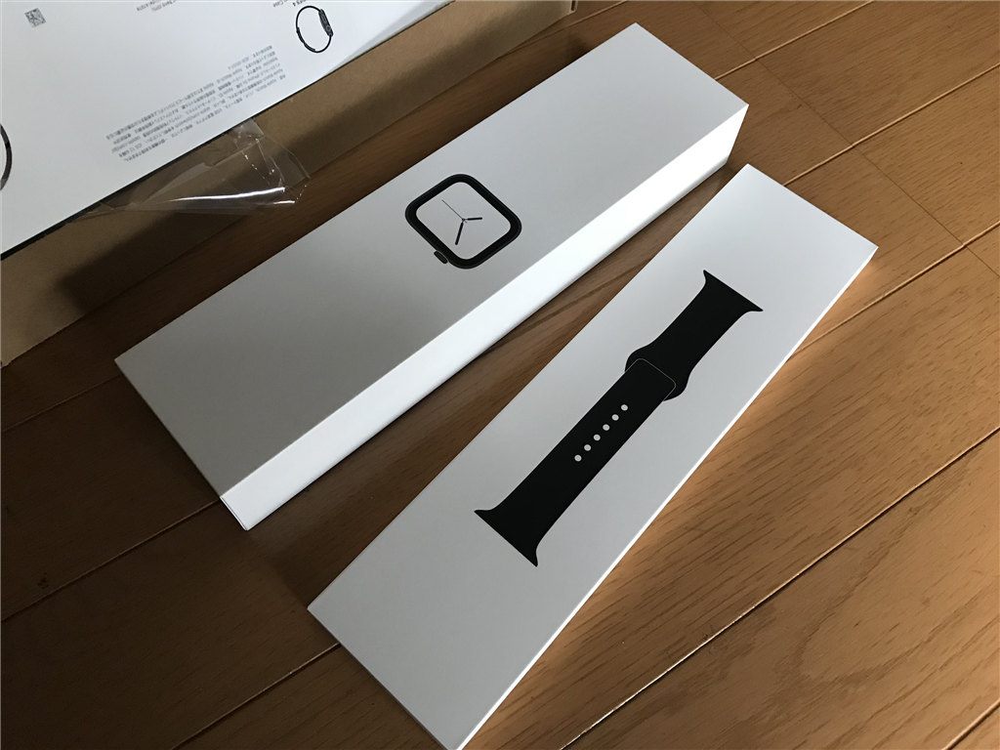

今日も朝の3時に目が覚めたので、ポチポチと仕事をした。一仕事終えて6時前にゴミを出し、コンビニでお菓子を買う。そこからさらに8時ぐらいまで仕事をすると、ちょっと眠くなってきたので布団にダイブ。そのまま寝てしまったようで、起きたら昼前だった。

その間にクロネコヤマトが荷物を持ってきてくれていたらしい。てっきり Apple Watch だと思って開けてみたところ――

ネックマッサージャーでした（ぁぅぁぅ

以前、おかんに買ってあげたネックマッサージャーが結構よかったので、同じようなのが欲しかったんだな。

<iframe src="https://hatenablog-parts.com/embed?url=https%3A%2F%2Fblog.daruyanagi.jp%2Fentry%2F2018%2F05%2F15%2F180320" title="5月12日：マッサージ器を衝動買いした - だるろぐ" class="embed-card embed-blogcard" scrolling="no" frameborder="0" style="display: block; width: 100%; height: 190px; max-width: 500px; margin: 10px 0px;"></iframe><cite class="hatena-citation"><a href="https://blog.daruyanagi.jp/entry/2018/05/15/180320">blog.daruyanagi.jp</a></cite>

自分で買ったのはオムロンの安いヤツ。

<a href="http://www.amazon.co.jp/exec/obidos/ASIN/B00LSG6JSC/bestylesnet-22/">オムロン ネックマッサージャー ブラウン HM-141-BW</a>
<ul><li>出版社/メーカー: オムロン(OMRON)</li><li>発売日: 2014/07/18</li><li>メディア: ホーム&キッチン</li><li><a href="http://d.hatena.ne.jp/asin/B00LSG6JSC/bestylesnet-22" target="_blank">この商品を含むブログ (2件) を見る</a></li></ul>

試しに使ってみたけど……前のものに比べると全然ダメだった。

まず、<b>コードが邪魔</b>。行動範囲にも制約がかかるし、折ったままコードが固まってしまっていて、マッサージしながらコードを伸ばしたら抜けて、マッサージが止まってしまった。AC アダプターの取り回しもめんどい。

肝心の<b>マッサージ機能もイマイチ</b>。もみ玉が小さいからか？　ガッチガチになった自分の肩にはあまり効かない。首以外にもさまざまな箇所で使えると謳ってるけど、<b>実質的には首専用なデザインもイマイチ</b>。これで背中とか足とかマッサージできるのかなぁ……。

前のヤツはもみ玉が大小2つずつ（？）あって、逆回転もできた。また、大雑把なデザインなので、首へのすわりは確かに悪かったけど、その分、肩甲骨なんかにも当てやすくて自由がきいた。まぁ、値段が倍ぐらい違うので比べるのはかわいそうだけど、んー……ここまで違うものかと思った。

気に入らないから返品、というのは Amazon を10年以上使ってて一度もやったことがないのだけど、これは返品して、おかんに買ってあげたやつと同じのを買おうかなと考えている。

あと、NAS に挿すための HDD が同梱されてたけど、その作業は週末にでもやるつもり。2ベイあるのに7年モノの HDD を1台しか挿さず、そのままずっとだましだまし運用してきたから、そろそろ限界だと思う。壊れる前に交換できそうでよかった（フラグ

ちなみに、Apple Watch は昼一でちゃんときた。午後3時ぐらいに開封してみたけど、結構気に入っている。これに関しては数日使ってから改めて触れるかもしれないし、触れないかもしれない。

