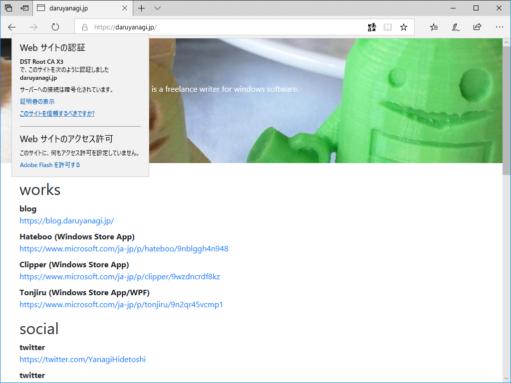

今週は3連休。外に行く元気もないので、このお休みは溜まってるインドア仕事を片付ける。まずは、サイトのお手入れ。はてなのおかげで blog.daruyanagi.jp が HTTPS になったのに、メイン（？）の daruyanagi.jp は HTTP のままでカッコ悪いなぁ、と思っていたところだったし、本腰を入れてやる。

現状、daruyanagi.jp は

<ul>
<li>ASP.NET Core Razor Pages：表はたいして何もないのだけど、ウラで謎の仕組みがいろいろ動いている
<ul>
<li>無職の仕事を楽にするためのツール</li>
<li>旧ブログ（かつて daruyanagi.jp ではてなブログを運営していた）からのリダイレクト</li>
</ul></li>
<li>Microsoft Azure の共有プランで独自ドメインを割り当てて運用（月1,000円ぐらい）</li>
</ul>
みたいな感じ。Microsoft Azure の共有プランは SSL をサポートしていないので、このままでは HTTPS 化できない。SSL 対応のベーシックプランにアップグレードすると、月7,000円ぐらいかかる。

たいしたサイトじゃないのに月7,000円もかけてはいられないし、できればタダでできないかなーと思ってたのだけど、GitHub Pages＋Let's encrypt ならば結構簡単にできそうだ。――というわけで、

<ul>
<li>今の daruyanagi.jp は独自ドメインを外す（引き続き daruyanagi.azurewebsites.net でアクセスできるので、ツール類の移行は不要。リダイレクトは数年以上やってたわけで、いい加減いいだろう）</li>
<li>GitHub Pages で HTTPS なペライチのサイトを立てて、これに daruyanagi.jp を割り当てる</li>
</ul>
みたいな感じでやってみた。

やり方はあちこちで解説されてるし、ぶっちゃけ公式のマニュアルみれば誰でもできると思うので割愛。ただ、HTTPS のオプションを有効化してから実際に反映されるまで少し時間がかかったのはちょっと不安で、そこだけあわあわしてしまった。ガチャガチャしてるうちに反映されて、無事使えるようになった。

<blockquote class="twitter-tweet" data-lang="HASH(0xc4a5d78)">
GitHub Pages で <a href="https://t.co/uJG0Fdi9by">https://t.co/uJG0Fdi9by</a> を HTTPS にしてる。もう少し待たないといけないみたい <a href="https://t.co/kCyLNdKm5M">pic.twitter.com/kCyLNdKm5M</a>
&mdash; だるやなぎ准将 (@daruyanagi) <a href="https://twitter.com/daruyanagi/status/1043382470861762560?ref_src=twsrc%5Etfw">September 22, 2018</a></blockquote>

<blockquote class="twitter-tweet" data-lang="HASH(0xbcb33c8)">
ぉ、いけたわ？ <a href="https://t.co/lnKuBSZjZE">pic.twitter.com/lnKuBSZjZE</a>
&mdash; だるやなぎ准将 (@daruyanagi) <a href="https://twitter.com/daruyanagi/status/1043382782163005441?ref_src=twsrc%5Etfw">September 22, 2018</a></blockquote>

<blockquote class="twitter-tweet" data-lang="HASH(0xca75af0)">
だめだな？ <a href="https://t.co/0Cj76LVvvI">pic.twitter.com/0Cj76LVvvI</a>
&mdash; だるやなぎ准将 (@daruyanagi) <a href="https://twitter.com/daruyanagi/status/1043383213886853120?ref_src=twsrc%5Etfw">September 22, 2018</a></blockquote>

<blockquote class="twitter-tweet" data-lang="HASH(0xcbbc3b8)">
HTTPS なったー <a href="https://t.co/1FSxr4NYUv">pic.twitter.com/1FSxr4NYUv</a>
&mdash; だるやなぎ准将 (@daruyanagi) <a href="https://twitter.com/daruyanagi/status/1043384844086996994?ref_src=twsrc%5Etfw">September 22, 2018</a></blockquote>

デザインも新しく……っていうか、手打ちでちょろちょろっと組んでポイっとあげておいた。あんまりテストしてないし、なんか味気ないけど、まぁ、おいおい充実させていくことにする。

