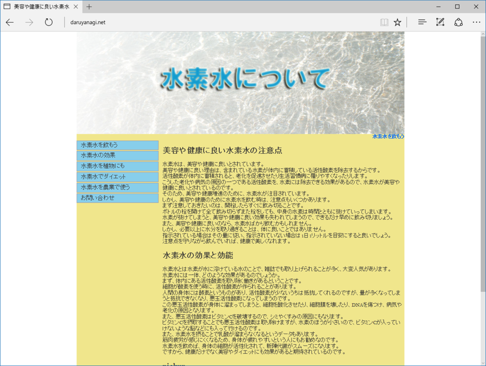
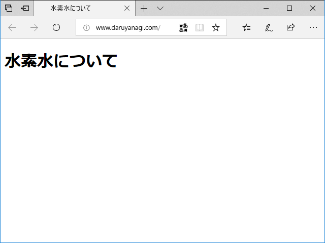

<h3>2015年4月：daruyanagi.net  を失う</h3>

<iframe src="https://hatenablog-parts.com/embed?url=https%3A%2F%2Fblog.daruyanagi.jp%2Fentry%2F2015%2F04%2F28%2F070348" title="ドメインの延長手続きミスに伴う連絡先の変更について - だるろぐ" class="embed-card embed-blogcard" scrolling="no" frameborder="0" style="display: block; width: 100%; height: 190px; max-width: 500px; margin: 10px 0px;"></iframe><cite class="hatena-citation"><a href="https://blog.daruyanagi.jp/entry/2015/04/28/070348">blog.daruyanagi.jp</a></cite>

daruyanagi.net のドメイン更新手続きを失念していて、所有権を失う。当時、このドメインは Value-Domain で管理してもらってたのだけど、「お金をチャージして更新手数料を払う」というちょっとめんどくさいシステムだった。クレジットカードがなかった高校生時代、XREA サーバーでお世話になってたころはそれがありがたかったのだけど、この時はさすがにちょっと Value-Domain を呪った……クレカで自動更新できたらよかったのに！<a href="#f-36559e86" name="fn-36559e86" title="今はできるよ">*1</a>　通知メールがスパム扱いされていて、完全に気付かなかった。

他にもドメインはもっていたのだけど、daruyanagi.net は

<ul>
<li>daruyanagi.net：ExpressWeb（ASP.NET） ＋独自ドメインでホームページを運用</li>
<li>mail.daruyanagi.net：Google Apps（現：GSuite）の無償プランでメールサービスを運用（メイン）</li>
</ul>
みたいな感じでフル活用していたので、喪失はかなり痛手だった。なかでも一番のショックは、みつばたん（<a href="http://c-mitsuba.com/">http://c-mitsuba.com/</a>）にデザインしてもらった名刺が配れなくなったこと……メールアドレスが印刷されていたのに、それが失効してしまった／(^o^)＼

<h3>2016年9月：daruyanagi.net  で水素水のアピールが始まる</h3>

ドメインを喪失して傷心の俺さまをあざ笑うかのように、daruyanagi.net  で水素水のサイトが建立される。

<blockquote class="twitter-tweet" data-lang="ja">
てか、<a href="https://t.co/V4lJHhUzOS">https://t.co/V4lJHhUzOS</a> が水素水のページになっててくそわろ
&mdash; しばやん (@shibayan) <a href="https://twitter.com/shibayan/status/780306879993884673?ref_src=twsrc%5Etfw">2016年9月26日</a></blockquote>

<blockquote class="twitter-tweet" data-lang="ja">
なるほど、 daruyanagi .net  のようなかつてはすごいPVを誇っていたドメインを高ドメインパワーとよび、そのパワーを使って水素水を宣伝するということか
&mdash; たなか (@tanaka_733) <a href="https://twitter.com/tanaka_733/status/1019851391840354304?ref_src=twsrc%5Etfw">2018年7月19日</a></blockquote> 

<h3>2017年ごろ：水素水への憎悪が心に満ち溢れる</h3>

「水素水」というキーワードを耳にするたびに憎悪、諦観、悲痛、嘲笑、自虐……さまざまな反応を示しており、精神に多大な負担がかかっていることが伺える。

<blockquote class="twitter-tweet" data-lang="ja">
おう、水素水とか売ってるやつは早くくたばれw
&mdash; だるやなぎ准将 (@daruyanagi) <a href="https://twitter.com/daruyanagi/status/827127141363961856?ref_src=twsrc%5Etfw">2017年2月2日</a></blockquote>

<blockquote class="twitter-tweet" data-lang="ja">
ウケるｗ / “「インチキ水素水」ブログ、「中傷だ」と日本トリムが研究者提訴（1/2ページ） - 産経WEST” <a href="https://t.co/ioBo5EQT8N">https://t.co/ioBo5EQT8N</a>
&mdash; だるやなぎ准将 (@daruyanagi) <a href="https://twitter.com/daruyanagi/status/852510925177241600?ref_src=twsrc%5Etfw">2017年4月13日</a></blockquote>

<blockquote class="twitter-tweet" data-lang="ja">
<a href="https://t.co/IMS2MHSp5b">https://t.co/IMS2MHSp5b</a> で水素水について学んでる
&mdash; だるやなぎ准将 (@daruyanagi) <a href="https://twitter.com/daruyanagi/status/854278025059254272?ref_src=twsrc%5Etfw">2017年4月18日</a></blockquote>

<blockquote class="twitter-tweet" data-lang="ja">
ドメイン喪失して水素水の解説サイトにされるやつはなにやってもダメ
&mdash; だるやなぎ准将 (@daruyanagi) <a href="https://twitter.com/daruyanagi/status/855286306380824576?ref_src=twsrc%5Etfw">2017年4月21日</a></blockquote>

<blockquote class="twitter-tweet" data-lang="ja">
いつも思うんだけど、 自分のWEBページを水素水が乗っ取ってしまうのってすごく悲しい…
&mdash; だるやなぎ准将 (@daruyanagi) <a href="https://twitter.com/daruyanagi/status/875411528844955648?ref_src=twsrc%5Etfw">2017年6月15日</a></blockquote>

<blockquote class="twitter-tweet" data-lang="ja">
近所に水素水の店ができたんだが、ドメインの更新忘れて水素水のサイトにされた俺への当てつけか
&mdash; だるやなぎ准将 (@daruyanagi) <a href="https://twitter.com/daruyanagi/status/1012711109231460361?ref_src=twsrc%5Etfw">2018年6月29日</a></blockquote> 

<h3>2018年9月初め</h3>

世界でただ一人の熱心な daruyanagi.net ウォッチャー・しばやん氏によって daruyanagi.net の異変が報じられる。

<blockquote class="twitter-tweet" data-lang="ja">
<a href="https://t.co/V4lJHhUzOS">https://t.co/V4lJHhUzOS</a> が水素水じゃなくなっている
&mdash; しばやん (@shibayan) <a href="https://twitter.com/shibayan/status/1039404423498190849?ref_src=twsrc%5Etfw">2018年9月11日</a></blockquote> 

<h3>2018年9月22日</h3>

なぜかお名前ドットコムで「daruyanagi.net」が売りに出されるのをウォッチしていたという @jz5 によって daruyanagi.net が購入可能になったという情報がもたらされる。

<blockquote class="twitter-tweet" data-lang="ja">
<a href="https://twitter.com/daruyanagi?ref_src=twsrc%5Etfw">@daruyanagi</a> 水素水サイト消えた 水素水売ってくれ
&mdash; ＪＺ５ (@jz5) <a href="https://twitter.com/jz5/status/1043372421082836993?ref_src=twsrc%5Etfw">2018年9月22日</a></blockquote>

Value-Domain ではまだ買えなかったが、確かにお名前ドットコムでは買える。早速アカウントを作成して、daruyanagi.net（1年分）を購入した。

<h3>今後の daruyanagi.net</h3>

お名前ドットコムで Google Apps の設定をやり直したのだけど、いまだにちゃんと名前解決されない。使い勝手にも違和感を感じた（なにかとドメインや有償サービスを売りつけようとする、コントロールパネルが大変使いにくい）ので、現在は Value-Domain への移管中。来週ぐらいには復活させられたらいいなぁ。

<blockquote class="twitter-tweet" data-lang="ja">
水素水のサイト作らないと……
&mdash; だるやなぎ准将 (@daruyanagi) <a href="https://twitter.com/daruyanagi/status/1043378419386306560?ref_src=twsrc%5Etfw">2018年9月22日</a></blockquote> 

<h3>謝辞</h3>

お名前ドットコムで daruyanagi.net を購入して僕に高値で売りつけることもできたにもかかわらず、情報を知らせてくれた @jz5 に謝意を表し、うまい棒を贈りました。ありがとう、ありがとう！

<a href="http://www.amazon.co.jp/exec/obidos/ASIN/B07H4BNF1K/bestylesnet-22/">うまい棒「完全オトナ買いセット」限定味含む全16種×30本＋プレミアム3種×10本 計510本</a>
<ul><li>出版社/メーカー: やおきん</li><li>メディア: その他</li><li><a href="http://d.hatena.ne.jp/asin/B07H4BNF1K/bestylesnet-22" target="_blank">この商品を含むブログを見る</a></li></ul>

<h3>最後に</h3>

<blockquote class="twitter-tweet" data-lang="ja">
ヒトはみな、自分のドメインを水素水のサイトにされない権利を持つ。
&mdash; だるやなぎ准将 (@daruyanagi) <a href="https://twitter.com/daruyanagi/status/1043739899755548672?ref_src=twsrc%5Etfw">2018年9月23日</a></blockquote> 

<h3>怒りの追記（2018/09/24 14:00）</h3>

<blockquote class="twitter-tweet">
<a href="https://twitter.com/daruyanagi?ref_src=twsrc%5Etfw">@daruyanagi</a> <a href="https://twitter.com/kazuakix?ref_src=twsrc%5Etfw">@kazuakix</a> 取り急ぎ用意した <a href="https://t.co/CrwyKU4zML">https://t.co/CrwyKU4zML</a>
&mdash; しばやん (@shibayan) <a href="https://twitter.com/shibayan/status/1044087657473560577?ref_src=twsrc%5Etfw">September 24, 2018</a></blockquote>  

だるやなぎは激怒した。必ず、かの邪智暴虐の @shibayan を除かなければならぬと決意した。

<a href="#fn-36559e86" name="f-36559e86" class="footnote-number">*1</a>:今はできるよ

