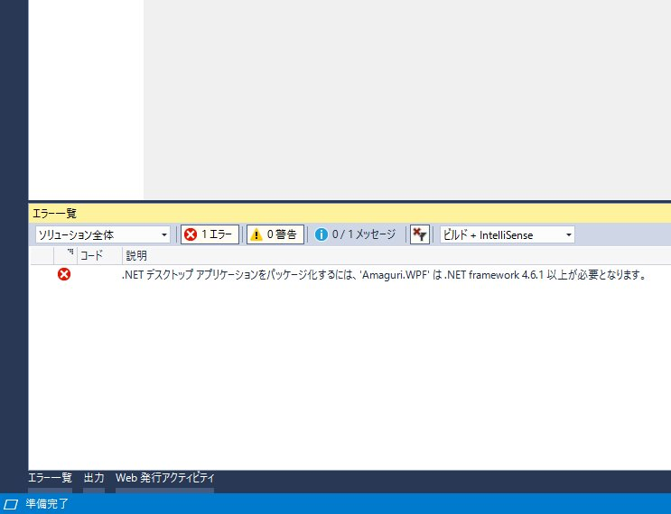

<iframe src="https://hatenablog-parts.com/embed?url=https%3A%2F%2Fblog.daruyanagi.jp%2Fentry%2F2018%2F08%2F26%2F224927" title="「Amaguri」v1.0.0.0 - だるろぐ" class="embed-card embed-blogcard" scrolling="no" frameborder="0" style="display: block; width: 100%; height: 190px; max-width: 500px; margin: 10px 0px;"></iframe><cite class="hatena-citation"><a href="https://blog.daruyanagi.jp/entry/2018/08/26/224927">blog.daruyanagi.jp</a></cite>

WPF アプリをストアに申請したのは2作目ですが、また新しく躓きました！

<h3>ターゲット フレームワーク '.NETCore,Version=v5.0' の mscorlib を解決できませんでした</h3>

Windows Application Package プロジェクトに Amaguri.WPF の参照を追加するとコケました。

<blockquote class="twitter-tweet">
プロジェクト システムでエラーが発生しました。  ターゲット フレームワーク &#39;.NETCore,Version=v5.0&#39; の mscorlib を解決できませんでした。これは、ターゲット フレームワークがインストールされていない場合、またはフレームワーク モニカーの形式が正しくない場合に発生する可能性があります。 <a href="https://t.co/gvVyEI3GxP">pic.twitter.com/gvVyEI3GxP</a>
&mdash; だるやなぎ准将 (@daruyanagi) <a href="https://twitter.com/daruyanagi/status/1044134050263314432?ref_src=twsrc%5Etfw">September 24, 2018</a></blockquote>  

最初、このエラーをみてもサッパリ意味が分からなかったのですが、そのままパッケージのビルドを進めてみると――

なんだ、そういうことか！　Desktop Bridge を利用するには .NET Framework 4.6.1 が必要なのだそうです。Amaguri はなぜか .NET Framework 4.5 で開発されていたので、フレームワークをアップデートして解決しました。

<h3>"プロセス起動" に関連した System.Diagnostics.Process.Start への参照があります</h3>

<blockquote class="twitter-tweet">
んー？　無視していいのかなぁ…… System.Diagnostics.Process.Start() が S mode でダメかもって怒られら <a href="https://t.co/RUBZha1fH5">pic.twitter.com/RUBZha1fH5</a>
&mdash; だるやなぎ准将 (@daruyanagi) <a href="https://twitter.com/daruyanagi/status/1044136465062477824?ref_src=twsrc%5Etfw">September 24, 2018</a></blockquote>  

Desktop Bridge アプリは System.Diagnostics.Process.Start() で外部アプリを起動することができないらしい。ハイパーリンクをクリックしたらウチのサイトにジャンプするというだけの処理なのだけど……うーん。

<pre class="code lang-cs" data-lang="cs" data-unlink>private void Hyperlink_Click(object sender, RoutedEventArgs e)
{
System.Diagnostics.Process.Start(&quot;https://blog.daruyanagi.jp/&quot;);
}
</pre>
最初はこの処理を削るしかないのかなと思っていたのですが、DesktopBridge.Helpers という NuGet を導入して「UWP で実行されている時だけ System.Diagnostics.Process.Start()  を実行しない」という処理を加えてみると、認定キットに合格することができました。

<pre class="code lang-cs" data-lang="cs" data-unlink>private void Hyperlink_Click(object sender, RoutedEventArgs e)
{
if (!IsRunningAsUwp())
{
System.Diagnostics.Process.Start(&quot;https://blog.daruyanagi.jp/&quot;);
}
}

public bool IsRunningAsUwp()
{
DesktopBridge.Helpers helpers = new DesktopBridge.Helpers();
return helpers.IsRunningAsUwp();
}
</pre>
IsRunningAsUwp() は公式サイトにあるサンプルコードそのままです。ソースコードをのぞいてみたのですが、GetCurrentPackageFullName() という API を呼んでみてエラーが出るかどうかで判別してるようですね。なるほでぃうす。

<iframe src="https://hatenablog-parts.com/embed?url=https%3A%2F%2Fgithub.com%2Fqmatteoq%2FDesktopBridgeHelpers" title="qmatteoq/DesktopBridgeHelpers" class="embed-card embed-webcard" scrolling="no" frameborder="0" style="display: block; width: 100%; height: 155px; max-width: 500px; margin: 10px 0px;"></iframe><cite class="hatena-citation"><a href="https://github.com/qmatteoq/DesktopBridgeHelpers">github.com</a></cite>

さてはて、S Mode でテストしてないので「クリップボードの画像をデスクトップに保存する」機能あたりでクラッシュしそうな気もするのですが、そのままストアに通ってくれるとありがたいなぁ。

