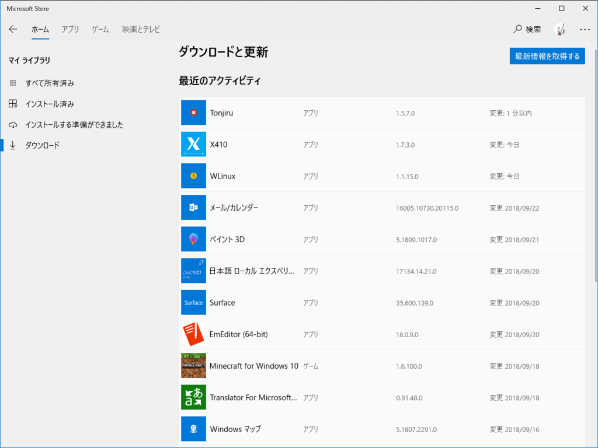

デスクトップで開いているウィンドウをまとめて閉じてすっきりさせるアプリ「Tonjiru」をアップデートしました（連休中に宣言した「インドアタスクを片付ける」の成果です♡）。ストアでの配信も始まっているようです。

<blockquote class="twitter-tweet" data-lang="HASH(0xef7d220)">
ストアに提出なう / “v1.5.0.0” <a href="https://t.co/6Npkr66dSb">https://t.co/6Npkr66dSb</a>
&mdash; だるやなぎ准将 (@daruyanagi) <a href="https://twitter.com/daruyanagi/status/1044132406041575424?ref_src=twsrc%5Etfw">September 24, 2018</a></blockquote>

（WPF バイナリのバージョンは 1.5.0.0 ですが、ストアパッケージはビルドするたびにマイナーバージョンがあがるので 1.5.7.0  です。まぁ、ビルドやリビジョンのナンバーはどうでもいいさね）

ストアに提出してから24時間ほどで審査を通過。WPF/Desktop Bridge なアプリですが、2回目からは審査が早いですね。

<iframe src="https://hatenablog-parts.com/embed?url=https%3A%2F%2Fwww.microsoft.com%2Fja-jp%2Fp%2Ftonjiru%2F9n2qr45vcmp1" title="Tonjiru を入手 - Microsoft Store ja-JP" class="embed-card embed-webcard" scrolling="no" frameborder="0" style="display: block; width: 100%; height: 155px; max-width: 500px; margin: 10px 0px;"></iframe><cite class="hatena-citation"><a href="https://www.microsoft.com/ja-jp/p/tonjiru/9n2qr45vcmp1">www.microsoft.com</a></cite>

v1.5 の目玉は――ウィンドウリストの更新時にしょぼいローディング画面を出すようになったことです。しょぼくても、あるのとないのとではえらい違いだよね。

ついでに、ローディング中はツールバーのボタンを無効化しました。イジるとクラッシュしてたんや……それに関連してエラー処理も足しています。

あと、ローディングにかかる時間がめっちゃ短縮されました。初期リリースのコードは「とりあえず動く」程度だったので直さないといけないなーと思ってたのですが……ちょろっといじったら劇的に早くなって、「もしかしてローディング画面いらんかったんちゃう……」って感じです。まぁ、アプリは堅固にしないとね、やっぱりちゃんとエラーチェックや待機エフェクトは大事だよね。

そのほかにも、デスクトップ版には入れてたけどストア版には入ってなかったジャンプリストの微修正やらなんやらいろいろマシになっています。このアプリを使っているのは世界で僕だけのような気もしますが、せっかくストアに申請したし、そのとき無駄に苦労した分大事にアップデートしたいと思います。

