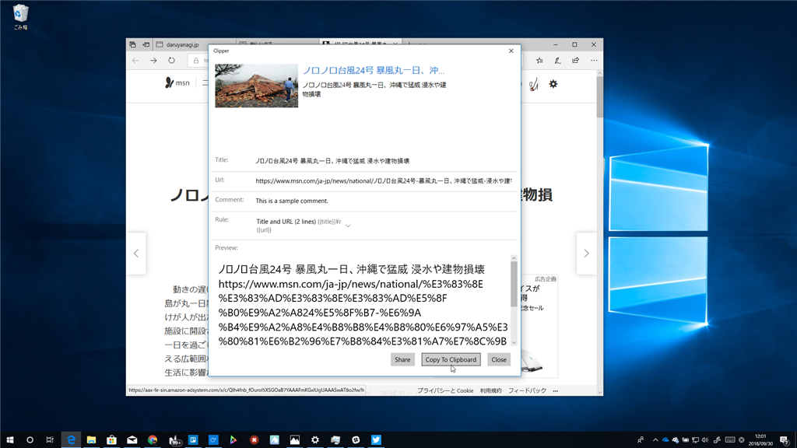

「Clipper」は、「Create Link」拡張機能のようなのを「Microsoft Edge」でもやりたいなーと思って作った UWP アプリです。タイトルと URL を好きな書式（HTML、markdown、wiki……）でクリップボードにコピーできます。

1年以上ぶりのアップデートで以下の問題点が修正されました。

<ul>
<li>共有画面の上部に表示している Web プレビュー（Html Fragment）がすごく長くなるアプリがあって、他のコントロールが隠れてしまう（操作不能になる）ことがあった問題</li>
<li>日本語を含むサイトの URL がときどきエンコードされないので、自分でちゃんとエンコードするようにした</li>
</ul>
大したアプリではないですが、気に入ったら使ってあげてください。

<iframe src="https://hatenablog-parts.com/embed?url=https%3A%2F%2Fwww.microsoft.com%2Fja-jp%2Fp%2Fclipper%2F9wzdncrdf8kz" title="Clipper を入手 - Microsoft Store ja-JP" class="embed-card embed-webcard" scrolling="no" frameborder="0" style="display: block; width: 100%; height: 155px; max-width: 500px; margin: 10px 0px;"></iframe><cite class="hatena-citation"><a href="https://www.microsoft.com/ja-jp/p/clipper/9wzdncrdf8kz">www.microsoft.com</a></cite> 

<h3>追伸</h3>

Microsoft Edge 氏、選択テキストの情報も Share してくだされー（大昔はできてたんだけどな……

