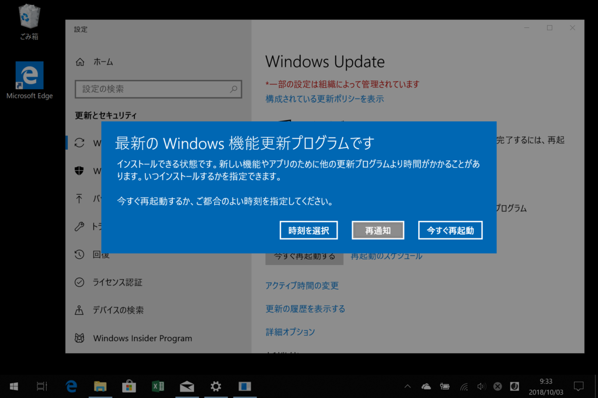

今朝は Surface の新製品の発表があったそうですが、なんかそのどさくさに埋もれる感じで Windows 10 RS 5、バージョン 1809 がリリースされました。Insider Program のブログには「まだ最終版じゃないよ！」みたいなことが書いてあったはずですが、ずいぶんあっさりですね。Release Preview リング？　知らない子ですね……。

<iframe src="https://hatenablog-parts.com/embed?url=https%3A%2F%2Fforest.watch.impress.co.jp%2Fdocs%2Fnews%2F1146013.html" title="Microsoft、「Windows 10 October 2018 Update」の一般提供を開始／“Windows Update”を通じて対応デバイスから順次配信。手動更新ツールも提供" class="embed-card embed-webcard" scrolling="no" frameborder="0" style="display: block; width: 100%; height: 155px; max-width: 500px; margin: 10px 0px;"></iframe><cite class="hatena-citation"><a href="https://forest.watch.impress.co.jp/docs/news/1146013.html">forest.watch.impress.co.jp</a></cite>

というわけで、さっそくうちもアップデートしてみました。

<h3>Surface Book 2</h3>

Windows Update 経由では降ってこなかったので、更新アシスタントで無理やり入れてみました。

なんかウィンドウの縁がふとましくなったので、速攻ロールバックしました。Windows Update で配ってなかったのには意味があるんですね（納得

ちなみに、ロールバックは3分ぐらいで終わりました。早すぎ！

ちなみに Your Phone＋Essential Phone PH-1 はバッチリ動きました。複数台からのアクセス（1903、1803 Fast Ring、1803 Release）も問題なくできますね……これはかなり便利。ノッチ が邪魔で Android コンパニオンアプリの操作が不能になる問題（フィードバック済み）も最新版ではしっかり直っていて、中の人を思いっきり褒めてあげたい気分です。

<h3>Surface Go</h3>

こっちは普通に Windows Update 経由でインストールできました。

再起動を促されてからの所要時間は15分ほど。トイレで少し長いうんちしてる間に終わります。ただ Surface Book 2 のときもそうだったんですが、アップデートしたあと最初のログインには少し時間がかかりました。認証だけ済ませて、ラジオ体操でもするとよいのではないでしょうか。

こっちはなんの問題もなし。S モードのままだしね！

<h3>Macbook（Bootcamp）</h3>

ふぁっ？　まだ 1803 にすらしてなかったぜ！！

