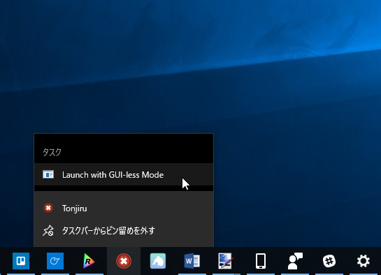
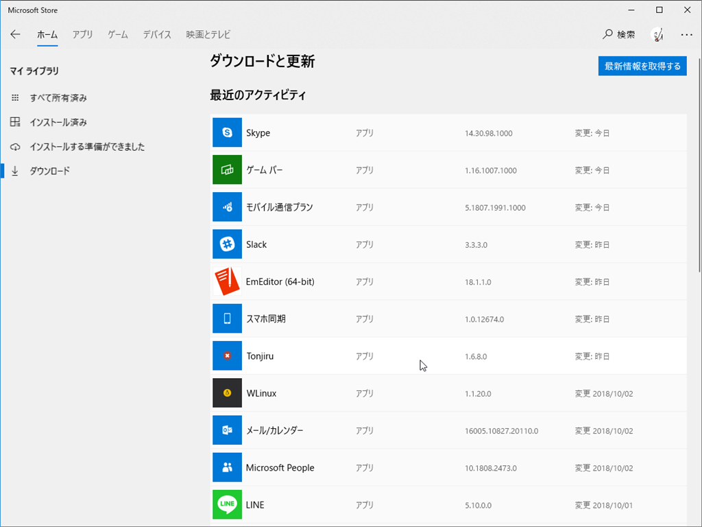

Tonjiru には UI を出さずにウィンドウだけ閉じる機能があるのですが、そこだけ（1.5 で改修した新しいリストではなく）古い除外リストを読むバグがあったのでサクッと直してストアに申請しました。

昨日あたり降ってきてるはずです。

教訓：同じような処理は一つにまとめましょう。

<iframe src="https://hatenablog-parts.com/embed?url=https%3A%2F%2Fwww.microsoft.com%2Fja-jp%2Fp%2Ftonjiru%2F9n2qr45vcmp1" title="Tonjiru を入手 - Microsoft Store ja-JP" class="embed-card embed-webcard" scrolling="no" frameborder="0" style="display: block; width: 100%; height: 155px; max-width: 500px; margin: 10px 0px;"></iframe><cite class="hatena-citation"><a href="https://www.microsoft.com/ja-jp/p/tonjiru/9n2qr45vcmp1">www.microsoft.com</a></cite>

