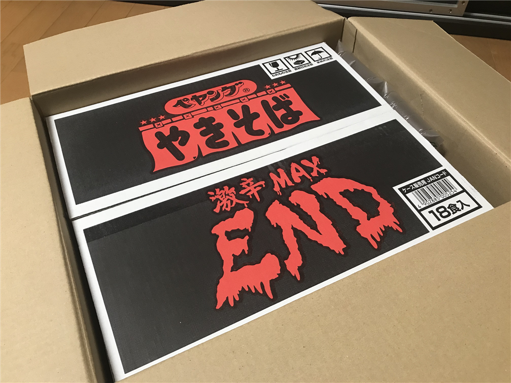
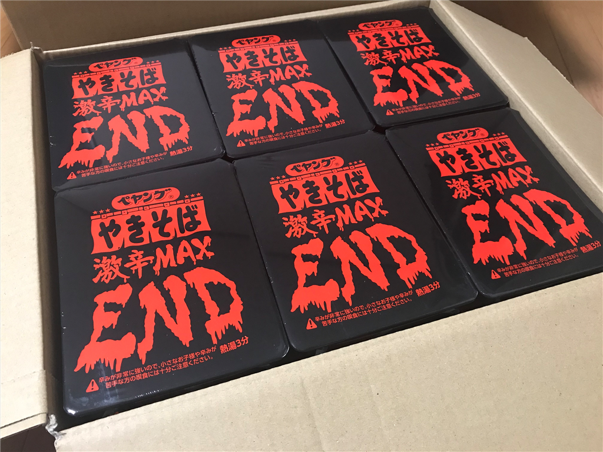
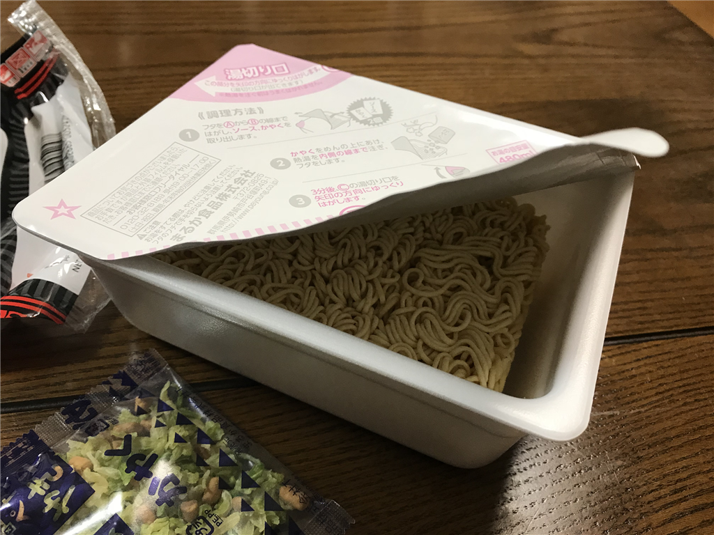
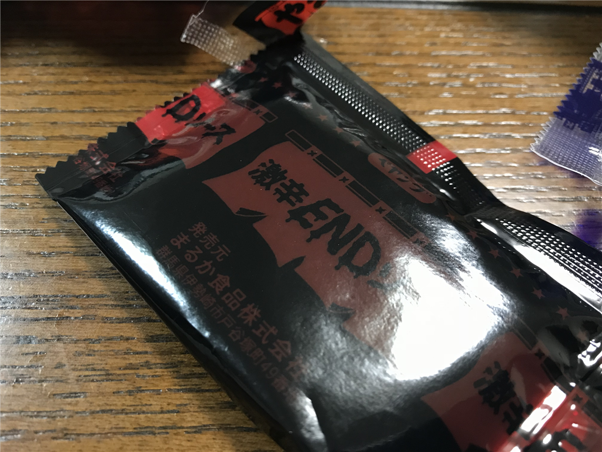
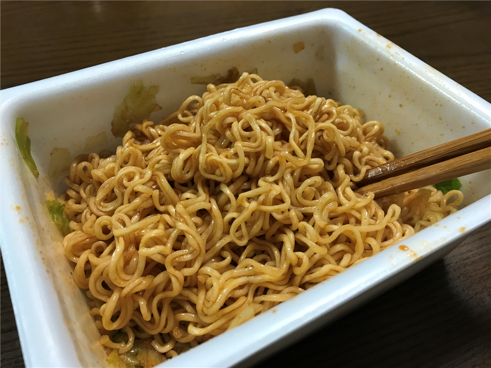
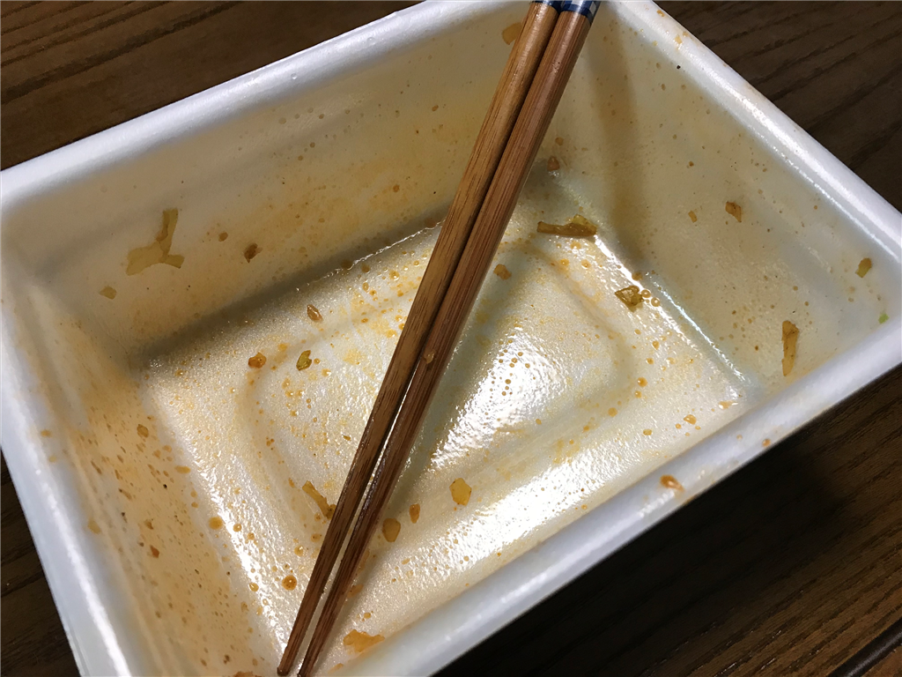

1カ月前の今日、とある方から「ペヤング 激辛やきそばEND」が送られてきました。

<blockquote cite="http://www.peyoung.co.jp/products/1041/">

ペヤング史上最強の激辛！ 
体中が熱く燃え上がる一品！

<cite><a href="http://www.peyoung.co.jp/products/1041/">&#x30DA;&#x30E4;&#x30F3;&#x30B0; &#x6FC0;&#x8F9B;&#x3084;&#x304D;&#x305D;&#x3070;END &nbsp;|&nbsp; &#x307E;&#x308B;&#x304B;&#x98DF;&#x54C1;&#x682A;&#x5F0F;&#x4F1A;&#x793E;</a></cite>
</blockquote>

イヤな予感しかしないのですが、だるやなぎたるもの、送られてきたものはありがたく食べなければなりません。仕方なく食べてみました。一応念のため、<b>食べる前に明日、何か予定がないか確認しておきます</b>。腹痛で外に出られない可能性というのもないわけではない。

それにしても、毎度毎度、結構な量です。辛辛魚だって、まぁ何個か残ってるぞ……。

フィルムさえはがしてしまえば、割とフツーのペヤングです。作り方も一緒。

ただ、ソースは（見た目が）どす黒い。送り主の悪意が感じられます。これを食って、ケツから血を出せという怨念が伝わってくる。

ぶっちゃけこのソースを調節すれば辛さを抑えられるのでは、とも思うのですが、そこは紳士なので最後の一滴まで絞りきってぶち込みます。

混ぜ混ぜすると、結構おいしそうなにおいがします。カップ焼きそばの匂いって、ちょっと独特でいいと思いませんか？　自分はなぜか、小学校の頃を思い出す。半ドンの土曜日、おかんが昼飯を作るのを面倒くさがってカップ焼きそばだったことがあったのですが（いや、いつもは割とちゃんと作ってくれたよ？）、うちはあんまりカップ麺を食べさせてくれる家庭ではなかったので、ちょっとうれしかった。

たまたまなかったのですが、マヨネーズなんかを添えると辛みを抑えられてよさそう。今回は青のりだけ足しました。

完食！　ぶっちゃけ、<b>言うほど辛くなかった</b>です。今までの辛いモノで鍛えられすぎたせいだろうか……まぁ、確かにしたがヒリヒリするものの、「これは無理だ！」という感触はなく、大変印象の薄い味だったかも。どれぐらい印象がなかったかというと、1カ月たってレビューを催促されるまで食ったことを忘れてたぐらい……。

<blockquote class="twitter-tweet">
辛いやつのレビュー書いてないやろ
&mdash; しばやん (@shibayan) <a href="https://twitter.com/shibayan/status/1051715431516405760?ref_src=twsrc%5Etfw">October 15, 2018</a></blockquote>  

まぁ、でも、ペヤングブランドで暴れられるのはコレが限界だよね。一般人にはちょっと辛いと思う。

試しに親父に食わせたところ、一口食う前から、立ち上る辛気を鼻から吸い込み、思いっきりムセてた。きったねー！

<a href="http://www.amazon.co.jp/exec/obidos/ASIN/B07GKY1DBJ/bestylesnet-22/">ペヤング 激辛やきそばEND 119g×18個</a>
<ul><li>出版社/メーカー: まるか商事</li><li>発売日: 2018/08/27</li><li>メディア: 食品&飲料</li><li><a href="http://d.hatena.ne.jp/asin/B07GKY1DBJ/bestylesnet-22" target="_blank">この商品を含むブログを見る</a></li></ul>

