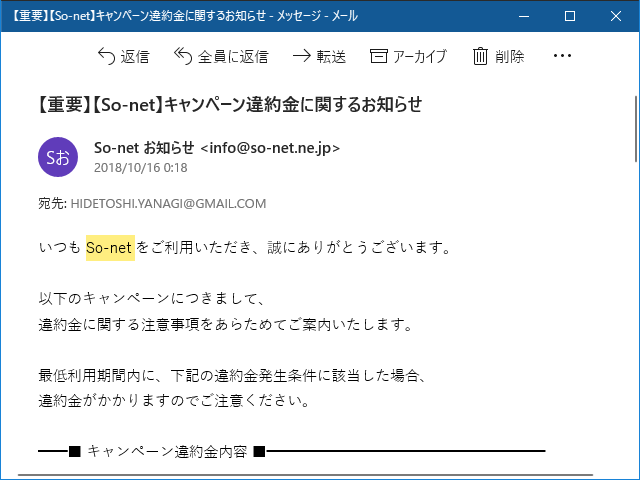

プロバイダーを乗り換えて早1年――というわけで、キャッシュバック 20,000 円×2 をもらってきました。

<iframe src="https://hatenablog-parts.com/embed?url=https%3A%2F%2Fblog.daruyanagi.jp%2Fentry%2F2017%2F11%2F23%2F203927" title="So-net と契約してネット回線を通した - だるろぐ" class="embed-card embed-blogcard" scrolling="no" frameborder="0" style="display: block; width: 100%; height: 190px; max-width: 500px; margin: 10px 0px;"></iframe><cite class="hatena-citation"><a href="https://blog.daruyanagi.jp/entry/2017/11/23/203927">blog.daruyanagi.jp</a></cite>

GMOとくとくBB のときはちゃんともらえるのか不安だったのですが、So-net はちゃんとメールとアプリで催促してくれて良心的な感じ。申し込みから振り込みまでも一瞬でした。

光回線の場合：（いちいちメールで通知が来る）

<ul>
<li>2018/10/15 9:38：ログイン</li>
<li>2018/10/15 10:00：キャッシュバックの送金完了</li>
</ul>
同時期に契約した WiMax2 の場合：

<ul>
<li>2018/10/25 11:32：ログイン</li>
<li>2018/10/25 11:41：キャッシュバックの送金完了</li>
</ul>
このスピード感はなかなかいい……んだけど、光回線の方はすぐに追いメールがきて、ちゃんと違約金の念押しをされました(;^ω^)

20/05/31 まで使わないと違約金 19,000円（不課税）がとられるとの由。退会だけでなく、コース変更の場合でもかかるのかー。結局、キャッシュバックをもらったはいいが違約金で吐き出すってことになりそう。おいしい話はないってことだね。

