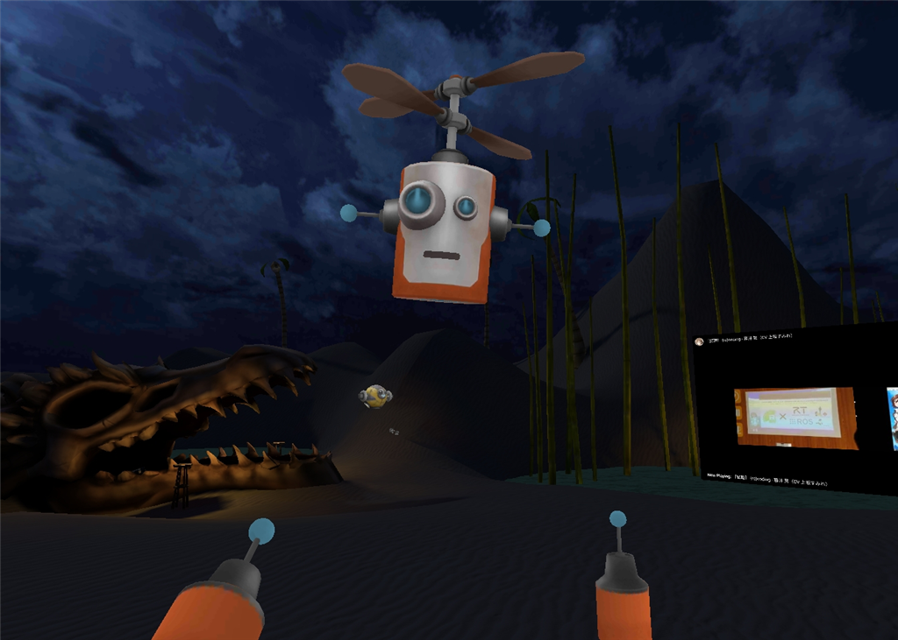
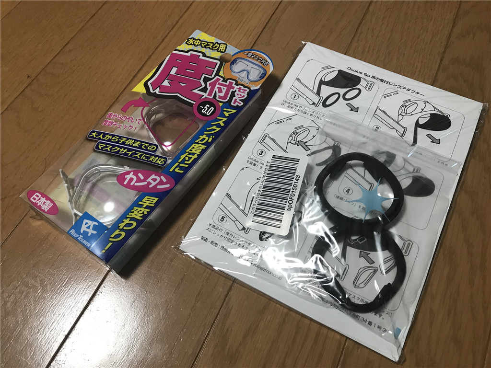
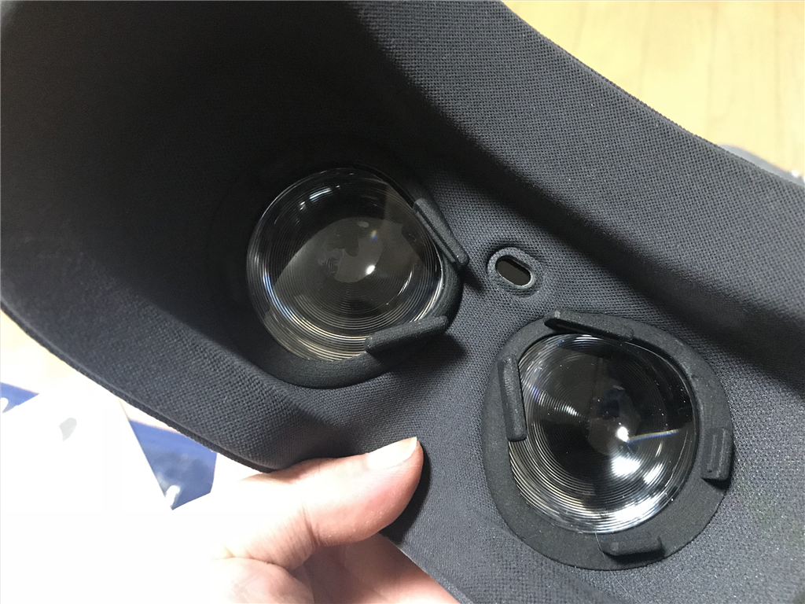
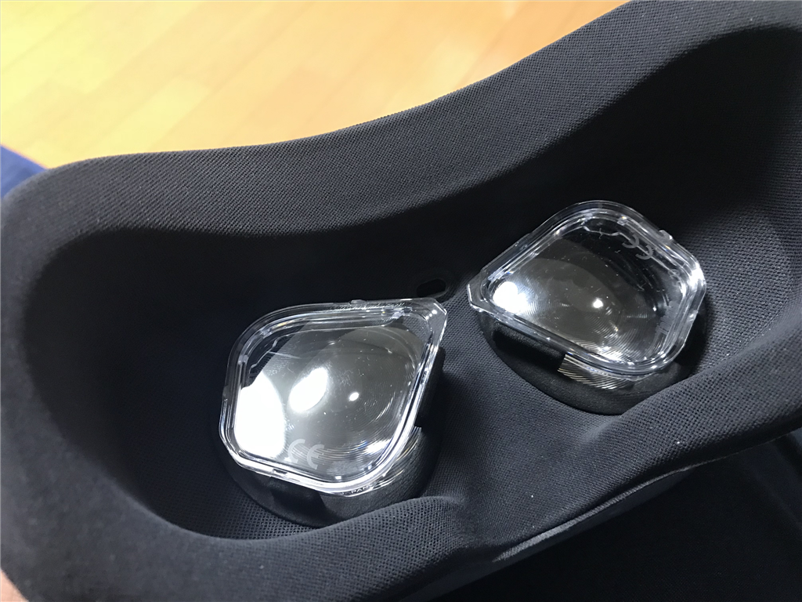
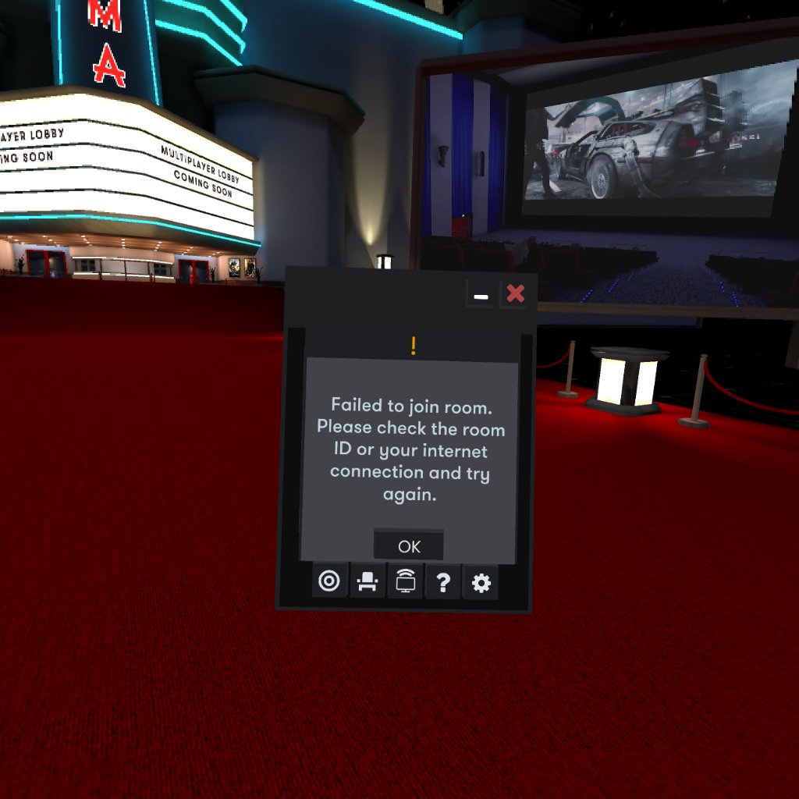
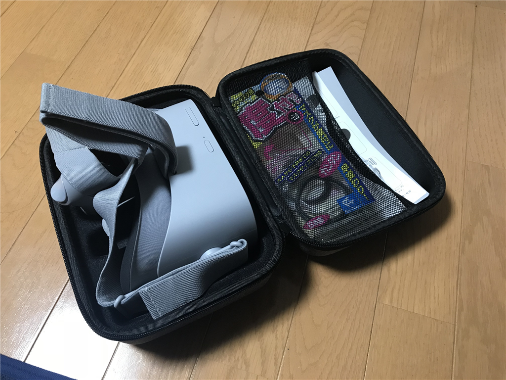
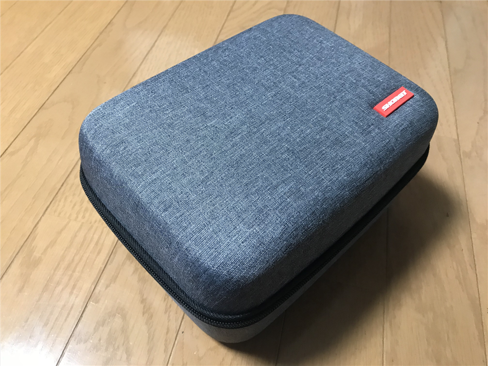

土曜日の晩は VR 飲み会に参加しました。言うてもダラダラと駄弁ってるだけなのですが、まぁ、それなりに楽しかったです。

<iframe src="https://hatenablog-parts.com/embed?url=https%3A%2F%2Fpronama.jp%2F2018%2F10%2F25%2Fvr-party%2F" title="プロ生 VR 飲み会 第1回 10/27（土）22:00～" class="embed-card embed-webcard" scrolling="no" frameborder="0" style="display: block; width: 100%; height: 155px; max-width: 500px; margin: 10px 0px;"></iframe><cite class="hatena-citation"><a href="https://pronama.jp/2018/10/25/vr-party/">pronama.jp</a></cite>

この飲み会に備えて、ちょっとした改造も施してみました。

<h3>メガネが邪魔</h3>

Oculus Go はメガネをかけたままでも利用できますが、ないに越したことはないですよね。何かいい方法はないかなぁ、と Web を徘徊していたら、よさげな商品を発見しました。

<ul><li>メディア: </li><li><a href="http://d.hatena.ne.jp/asin//bestylesnet-22" target="_blank">この商品を含むブログを見る</a></li></ul>

（なぜかちゃんとリンクが張れないな？ 商品リンク： <a href="https://amzn.to/2SqJ1aK">https://amzn.to/2SqJ1aK</a>）

水中マスク用の度付レンズを Oculus Go へ装着するためのアダプター。ぶっちゃけ 4,000 円は高いなと思いましたが、まぁ、モノは試し。レンズと一緒に購入してみました。

ぶっちゃけ、自分の眼鏡の度がわからなかったのですが（たぶん眼鏡を買ったときの書類を探せばわかると思うのだけど、面倒くさかった）、適当に -0.5 のものを購入。ものすごく高いものでもないので（1,000円ぐらいかな？）、ダメなら買いなおせばよいと割り切りました。

<a href="http://www.amazon.co.jp/exec/obidos/ASIN/B06XJRWWXK/bestylesnet-22/">リーフツアラー シュノーケル 度付き レンズ 水中マスク用 フレーム×1個 レンズ×2枚 セット -5.0 ライトグレー RA0509</a>
<ul><li>出版社/メーカー: リーフツアラー(REEF TOURER)</li><li>メディア: スポーツ用品</li><li><a href="http://d.hatena.ne.jp/asin/B06XJRWWXK/bestylesnet-22" target="_blank">この商品を含むブログを見る</a></li></ul>

「フレーム×1個 レンズ×2枚 セット」のセットを買ったけど、フレームは要らんかった……まぁ、いつか使うかもしれないし、問題ない。

装着は簡単で、もとからあった枠を外してアダプターをはめ込み……

水中マスク用の度付レンズをハメるだけ！　ちょっと右目の度が足りないみたいでボンヤリしていますが、まぁ、だいたい大丈夫。メガネなしで Oculus Go が使えるようになって大満足です。

ただ、リアルを徘徊するときこれまではゴーグルを外せばよかっただけなのですが、レンズを仕込むと追加で"メガネを探してつける”という所作が必要になりました。これは盲点で、ちょっと不便だ。メガネを付けたままゴーグルを付けるのに慣れっちゃってて、レンズ×メガネの二重装着で目がクラクラすることも……そもそもレンズとメガネが鑑賞して傷つきそうだし、気を付けないと。

<h3>VR 飲み会</h3>

集まったのは結局 3人＋1人。うち、1人はうまくいかなかったみたいで、次の機会に……となっちゃいました。Facebook で繋がっていなくても開催できるよう BigScreen Beta で招集をかけたのですが、3人以上は入れない？

しょうがないので残ったメンツだけでゲームをして遊びました。BigScreen Beta はルーム内でチェスなんかもできるのですが、今回は Dead and Buried というゲームをダウンロード。マルチプレイは、銃の早打ち（クイックドロー）対決しかなかったのですが、まぁまぁ、楽しめました。5回も殺されてミンチになっただよ……。

あとは Altspace VR というゲームも試してみました。BigScreen Beta と同じく部屋を共有するアプリでしたが、キャンプファイヤーでマシュマロを焼いたり、花火を楽しめるちょっとエンタメ向けのアプリなのかな（キャンプ以外にもいろんな環境があるみたい）。操作に慣れが必要でしたが、みんなでワイワイ盛り上がるにはいいと思います。イヌやネコなどのペットもいてかわいい。

<h3>ケースも買った</h3>

2時間ぐらい遊んで、この日はお開き。レンズと一緒に買っておいたケースにしまいました。

<a href="http://www.amazon.co.jp/exec/obidos/ASIN/B07FYW8YC1/bestylesnet-22/">Oculus GOケース Lichifit Oculus GO収納バッグ VR保護ケース VR眼鏡キャリングケース 収納力抜群 全面保護 小物収納可能 耐衝撃 グレー</a>
<ul><li>出版社/メーカー: Shenzhenshi Lichi Dianzishangwu Co.Ltd</li><li>メディア: Wireless Phone</li><li><a href="http://d.hatena.ne.jp/asin/B07FYW8YC1/bestylesnet-22" target="_blank">この商品を含むブログを見る</a></li></ul>

本体だけでなく、コントローラーや充電器も一緒に収納できてなかなか便利。買っておいて損はないかな？

ちなみに、次回の VR 飲み会は……いつやるのか忘れた。興味があったらお問い合わせください。

