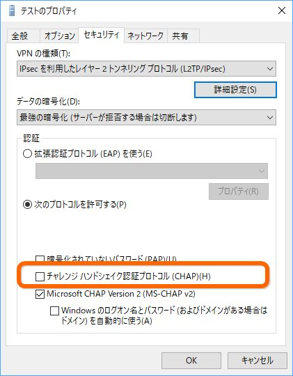
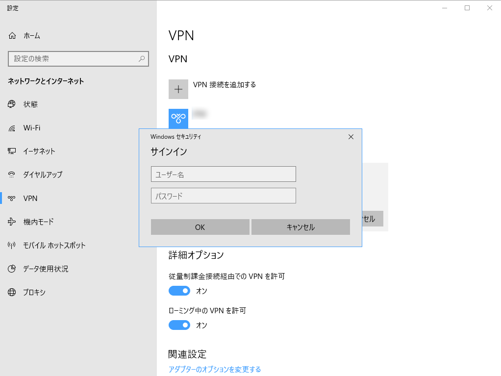

OS をクリーンアップするたびに GUI で VPN をセットアップするのが面倒くさくなったので、PowerShell でできないかなーと思って少し調べた。

<iframe src="https://hatenablog-parts.com/embed?url=https%3A%2F%2Fnasunoblog.blogspot.com%2F2016%2F03%2Fhowto-add-vpn-adaptor-using-powershell.html" title="PowerShell を使ってVPN接続を追加する～Add-VpnConnection | 元「なんでもエンジニ屋」のダメ日記" class="embed-card embed-webcard" scrolling="no" frameborder="0" style="display: block; width: 100%; height: 155px; max-width: 500px; margin: 10px 0px;"></iframe><cite class="hatena-citation"><a href="https://nasunoblog.blogspot.com/2016/03/howto-add-vpn-adaptor-using-powershell.html">nasunoblog.blogspot.com</a></cite>

必要な部分だけ、上記のサイトから拝借、うちの場合［データの暗号化］を“最強の暗号化”にしなきゃいけないので、`AuthenticationMethod` に `Maximum` を指定。

<pre class="code lang-ps1" data-lang="ps1" data-unlink>$PreKey = &quot;***&quot;

$VpnUrl = &quot;***&quot;
$VpnName = &quot;***&quot;

Add-VpnConnection -Name $VpnName `
-ServerAddress $VpnUrl `
-RememberCredential -L2tpPsk $PreKey `
-AuthenticationMethod MSChapv2 `
-EncryptionLevel Maximum `
-TunnelType L2tp `
-Force
</pre>
これであっさり VPN を追加できたのだけど、うちの環境では `CHAP` プロトコルも有効化しないと繋がらないらしい。ここのチェックボックスね。

GUI ではできないのかなぁ、と思い設定後に `C:\Windows\system32\ncpa.cpl` を開いて手動でチェックを入れるスクリプトにしてみたりもしたけど、どうにもかっこ悪いので Twitter で聞いてみたら、幸い返事がいただけた。

<blockquote class="twitter-tweet">
もうお試しかもしれませんが、-AuthenticationMethod で複数の認証方法をカンマ使って指定したらうまくできます。 <a href="https://t.co/4LsYAR7Ulv">pic.twitter.com/4LsYAR7Ulv</a>
&mdash; のらねこ！ C95 12/30日曜 東ト27a (@ragemax) <a href="https://twitter.com/ragemax/status/1058674732021645312?ref_src=twsrc%5Etfw">November 3, 2018</a></blockquote>  

ぉ、`AuthenticationMethod` って複数設定できるのか！　ってことでちょい修正。

<pre class="code lang-ps1" data-lang="ps1" data-unlink>$PreKey = &quot;***&quot;

$VpnUrl = &quot;***&quot;
$VpnName = &quot;テスト&quot;

Add-VpnConnection -Name $VpnName `
-ServerAddress $VpnUrl `
-RememberCredential -L2tpPsk $PreKey `
-AuthenticationMethod Chap,MSChapv2 ` # ここ
-EncryptionLevel Maximum `
-TunnelType L2tp `
-Force
</pre>
確かめてみたところ、意図したとおりにチェックボックスがオンになっていた。やったねー！

ちなみに ID とパスワードを設定するコマンドレットはないとのこと。

<pre class="code" data-lang="" data-unlink>$RasExec = &#34;C:\windows\system32\rasdial.exe&#34;
$VpnUser  = &#34;***&#34;
$VpnPass = &#34;***&#34;

#Add User &amp; Pass
cmd.exe /c $RasExec $VpnName $VpnUser $VpnPass</pre>
上記サイトでは rasdial.exe を使った解決策が示されていたけど、うちは定期的なパスワード変更が義務付けられている & 1Password で資格情報を生成・管理しているので、バッチファイルにパスワードを書くのはやめた。

この認証ダイアログで［資格情報を記憶する］とかいうチェックボックスがあれば便利なんだがな―って思ってたけど、1度繋ぐと保存されるのかな？　2回目は聞かれなかった気がする。

とりあえずテストは完了したので、これを初期化スクリプトに追記して今日のお仕事は終わり。また便利になってしまった。

<h3>追伸</h3>

<blockquote class="twitter-tweet">
（もうめんどいからいいや）
&mdash; だるやなぎ准将 (@daruyanagi) <a href="https://twitter.com/daruyanagi/status/1058687649286746112?ref_src=twsrc%5Etfw">November 3, 2018</a></blockquote>  

