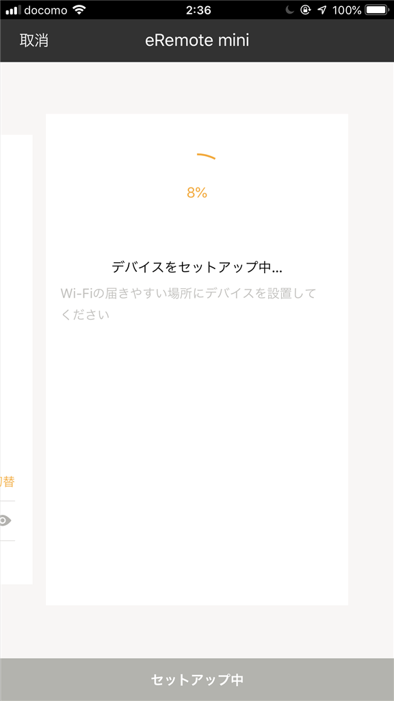
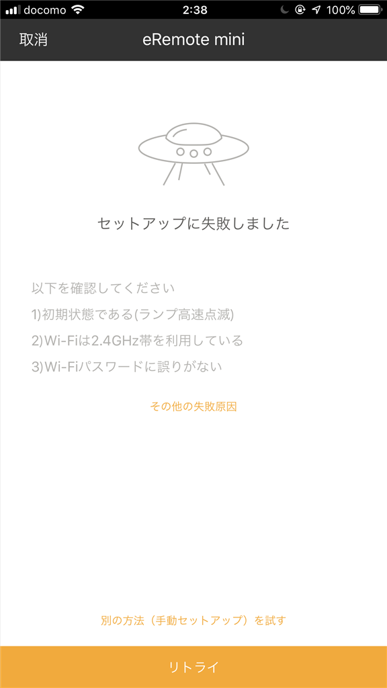
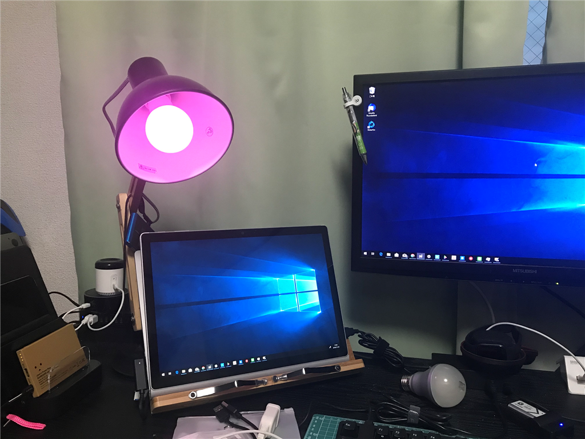
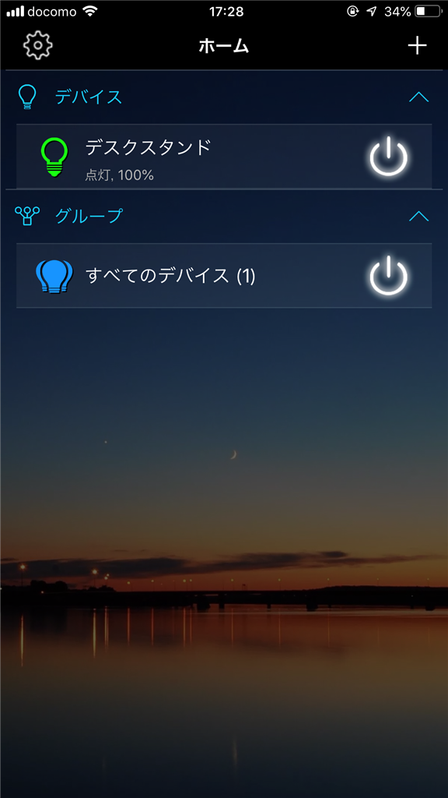
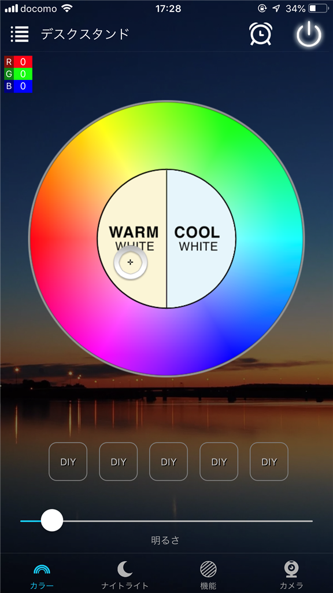
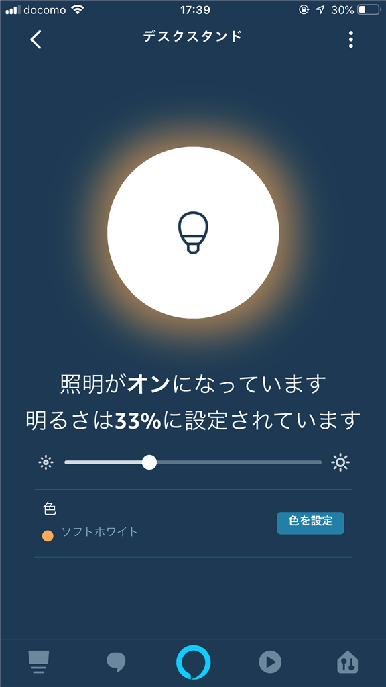
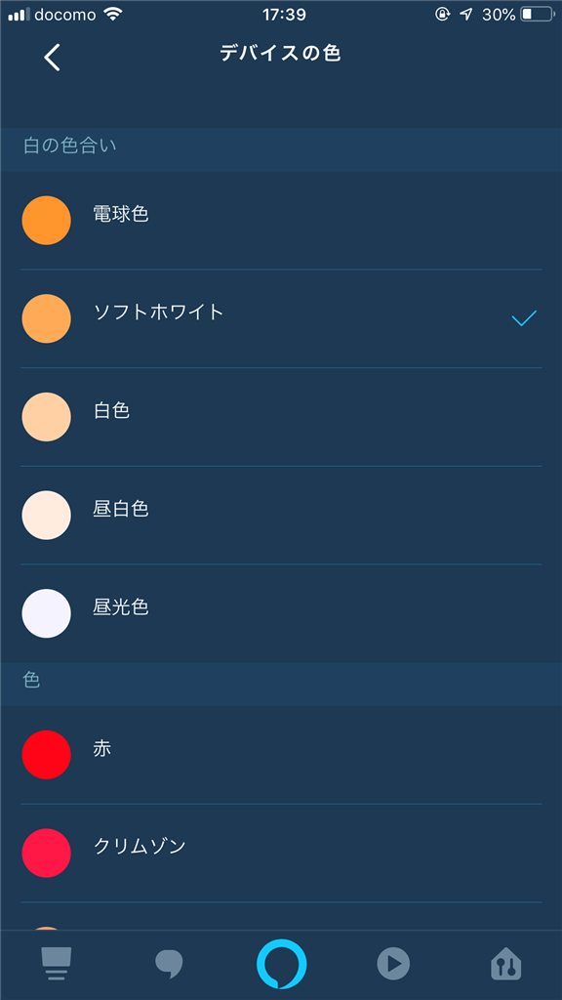

Amazon Echo Dot（Alexa）で使っていた eRemote mini が先月お亡くなりになった。ある日突然、呼びかけても応答しなくなって、再セットアップを試みるも Wi-Fi に繋がってくれない。

<blockquote class="twitter-tweet" data-lang="HASH(0xb9894d0)">
eRemote が WiFi に繋がらなくなった（複数の 2.4GHz 帯で試したけどダメ  最近はもっといいのあるかもだし、乗り換えを含め検討するか……
&mdash; だるやなぎ准将 (@daruyanagi) <a href="https://twitter.com/daruyanagi/status/1046537345627971586?ref_src=twsrc%5Etfw">September 30, 2018</a></blockquote>

　

たった1年すらもたないのはヒドいな、って感じだけど、なんでも初めはこういう有象無象、玉石混交、試行錯誤があるわな。残念だけど、退役させてリモコンで照明を消す縄文生活に戻った。

<iframe src="https://hatenablog-parts.com/embed?url=https%3A%2F%2Fblog.daruyanagi.jp%2Fentry%2F2017%2F12%2F24%2F194233" title="Amazon Echo Dot を買ってみた - だるろぐ" class="embed-card embed-blogcard" scrolling="no" frameborder="0" style="display: block; width: 100%; height: 190px; max-width: 500px; margin: 10px 0px;"></iframe><cite class="hatena-citation"><a href="https://blog.daruyanagi.jp/entry/2017/12/24/194233">blog.daruyanagi.jp</a></cite>

メインの役割を失った Amazon Echo Dot も利用頻度が大幅に減り、単なる電気食いになってしまう。

<h3>デスクスタンドの改善計画</h3>

それはそうと、去年の今ごろ、ちょっとシャレオツなデスクスタンドを買った。お手ごろな値段でシンプルなスタイルなのは大変気に入っている

<blockquote class="twitter-tweet" data-lang="ja">
デスクスタンドが明るすぎるので、コピー用紙と輪ゴムで対策。最悪、燃えるかもしれんからなにか対策考えとかないと <a href="https://t.co/5lgnkbJolK">pic.twitter.com/5lgnkbJolK</a>
&mdash; だるやなぎ准将 (@daruyanagi) <a href="https://twitter.com/daruyanagi/status/936030811605712896?ref_src=twsrc%5Etfw">2017年11月30日</a></blockquote>

お手ごろな値段でシンプルなスタイルなのは大変気に入っているのだが、間違って 60W の電球を買ってしまったので（MAX は 40W/E26 だと書いてある）めっさ明るい。電球を買い替えるのが面倒なので、明るさを和らげるためコピー用紙を輪ゴムでカサに括って運用していたのだけど、いつ燃えてもおかしくない気がする。あと、この子は電源のスイッチが後ろの方にあり、付けたり消したりするのが面倒だった。

というわけで、Alexa でコントロールできる電球を買ってみようと思い立ったわけですよ。使わなくなった Amazon Echo Dot の再生にもなるし、どうせいつかは電球を買い替えなきゃだし……結構いいアイデアじゃないか？　

この分野では<del>クソ高い</del> Philips Hue が有名だけど、Amazon で探してみたところ 1,500 円ぐらいでパチモンが売っている。

<a href="http://www.amazon.co.jp/exec/obidos/ASIN/B07DNRYB4X/bestylesnet-22/">Magic Hue WiFi スマートLED RGBW電球 ワイヤレスタイミングスマート LED照明電球 操作調光 調色モードライト WiFi操作 スマホン 非常灯 スマートフォンコントロール 用の新しいマジックホーム E26 (調光調色40Wの明るさに相当+暖かい白 色&冷かい白 色)</a>
<ul><li>出版社/メーカー: Zengge Co., Limited</li><li>メディア: </li><li><a href="http://d.hatena.ne.jp/asin/B07DNRYB4X/bestylesnet-22" target="_blank">この商品を含むブログを見る</a></li></ul>

ちゃんと Alexa 対応で eRemote mini みたいなスマートホームハブなしでダイレクトでつながってくれるらしい。明るさも絞れるみたいだし、40W タイプを買って付けてみた。

接続は簡単で、専用のアプリ（Magic Home）からこの子が発する全裸防御の Wi-Fi に繋いで Alexa と同じ Wi-Fi に繋ぐようにセットアップするだけ。若干不安がないでもないけど、セットアップが完了したら全裸 SSID は見えなくなったので大丈夫なのかもしれない。

 

実用性がまったくないんだが、ライトの色を赤とか青とかにできるのも面白いな。なんか色をクロスフェードさせるアクションもあるみたい（カスタムアクションを作成することも可能）。タイマーで日の出・日の入りと連動してライトを ON/OFF する機能もあったけど、ユーザーインターフェースがいまいちでよくわからんかった。まぁ、使わないからいい。

<iframe src="https://hatenablog-parts.com/embed?url=https%3A%2F%2Fwww.amazon.co.jp%2FZengge-Co-Limited-Magic-Home%2Fdp%2FB01HFZI9AK" title="Magic Home" class="embed-card embed-webcard" scrolling="no" frameborder="0" style="display: block; width: 100%; height: 155px; max-width: 500px; margin: 10px 0px;"></iframe><cite class="hatena-citation"><a href="https://www.amazon.co.jp/Zengge-Co-Limited-Magic-Home/dp/B01HFZI9AK">www.amazon.co.jp</a></cite>

Alexa 対応もばっちりで、スキルを有効化したら「アレクサ、デスクスタンド点けて」で点灯できるようになる。

 

色や明るさは Amazon Alexa アプリからも変更できたので、専用アプリはセットアップが終わったらもういらないかもしれないな。

とにかく、わざわざスタンドの後ろに手を伸ばさなくても点灯できるようになったのは便利。あとは長持ちしてくれたらいいんだけど……もう少しぜいたくを言うと、いろいろアプリ入れるのがめんどくさいので、早くどこかのメーカーがそれなりのシェアを握って、ラインナップを拡充てくれると助かる。一番いいのは、接続方法が標準化されることだが……まぁ、今の段階でそういうのが策定されるのは期待薄なんで。

