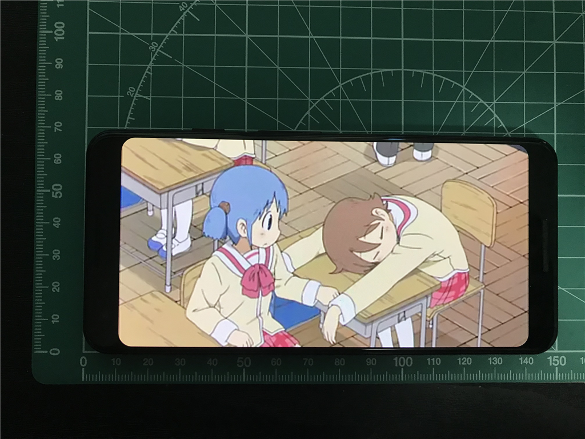

<h3>10月11日</h3>

Pixel 3 の発表から一夜、ちょっと気絶している間に注文をしてしまう。まぁね、リファレンス機だから買わないと仕方ないよね。

<blockquote class="twitter-tweet" data-lang="HASH(0xcc5d4f8)">
Pixcel 3 64GB 買った。128GB は在庫なかった……発送先はシンガポールだったんだけど、ちゃんと日本向けなんだろうなこれ
&mdash; だるやなぎ准将 (@daruyanagi) <a href="https://twitter.com/daruyanagi/status/1050162573654425600?ref_src=twsrc%5Etfw">October 10, 2018</a></blockquote> 

<h3>10月30日</h3>

忘れかけたころに発送メールが届く。11月9日から16日ごろ到着って書いてあるように読めるんだが、船便でくるんだろうか。

<blockquote class="twitter-tweet" data-lang="HASH(0xde9bc00)">
Pixcel 3 はよこい！ <a href="https://t.co/PAYE6PJG0z">pic.twitter.com/PAYE6PJG0z</a>
&mdash; だるやなぎ准将 (@daruyanagi) <a href="https://twitter.com/daruyanagi/status/1057191614311854086?ref_src=twsrc%5Etfw">October 30, 2018</a></blockquote> 

<h3>11月5日</h3>

羽田着、即日クロネコヤマトによって松山まで送られる。マンションのエレベーターが定期点検中だったの失念し、16:00～180:00 到着指定にしてしまってごめんなさい。お～いお茶もついでに1ケース買ってたのだけど、7階まで階段で届けさせてしまった。

<blockquote class="twitter-tweet" data-lang="HASH(0xd1b6550)">
だるやなぎの Pixcel 3 はこんな感じ <a href="https://t.co/MrnUww08rn">pic.twitter.com/MrnUww08rn</a>
&mdash; だるやなぎ准将 (@daruyanagi) <a href="https://twitter.com/daruyanagi/status/1059233990496870400?ref_src=twsrc%5Etfw">November 5, 2018</a></blockquote> 

<h3>開封</h3>

さっそく開封。サイズもろもろをまったく確認せずに買ったのだけど、思ったより「細いな？」というのが第一印象。指の短い自分の手にもピッタリ収まる。これは好感触だな。

内容物は、本体、AC アダプター、ケーブル類、イヤフォン（USB-C に変換して接続）など。ステッカーもついてたけど、貼るのもったいないな。

<h3>気になったところ</h3>

液晶画面はカドがとれていて、ビデオを全画面表示したときにちょっと気になる。普段はバーがあるから問題ないのだけど……個人的にはカチッと四角い方が好きだなー。

あと、細長いのでマンガを読むときも上下に余白が出ていまいちだと感じた。まぁ、読書は Kindle Oasis やら iPad mini 4 でやるのが好きなので、あまり問題にはならない。むしろ手になじむ細さの方が好印象。

触覚フィードバックはちょっと重たく、Essential Phone PH-1 が ﾋﾞｯﾋﾞｯ て感じだったのに対し、ｺﾝｯｺﾝｯ て感じ。個人的には Pixel 3 の方が好きかもしれない。一番慣れてるのは iPhone で、それが一番しっくりくるけど、違和感はないかな。

<h3>おサイフケータイ</h3>

Pixel 3 で一番うれしいのは SUICA が使えることだよね……ってことでさっそく登録してみた。

 

あんまり知らんのだが、SUICA の登録は「おサイフケータイ」アプリじゃなくて「Google Pay」アプリでやるのがよいみたい。iPhone みたいに「実カードを読み込んで～」みたいなプロセスがあるのかなって思ってたけどそれはなく、すんなり SUICA が端末に新規登録されてしまった（もしかしたら自分のやり方が変なのかもしれんが）。手元に余った実カードを用意していたのだけど、見事スカぶったぜー……今度東京行ったときに返納してデポジット返してもらおうっと。

ちなみに、登録処理には SIM がいるらしい。エラーで先に進めなかったので、急遽 iPad Pro に刺さってたデータ SIM（IIJmio）を抜き、急場をしのいだ。

 

あと、

<blockquote>

アプリを起動させる必要は 
ありません。改札の読み取 
り機にかざすだけです

</blockquote>

との由（登録完了後に送られてくる案内メールより）。レジで使うときも支払い方法を「SUICA」に指定するだけで、アプリの起動は必要がないらしい。まぁ、これはおいおい試してみることにする。

 

ついでに、カード入れに入ってたヤツで登録できそうなのは全部「おサイフケータイ」アプリに登録した。クロネコヤマトだけどうやって登録するのかわからんかったけど、ガラケーサイト 9625.jp から手続きを行うのが自分にはわかりやすかったかも。

10年以上？使っていてボロボロなヨドバシポイントカード、おサイフケータイ（かざすフォルダっての？）に登録したから捨ててもいいよね……。

<h3>OneDrive</h3>

iPhone で同期した写真は年月でフォルダー分けされるのに、Android から同期した写真はカメラ ロール直下に展開されるんだな？　ちょっとめんどくせえな……。

今日のあたりはこの辺で。iPhone の代わりにメインに使ってもいいなーって思うけど、そのときは iPhone で使ってる

<ul>
<li>LINE アプリ</li>
<li>将棋連盟 Live</li>
</ul>
を Pixel 3 に切り替えなきゃいけない。もうちょい考えてからにする。

