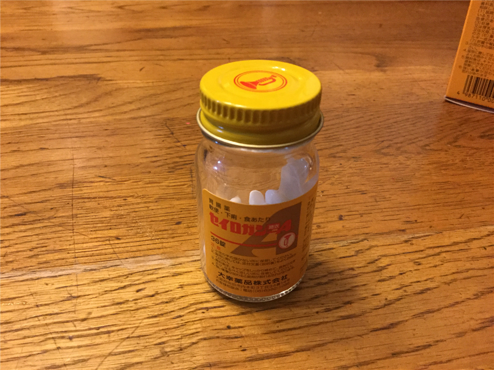

今週のはじめ、松山から（墓参りで伊賀を経由して）市川へ。1カ月ほど、市川を拠点に働く。

それにしても、今月は中盤から体調を崩し気味でつらかった。とくに週明けからは腹が猛烈に痛い。間欠的に胃のあたりがキリキリして、夜もろくに眠れずに悶絶。仕事をほったらかしにするわけにもいかず、ずっと腹を抱えて机に向かっていた。日頃、徳しか積んでないのに何故だ。

日曜日の日、おかんといっしょにいったお寿司屋さんが悪かったのだろうか……日曜、月曜と耐えたが、火曜になって薬嫌いの自分もとうとう耐え切れなくなり、正露丸を買って服用した。これが効いたのか、もともと快方に向かっていたのか、水曜（今日）はそれほど痛くない。ときどき違和感はあるが、痛みにまではならない……そんな感じ。

今週はあまり無理をせず、とにかく仕事を乗り切るモードで頑張る。

