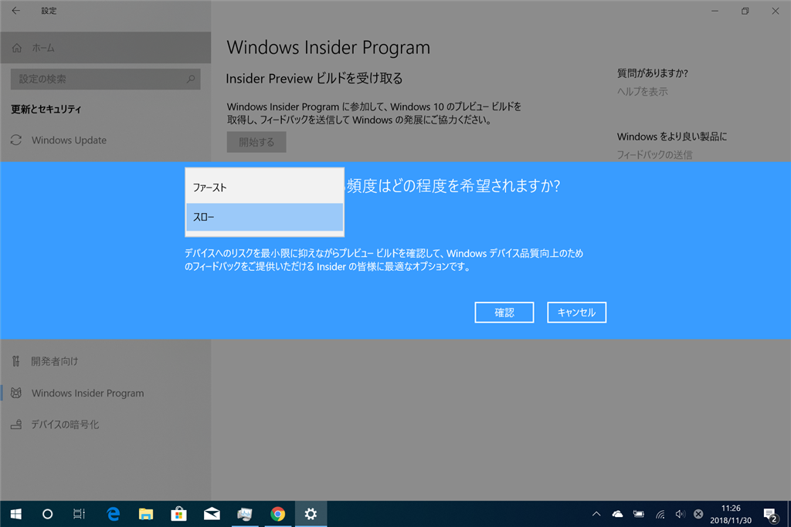

昨日届いた Surface Go は

<ul>
<li>Wi-Fi が途切れがち（ファームウェアをアップデートしたのになぁ）</li>
<li>Surface Pen が書けない or ボタンが効かない（ペアリングしなおすと直るけど、じきにどっちかが発生する？　ダブルクリックでスクショとったりするの便利なのに残念）</li>
</ul>
以外は快調で、手になじんで使いやすい。Wi-Fi が不調なのは LTE つなげば気にならない（IIJmio が遅いけど……）が、Surface Pen はどうにかならないかなぁ、と思うんだけど……初期不良かどうかをチェックする方法あればいいのにな。

それはともかく、Surface Go LTE に Windows 10 Insider Preview ビルドを入れた。もともとこの端末はブログを書く＆Insider ビルドのテストをするために買ったので、これは既定路線。

これまで Insider Preview ビルドのテストには Surface Pro 3 を使っていたのだけど、「Windows Hello がない」みたいなところがだんだん弱点になってきて……しかも、この前のビルドで改善された［電源］メニューだけど、Surface Pro 3 には Fluent 効果が効いていないような。Surface Go で試したらキレいだった。いろいろそんな感じで、Surface Pro 3 はもういい加減古く、プレビューテスト端末を更新したいなぁとずっと思ってたんだよね。とりあえず Surface Go なら外部 GPU とかの改善でなければだいたい試せるはず。気軽に持ち運べる Surface Go なら利用機会も増えるだろうし、有用なフィードバックができる……はず。

<h3>Insider Preview に参加したら何がうれしいのか</h3>

フツーの人が Insider Preview を入れる理由はないんだけど、機能の要望とかが通ると結構うれしいんだよね。自分の場合は「Bluetooth デバイスのバッテリー残量をみれるようにしてや」ってフィードバックを書いたんだけど、この前の機能アップデートでついに実装された。

フィードバックの票数は少なくても、有用であればちゃんと汲み取ってもらえるし、世間で言われてるほど無為無策ってわけでもない――October 2018 Update の件はあまり弁護できないけど。新しい機能を試すのは純粋に楽しいし（そう思わない人にはお勧めできないかな）。使い慣れちゃうと現行版に戻るのがちょっと辛いってぐらい便利なのもあるので、そういうのをいち早く体験できるのもメリットではある。最近で言えば、クラウドクリップボードとかかな。今の Insider だと新しい Microsoft IME にはちょっと興味あるかも。設定画面以外はまだどこが新しいのかさっぱりわかってないんだが。

<h3>Insider Preview への参加は簡単</h3>

Windows Insider Program への参加は、「設定」アプリの［更新とセキュリティ］－［Windows Insider Program］から簡単に行える（要、Microsoft アカウント）。

［開始する］ボタンを押す。

Microsoft アカウントをリンクさせる。

もしかしたら Windows Insider Program への参加とかが求められるかも（忘れた

［Windows のアクティブな開発］を選択。［スキップして……］は現在閉鎖中なので考えないでいい。

お好きな方を選択。［ファースト］は新しいけど危険が危ないデシ、［スロー］はちょっと安全だけどあまり降ってこなかったりする。

あとは再起動して――

［Windows Update］をかければ終わり。

