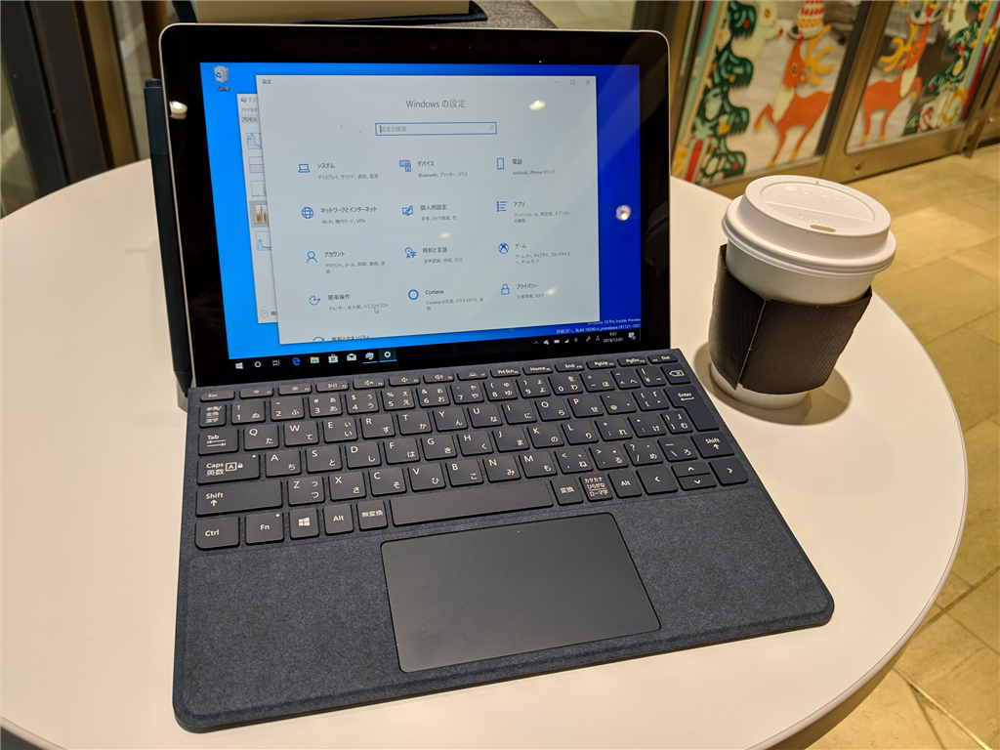
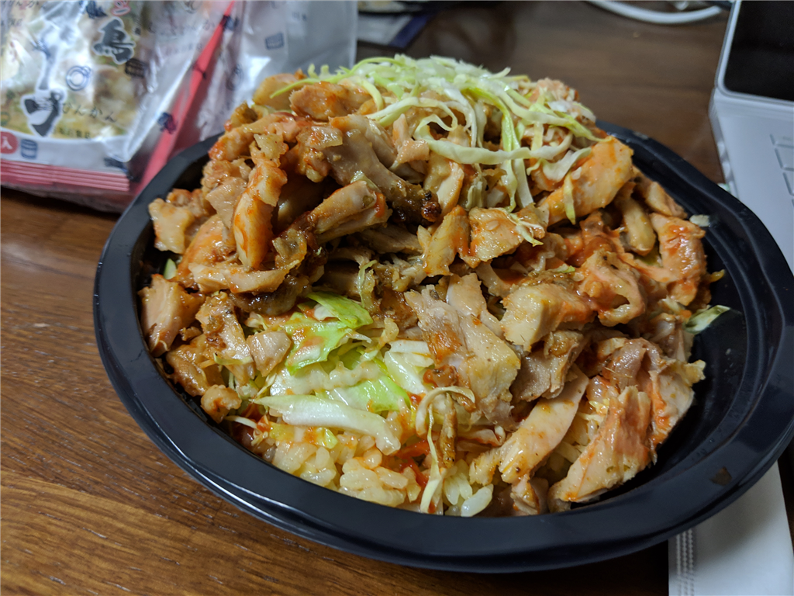

（この日記は、川崎で映画を見る約束した友人を待つ間、カフェで Surface Go を引っ張り出して書いている。LTE があるのは大変気軽でよい。みんな、買うなら LTE 付きの Surface Go だぞ！）

木曜日はようやく腹痛も収まり、ちょっと飲んでも大丈夫かなーっと思っていたところにお誘いが来たので、6時に仕事をたたんで小岩へ出た。久しぶりに小岩でしこたま飲む。その日はちゃんと電車で帰った。

帰り道、ケバブの屋台ができていたので「ケバブ丼」を買った。ケバブといえばトルコな感じだけど、この屋台のおっさんはイランからきたらしい。「トルコもイランもだいたい一緒」との由。まぁ、そんなものなのかもしれない

ケバブ丼はちょっとピリ辛で、結構おいしかった。またリピートしてもいい。ただ、値段を覚えてない……小銭入れから払ったから、たぶん600円とかそんな感じだと思う。

