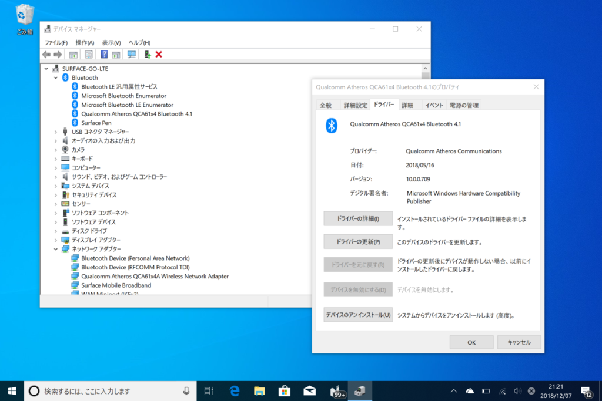

<h3>現象</h3>

Wi-Fi が途切れる。スリープから解除したときに発生することが多いように感じるが、普通に使っていてもときどき発生する。

<h3>参考</h3>

<blockquote cite="https://www.reddit.com/r/Surface/comments/953a93/surface_go_wifi_issues/">

So Ive tried various suggestions and the only thing that has seemed to work so far has been assign a static IP to the Surface GO...Ill report back if anything changes.

<cite><a href="https://www.reddit.com/r/Surface/comments/953a93/surface_go_wifi_issues/">Surface GO WiFi Issues : Surface</a></cite>
</blockquote>

これはまだ試していないが、いろいろやってダメなら試してみる。

<iframe src="https://hatenablog-parts.com/embed?url=https%3A%2F%2Fanswers.microsoft.com%2Fen-us%2Fsurface%2Fforum%2Fsurfgo-surfnetwork%2Fsurface-go-wifi-adapter-problems%2Fffb5a805-0355-4c24-ade6-cfac50ad3966%3FmessageId%3De648553d-353b-4752-a9c9-0d91d36e934e%26page%3D1" title="Surface Go WiFi Adapter Problems" class="embed-card embed-webcard" scrolling="no" frameborder="0" style="display: block; width: 100%; height: 155px; max-width: 500px; margin: 10px 0px;"></iframe><cite class="hatena-citation"><a href="https://answers.microsoft.com/en-us/surface/forum/surfgo-surfnetwork/surface-go-wifi-adapter-problems/ffb5a805-0355-4c24-ade6-cfac50ad3966?messageId=e648553d-353b-4752-a9c9-0d91d36e934e&page=1">answers.microsoft.com</a></cite>

Microsoft の公式フォーラム。

Wireless Network 12.0.0.722

Bluetooth 10.0.0.709

Surface Broadband 10.0.17134.1

<h3>トラブルシューティング</h3>

<h4>OS のクリーンアップ</h4>

前回のついで。

<iframe src="https://hatenablog-parts.com/embed?url=https%3A%2F%2Fblog.daruyanagi.jp%2Fentry%2F2018%2F12%2F01%2F202501" title="Surface Go LTE で Surface Pen が機能しない現象のトラブルシューティング - だるろぐ" class="embed-card embed-blogcard" scrolling="no" frameborder="0" style="display: block; width: 100%; height: 190px; max-width: 500px; margin: 10px 0px;"></iframe><cite class="hatena-citation"><a href="https://blog.daruyanagi.jp/entry/2018/12/01/202501">blog.daruyanagi.jp</a></cite>

今のところ問題はなさそうだが、少し様子を見る。

<del>LTE の設定は問題の解消を確認するまでやらない。</del>スリープ・復帰、再起動などを試してみたが問題がなさそうなので、APN の設定（IIJmio）をしてモバイルネットワークも有効化した。これで少し様子を見る。

→ Surface Go は接続できるようになったが、ほかの端末がルーター（au ひかり貸し出しの Aterm BL900HW）に接続できなくなった 
→ Surface Go のみ Wi-Fi の調子が悪い（バッテリー駆動時のみ？）

