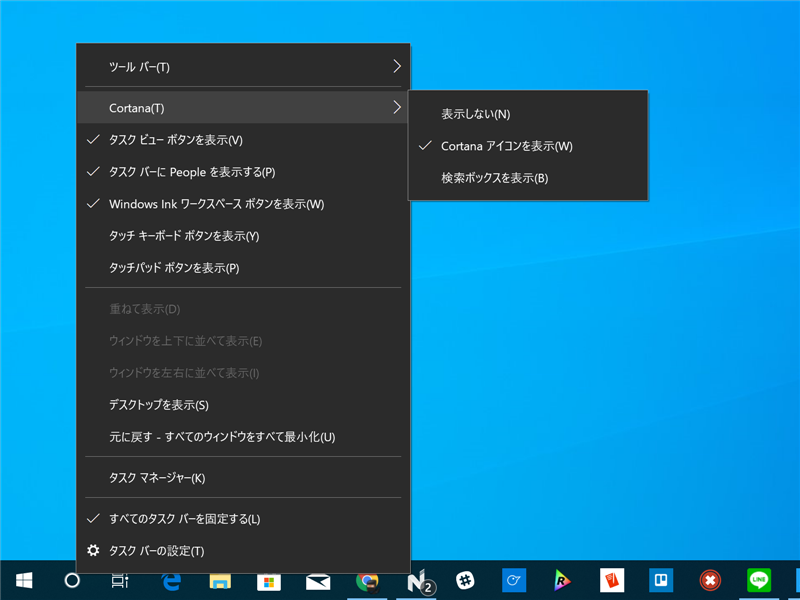
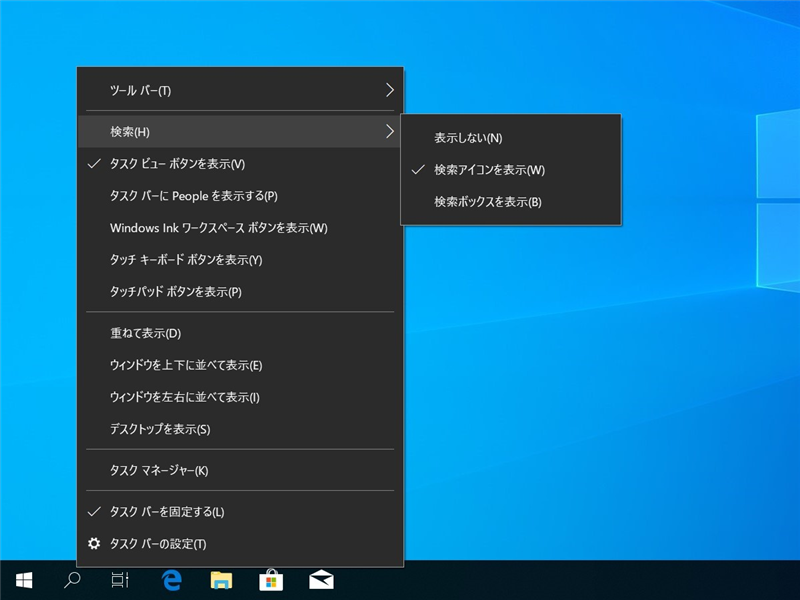

<h3>バージョン 1803</h3>

タスクバーのアイコンは Ccortana、コンテキストメニューの表記も「Cortana］、「Cortana アイコンを表示］。

<h3>バージョン 19H1</h3>

タスクバーのアイコンは虫眼鏡、コンテキストメニューの表記は「検索］、［検索アイコンを表示］。

Cortana、やめるのかなぁ。まぁ、Cortana がほとんど浸透していなくて、アイコンの意味が分からないから変更しただけなのかもしれないけど。

