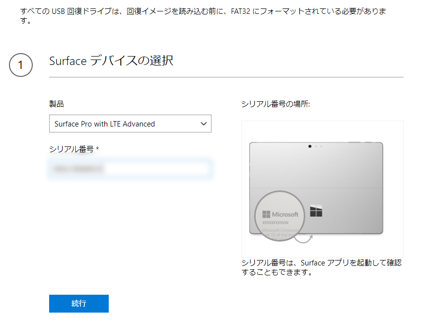

泣きっ面に蜂ってこのことですね！

<h3>Surface Book 2</h3>

SYSTEM_THREAD_EXCEPTION_NOT_HANDLED でブルースクリーン。

<blockquote cite="https://support.microsoft.com/en-us/help/4467682/windows-10-update-kb4467682">

fter installing this optional update some users may get a blue or black screen with error code, “System thread exception not handled.”

For customers who are currently experiencing this issue, please follow these instructions Troubleshoot blue screen errors and uninstall KB4467682.

Note For Surface Book 2 customers, we are only blocking this optional update. You will receive the required December 2018 security update release.

A resolution for this issue will be available in the December 2018 security update release.

<cite></cite>
</blockquote>

とのことなので、KB4467682 をアンインストールしておいた。もう一度更新を確認するとまた KB4467682 が降ってきたんだが、見なかったことにする。

<iframe src="https://hatenablog-parts.com/embed?url=https%3A%2F%2Fforest.watch.impress.co.jp%2Fdocs%2Fnews%2F1156763.html" title="Surface Book 2でブルースクリーンが発生する不具合 ～更新プログラム「KB4467682」が原因／アンインストールすると解消される" class="embed-card embed-webcard" scrolling="no" frameborder="0" style="display: block; width: 100%; height: 155px; max-width: 500px; margin: 10px 0px;"></iframe><cite class="hatena-citation"><a href="https://forest.watch.impress.co.jp/docs/news/1156763.html">forest.watch.impress.co.jp</a></cite> 

<h3>Surface Go LTE</h3>

タイプカバーを広げると

<ul>
<li>Wi-Fi が機能しなくなっている：SSID もつかまない</li>
<li>モバイル回線が不安定：こっちは機能したりしなかったり。つながっても、インターネットにまでは出られない</li>
<li>Sueface Pen：タッチはできるが、ボタンをクリックできない現象が再発</li>
</ul>
と、かなり悲惨なことになっていたので、とりあえず再起動してみたところ――起動なさらない。享年7日の命でござった。

Insider Preview ビルドのせいか、メッセージの類も――ボタンにも！――表示されないので、何が起こってるのかさっぱりわからないのだけど、たぶん「Windows を起動できませんでした」的なことが書いてあるのだと思う。

いろいろガチャガチャやってみたけど、このありさまではにっちもさっちもいかない。

とりあえず <a href="https://support.microsoft.com/ja-jp/surfacerecoveryimage">https://support.microsoft.com/ja-jp/surfacerecoveryimage</a> から回復イメージをダウンロード（Surface Go LTE の場合で 7GB ぐらいかな？）。手元に USB-C のメモリがなかったので、どうせまた使うこともあろうと Amazon に注文した。明日の朝には着くので（さすが Amazon）、それまでには回復イメージのダウンロードも終わってるだろうし、サクッと元の環境を復元……したい。

