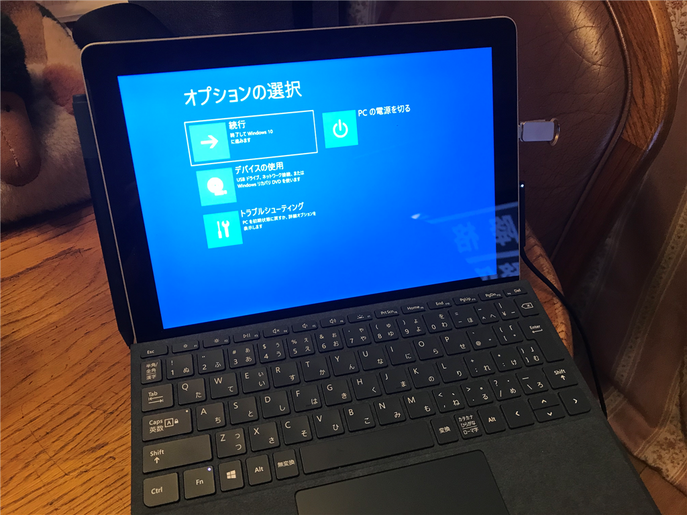
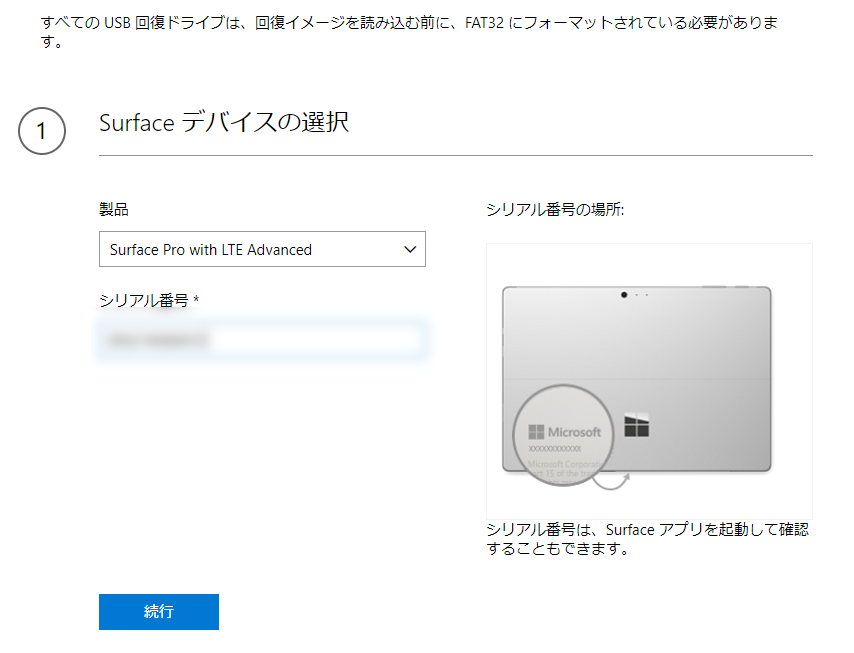
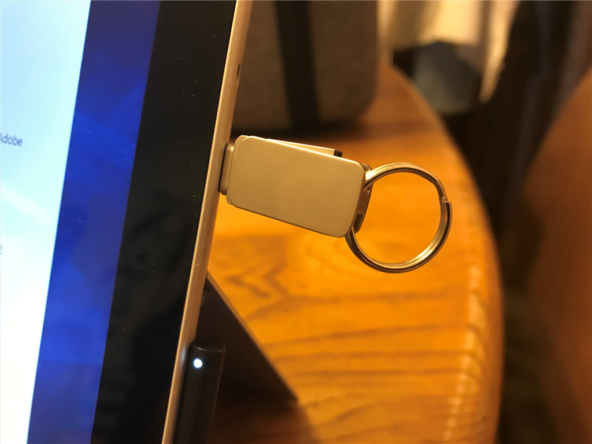

先日お亡くなりになった Surface Go with Advanced LTE を復活させた。

<iframe src="https://hatenablog-parts.com/embed?url=https%3A%2F%2Fblog.daruyanagi.jp%2Fentry%2F2018%2F12%2F05%2F194602" title="12月5日：Surface Book 2 が BSoD。Surface Go はお亡くなりになった - だるろぐ" class="embed-card embed-blogcard" scrolling="no" frameborder="0" style="display: block; width: 100%; height: 190px; max-width: 500px; margin: 10px 0px;"></iframe><cite class="hatena-citation"><a href="https://blog.daruyanagi.jp/entry/2018/12/05/194602">blog.daruyanagi.jp</a></cite> 

<h3>回復ドライブの作成</h3>

まず、Microsoft のサイトから回復イメージをダウンロードして USB フラッシュメモリーにコピーする。法人向けの Surface ならば以下のサイトで回復イメージをダウンロードできる。

<ul>
<li><a href="https://support.microsoft.com/ja-jp/surfacerecoveryimage">https://support.microsoft.com/ja-jp/surfacerecoveryimage</a></li>
</ul>
型番とシリアルナンバーが必要。サイズは7GBちょいだった。

回復イメージは ZIP で圧縮されているので、それを展開。FAT32 でフォーマットしたフラッシュメモリに丸ごとコピーしたら完成だ。

フラッシュメモリは USB-C 接続のものを新たに買った。ハブを介せば普通の USB メモリも使えるらしいが、これからは USB-C が普及していくだろうし、専用のものを一本持っておくとスマートだ。

<a href="http://www.amazon.co.jp/exec/obidos/ASIN/B07DW3JWRR/bestylesnet-22/">Type Cメモリ USBメモリ 3.0 フラッシュドライブ 32GB OTG USB Cメモリ3.1 MECO 2in1 USB 3.1 + USB 3.0 デュアルメモリ メモリースティック キーリング付き 金属 防水360度回転デザイン 高速データ転送 スマホ/MacBook/Windows/ノートパソコン対応</a>
<ul><li>出版社/メーカー: MECO</li><li>メディア: </li><li><a href="http://d.hatena.ne.jp/asin/B07DW3JWRR/bestylesnet-22" target="_blank">この商品を含むブログを見る</a></li></ul>

うちは USB/USB-C の両方を使えるものを Amazon で適当に探して買った。なにげに防水らしいから、間違って水洗便所に落としても死なない。

回復処理は10分ちょいで完了するようだ。家で使うとやっぱり Wi-Fi が不安定だが、そとで LTE 接続で使う分には今のところ快調だ。この記事も総武快速のグリーン車の中で書いている。

