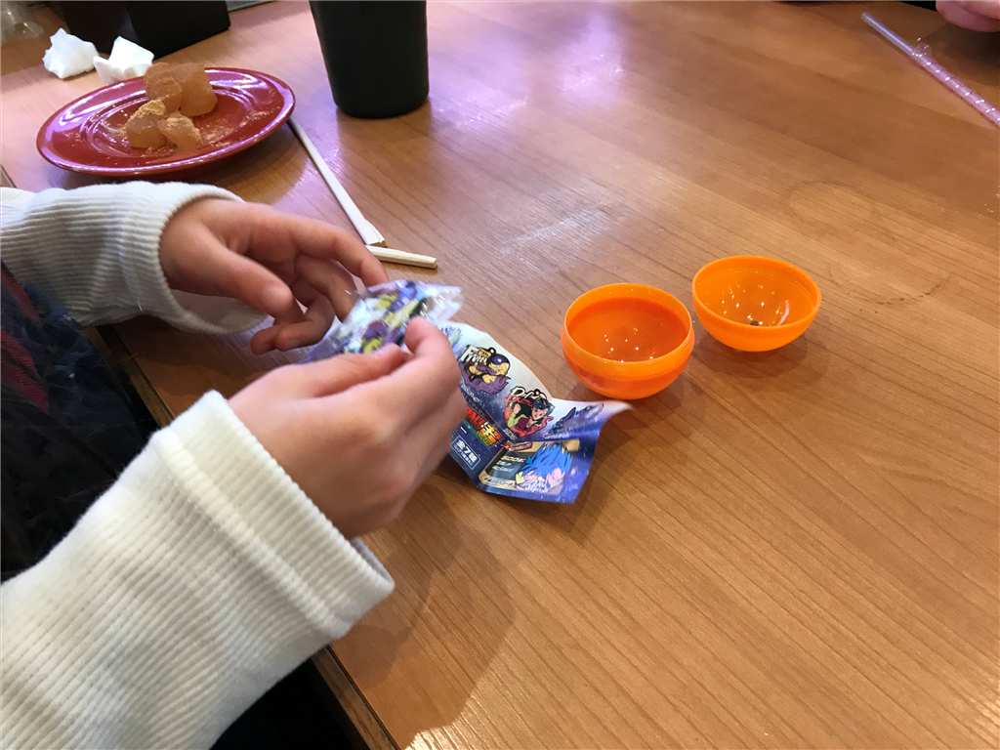
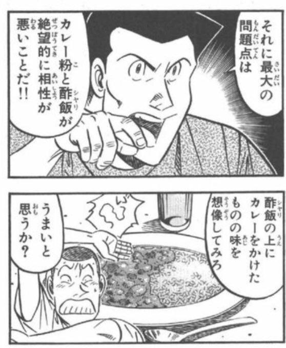
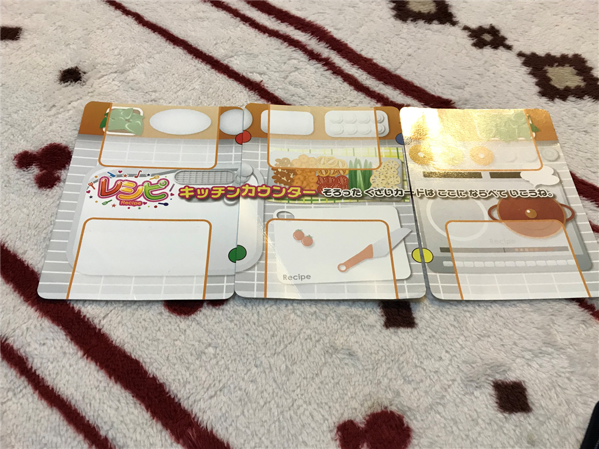

月曜日、仕事を朝のうちに大方終わらせて、昼は妹とその息子娘とお寿司を食べに行った。くら寿司は食べたお皿をシュートに入れる方式なのだけど、甥っ子・姪っ子に皿を渡すと「なんですぐわたすのぉー！？」「たべるひまないよぉー！！」とか言いながら喜んで片づけてくれる。食った皿の数に応じてガチャもあるし、結構喜んでくれるのがいい。

「ドラゴンボール、要らない！」って即捨てられたけど (´；ω；`)ｳｩｩ

あと、ついでにネットで話題になっていたシャリカレーにチャレンジした。

甘口カレーを頼んだのだけど（ほかにも黒酢カレー？があった）、甘いやら酸っぱいやら？　後味にスパイスの風味も残るので、5 歳児と 3 歳児には厳しいかもなぁって感じた。

<blockquote class="twitter-tweet" data-lang="HASH(0xe6f1450)">
シャリカレー食ってる (@ くら寿司 市川インター店 - <a href="https://twitter.com/mutenkurasushi?ref_src=twsrc%5Etfw">@mutenkurasushi</a> in 市川市, 千葉県) <a href="https://t.co/HDu9W8jgB0">https://t.co/HDu9W8jgB0</a> <a href="https://t.co/uSRoKDIQK1">pic.twitter.com/uSRoKDIQK1</a>
&mdash; 独身貧乏高卒無職婚活ヒエラルキー最底辺やなぎ (@daruyanagi) <a href="https://twitter.com/daruyanagi/status/1071980415936794625?ref_src=twsrc%5Etfw">December 10, 2018</a></blockquote>

妹に数口食ってもらったけど、寿司 5 皿分ぐらいの量はあった気がする。たしか380円ぐらいだったので、コスパは悪くない。

家に帰ってからは、「レシピ」というカードゲームをやった。配られたレシピカードに書いてある通りに、引いたり捨てたりしながら6つの具材カードを集め、先にコンプリートさせた人が勝ち。自分に必要な具材カードを他人が捨てるとき、「レシピ！」と宣言するとそれを得ることもできるのだけど、それでカードを引く順番がスキップされたりするのが戦略的要素なのだろうか。

<a href="http://www.amazon.co.jp/exec/obidos/ASIN/B00SGX3BTU/bestylesnet-22/">ホッパーエンターテイメント レシピ カードゲーム HRCP-PAC001</a>
<ul><li>出版社/メーカー: ホッパーエンターテイメント</li><li>メディア: おもちゃ＆ホビー</li><li><a href="http://d.hatena.ne.jp/asin/B00SGX3BTU/bestylesnet-22" target="_blank">この商品を含むブログを見る</a></li></ul>

まだ仕事が残ってるのに4回も突き合わされ、ナポリタン、酢豚、カレーライスなんかを作らされた。姪っ子などはレシピカードをすべて暗記してるらしく、僕が「レシピ！」しそこなったら教えてくれた……それじゃゲームにならんけど、やさしいのはすごくいいことだと思うよ。

そうやって僕らが遊んでる間、妹が実家の大掃除をやってくれた。そこまでせんでいいのに、と思ったが、子どもの面倒から解放されるなら安いものだという。そんなものなのだろうか。っどっちにしろ、できたやつだと思う。

