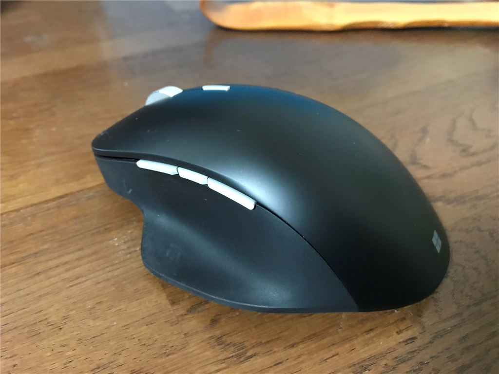
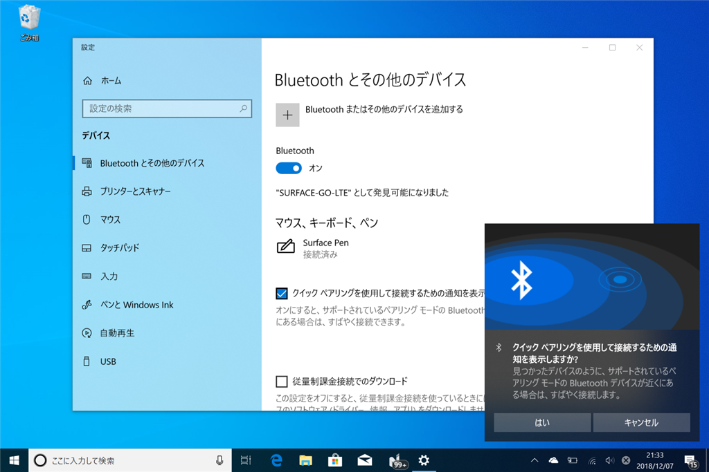
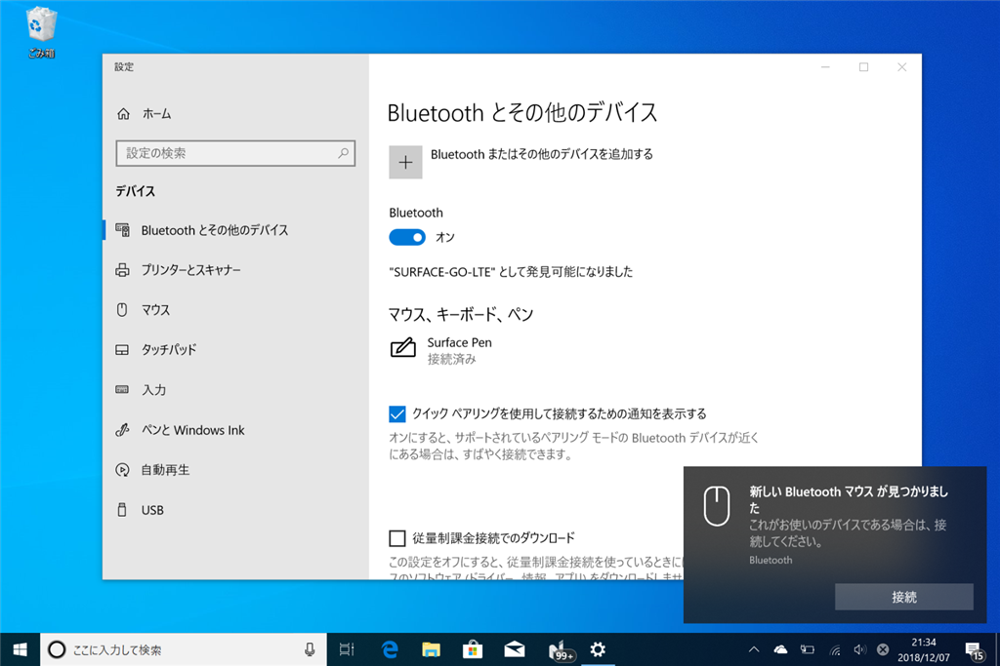
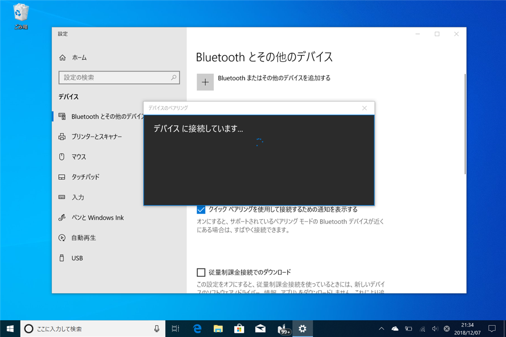

<figure class="figure-image figure-image-fotolife" title="おニューなマウス"><figcaption>おニューなマウス</figcaption></figure>

11月末から仕事道具を実家（千葉県市川市）に送って仕事をしているのだけど、マウスを入れておくのを忘れてしまった。仕方ないのでこっちで新しいのを買ったが、いつものやつを買うのもなんか癪だったので、Microsoft  Precision Mouse というのを買ってみた。ちょっと高くて、11,000 円ぐらい。

<a href="http://www.amazon.co.jp/exec/obidos/ASIN/B07FF2KPMJ/bestylesnet-22/">マイクロソフト マウス Bluetooth/USB有線 両対応 プレシジョン マウス ブラック カスタマイズ可能ボタン 磁気スクロールホイール 高精度 GHV-00007</a>
<ul><li>出版社/メーカー: マイクロソフト</li><li>発売日: 2018/07/26</li><li>メディア: Personal Computers</li><li><a href="http://d.hatena.ne.jp/asin/B07FF2KPMJ/bestylesnet-22" target="_blank">この商品を含むブログを見る</a></li></ul>

特徴はざっとこんな感じらしい（<a href="https://blogs.windows.com/japan/2018/07/19/microsoft_precision_mouse_black/">&#x6A5F;&#x80FD;&#x7F8E;&#x3092;&#x8FFD;&#x6C42;&#x3057;&#x305F;&#x81F3;&#x9AD8;&#x306E;&#x30DE;&#x30A6;&#x30B9;&#x3001;&#x30D6;&#x30E9;&#x30C3;&#x30AF;&#x306E;&#x30D7;&#x30EC;&#x30B7;&#x30B8;&#x30E7;&#x30F3; &#x30DE;&#x30A6;&#x30B9;&#x304C;&#x65B0;&#x767B;&#x5834;&#x3002;2018 &#x5E74; 7 &#x6708; 26 &#x65E5;&#xFF08;&#x6728;&#xFF09;&#x3088;&#x308A; Amazon.co.jp &#x3067;&#x5148;&#x884C;&#x8CA9;&#x58F2;&#x958B;&#x59CB;&#x3002; - Windows Blog for JapanWindows Blog for Japan</a> より）。

<ul>
<li>計算しつくされた重量感、動作の安定性、そしてこの上ないスムーズなスクロール感</li>
<li>豊富な機能と、人間工学に基づき設計された疲れにくい製品形状により、長時間の利用時も作業効率を維持</li>
<li>最大 3 つのデバイスで切り替えなしに利用</li>
<li>動作遅延やバッテリー切れの心配がない有線、ケーブルレスでストレスフリーな無線（Bluetooth）の両対応</li>
<li>4 つのカスタマイズ可能なボタン</li>
</ul>
個人的には有線も無線でも使えるのがポイント高いかな？　この2週間ほど使った限りでは Bluetooth で快適に使えているけれど、なんとなく Bluetooth はまだ信用ならんなと思ってるし。あと、デバイスの切り替え機能が割とよかった。

<figure class="figure-image figure-image-fotolife" title="底面のデバイス切り替えインジケーター"><figcaption>底面のデバイス切り替えインジケーター</figcaption></figure>

底面にあるインジケーターで、どのデバイスとつながるのかがわかる。最新の Windows 10 ならば接続も簡単だしな。キーボードマウスセンターのインストールまでシームレスにできる（うちに入ってるのは v10 だけど、昨日か一昨日だかに v11 がでた）。

で、肝心の使い勝手だけど――使い始めはちょっと重かったかな……重量というより、摩擦？　Age of Empirte:HD で2時間弱ほど遊んでみたけど、ちょっと肩凝った。でも、次第になじんできたようで、今はそれほど不満を感じない。「計算しつくされた重量感」かと言われれば、そうは思わないと答えるけど、まぁ、悪くはない。

大きさはちょうどいい～大きすぎるの間ぐらい。自分は手で「掴む」というよりは、完全に手を「乗せて」使ってる。自分はこれでも不満はない。

感度の調整は興味ないから評価の対象外。ガチで FPS やら MMO やる人には関係あるのかもしれんけど、わいの場合はいいところ AoE ぐらいしかやらんし。

カスタムボタンは、前の（仮想）デスクトップ・次のデスクトップに設定するのが気に入った（デフォはブラウザーの戻る・進む）。これまではキーボードショートカットやタッチパッドの3本指ジェスチャーを使うことが多かったけど、デスクトップではマウスのカスタムボタンを使うようになった。

あと、ホイールのところのボタンでクリクリスクロールとブワーっていう（慣性）スクロールが切り替えられるのはいいかも。自分はクリクリ感のあるホールの方が断然好みだけど、使ってみるとブワーっていう方も悪くない。とくに、長い PDF を斜め読み（スクロール読み？）するときなんかは、慣性スクロールの方が操作数少なくていい。ぶっちゃけほとんどの人にとってはオーバースペックなこの機能だけど、さすが1万円越えだなって思った。

結論としては、クリクリスクロールだけのを 6,000 円で売ってくれるならスペアを買いだめしたいかも。10,000 円越えはちょっと……あとの評価は耐久性次第かな。3年でバカになるならちょっとお勧めできないけど、5年持つなら次もこれを買う（売ってるだろうか……？）。

