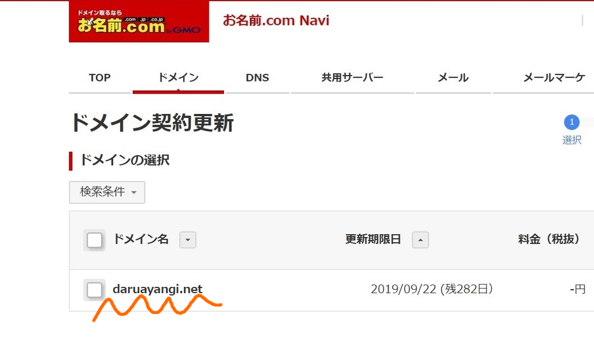

9月に取り戻した daruyanagi.net ドメインを お名前ドットコム から Value-Domain へ移管しました。どっちも GMO 傘下だけど、お名前ドットコムは使いにくくて仕方ないし、うっとうしいメールはバンバカくるしで、早く縁を切りたかった。Value-Domain は高校生のころから使って手馴れてるしなー。

<iframe src="https://hatenablog-parts.com/embed?url=https%3A%2F%2Fblog.daruyanagi.jp%2Fentry%2F2018%2F09%2F24%2F134516" title="9月22日：ドメイン喪失から3年半……daruyanagi.net がもどってきました（もう水素水を売ってるヤツだなんて言わせない！！ - だるろぐ" class="embed-card embed-blogcard" scrolling="no" frameborder="0" style="display: block; width: 100%; height: 190px; max-width: 500px; margin: 10px 0px;"></iframe><cite class="hatena-citation"><a href="https://blog.daruyanagi.jp/entry/2018/09/24/134516">blog.daruyanagi.jp</a></cite>
 

ドメインの移管は簡単で、

<ul>
<li>ドメイン>ドメイン詳細 画面で AuthCode というのを取得</li>
<li>移管先で手続きを行う（このときに AuthCode が必要）</li>
<li>メールがくるのでそれに従って移管処理に OK をだす</li>
</ul>
だけ。1日で済んだ。もともとこのドメインは Value-Domain で管理していたのだけど、移管されたドメインの管理画面を見ると、そのときの DNS 設定がそのまま残ってた。Google Apps（G Suite）の設定をやり直さなくて済んでらくちん。www が ExpressWeb に向いていたのも懐かしい。あのときは ASP.NET がやすい ExpressWeb でサイトを運営してたんだよね。

あと、ドメインの有効期限が1年足されて、600日ぐらいになってた。念のため契約年数を足して、自動更新を有効化しておく。

これでお名前ドットコムからのメールを全部スパム送りにすれば、すべて終わり。

<h3>daruyanagi.net を取り戻すときの悲劇</h3>

前回のブログではまだ書いてなかったけど、daruyanagi.net を取り戻すときはいろいろ悲劇があった。まずこれを見てくれたまえ。

<b>daruayanagi.net !!</b> ドメインが戻ってくるんではないかという期待で舞い上がってしまい、typo に気づかず契約してしまった／(^o^)＼ ムダ金が……。

しかも、typo に数日気づいてなくて……なんどやっても G Suite のドメイン設定がうまくいかんなぁ、と悩みぬいた末、ドメインのつづりを再確認してようやく気が付いたという。マジで吐血しそうになった。

あと、お名前ドットコムに「ドメインを取り返した代」を1万円ぐらい取られた。魂抜けそう。

まぁ、ドメインの管理はちゃんとしないと、いろいろ公開するよねってことで。みんな気を付けてね。そんじゃーね。

