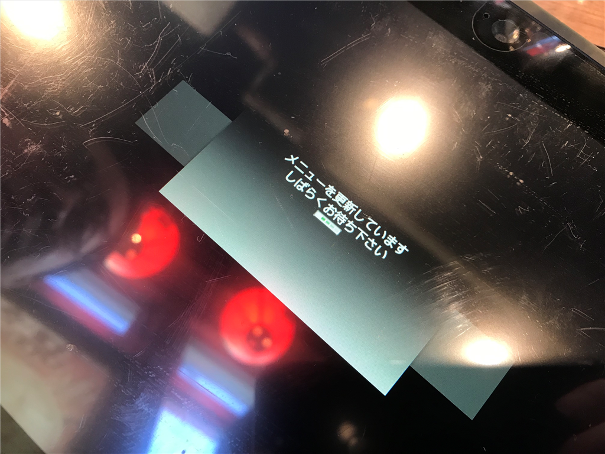
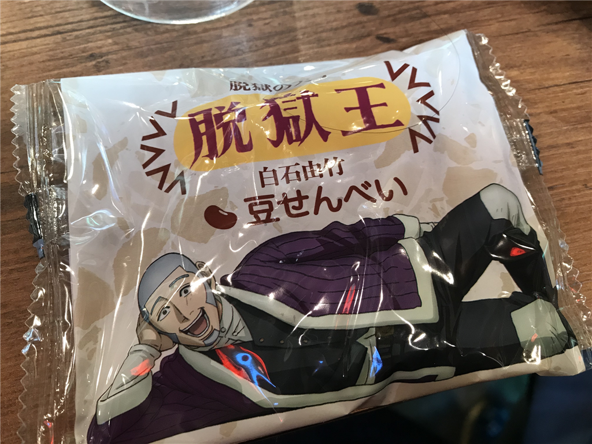
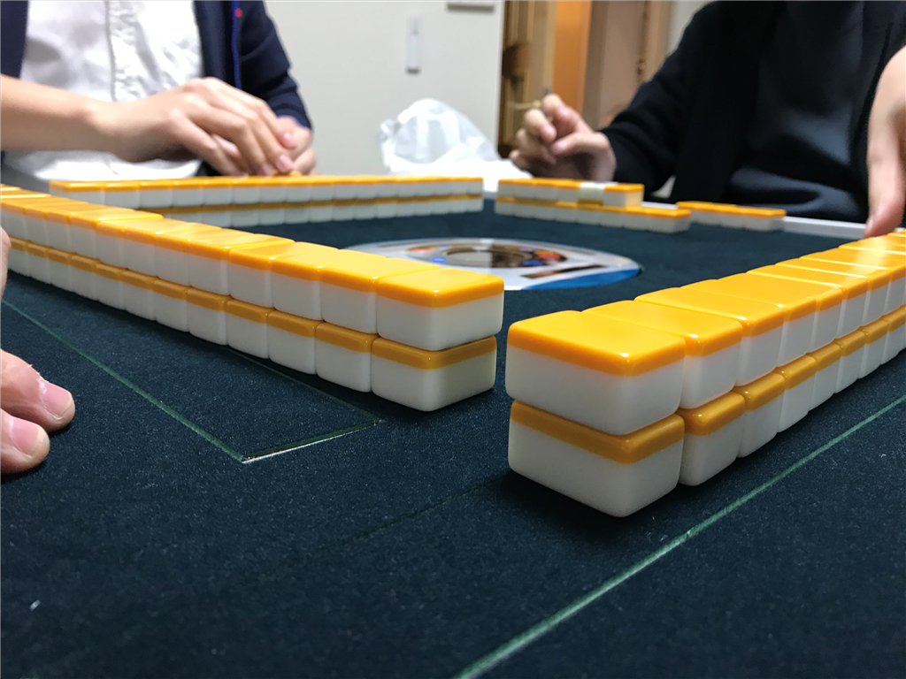

土曜日はおおば会に参加した。おおば会というのは、秋葉原の磯丸水産で @tworks 氏を囲みながら行われる飲み会。朝の10時から殷の紂王ばりに「長夜の飲」をやるのだが（昼だけど）、そのとき、注文を一度に行わず、ちまちま頼んでできるだけレシートを長くする。店員からしたら迷惑この上ない会だけど、売り上げはまぁまぁ行くはずなので、許してちょんまげ。

<iframe src="https://hatenablog-parts.com/embed?url=https%3A%2F%2Fatnd.org%2Fevents%2F101722" title="耐久おおばさんと遊ぶ会 第6シーズン - 忘年☆歌劇スタァライト : ATND" class="embed-card embed-webcard" scrolling="no" frameborder="0" style="display: block; width: 100%; height: 155px; max-width: 500px; margin: 10px 0px;"></iframe><cite class="hatena-citation"><a href="https://atnd.org/events/101722">atnd.org</a></cite>

少し遅れて10時半に参上すると、2階の奥にこじんまりとした集団がいる。前回は30人ぐらいいたので地下の座敷をほぼ貸し切りで使えたのだけど、今回は少し人数を絞って20人にしたせいか椅子席に押し込められたらしい。

11時、注文タブレットの端末が無反応になる。どうやら定期的にメニューデータを更新するようだ。初めて目にしてテンションが上がる。

あと、誰かのお土産で網走のお菓子をもらった。パッケージがアレだったけど、中身は大変おいしい豆せんべい？だった。最近の網走は重犯罪者はおらず、コソ泥しかいないらしい。たいした罪でもないのにあんな寒いところに送られたらいやだなぁ……絶対に痴漢とか露出狂とかせんとこうと思った。

で、痴漢で思い出したけど、はまもつ氏が娘さんを連れてきたのだけど、とてもかわいかった。ほっぺたのぷにぷに感がたまらん。健やかな成長を願う。

<blockquote class="twitter-tweet" data-lang="ja">
おおば会、最終レシート161cm <a href="https://t.co/g1vTxwCi2W">pic.twitter.com/g1vTxwCi2W</a>
&mdash; さくさん (@ch3cooh) <a href="https://twitter.com/ch3cooh/status/1073836444215472128?ref_src=twsrc%5Etfw">2018年12月15日</a></blockquote>

結局、今回のレシート長は 161cm。人数を絞ったのに、かえって長くなったらしい。どういうカラクリかはよくわからんけど、みんなのご協力のたまものだと思う。自分は一応「財布」役？を仰せつかってたのだけど、計算・お会計はみんながやってくれて自分は何もすることがなかった（おおきにおおきに。今回は Kyash も活用されたみたいだけど、1カ月の限度額がもっと増えたら使い出がありそう。うちも愛媛帰ったら Kyash で割り勘な飲み会やってみたい。

あとは、アキバで甥っ子・姪っ子にあげる将棋盤を買い、@icchu さんの家でマージャンを観察した（自分は打てないのでｗ）。床暖房があったかくて爆睡してしまって、何のために来たんだって感じだけど、帰りに @bonprosoft 君とおしゃべりできて楽しかった。

おしまい。

