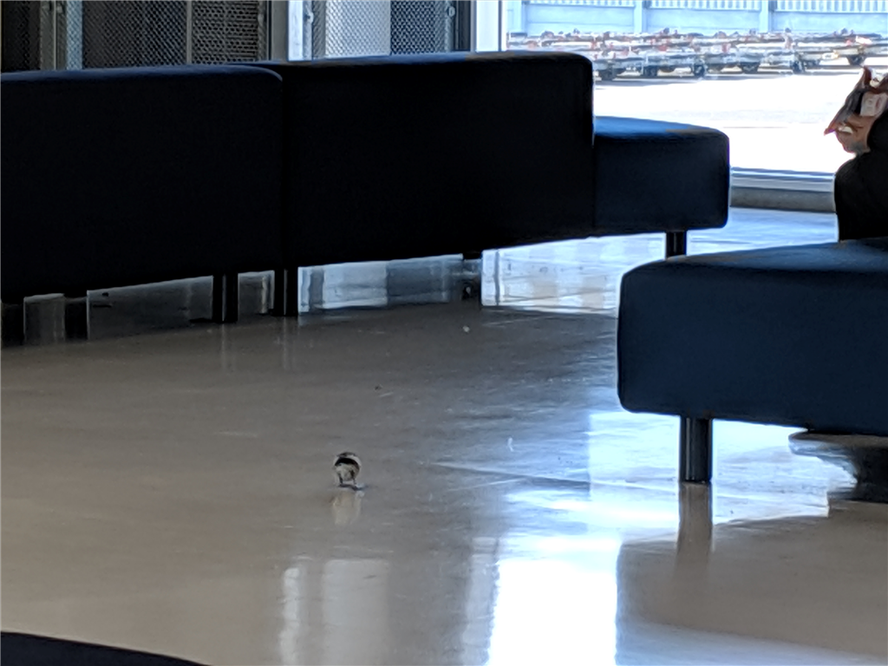
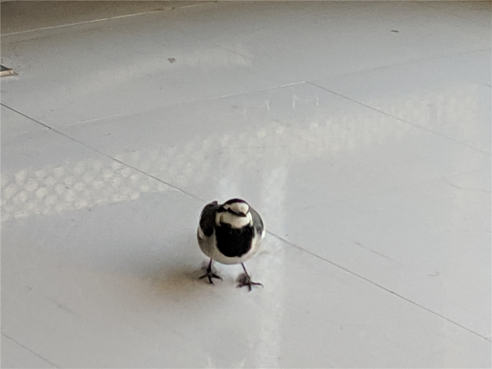
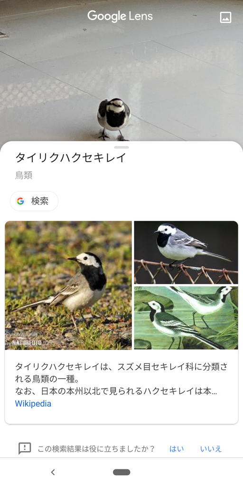

今回の東京滞在はこれにて終わり。松山へ帰る。どのルート（飛行機、船、サンライズ瀬戸などなど）をとるか、多少迷ったけど、ちょうどジェットスターが 5,980 円と安かったので、大晦日の日に抑えておいた。よい時間帯をチョイスしたり、上位プランを追加したりしたため、最終的には 12,000 円ぐらいになったけど、それでもだいぶ安い。

総武快速のグリーン車でゆったり行こうと思っていたのだが、おかんが京成の市川真間まで送ってくれた＆京成に乗れとうるさい。結局、仕方なく京成を使ったのだけれど、JR で行くつもりをしていたのでだいぶ早くついてしまった（JR で行く方が30分ぐらい長くかかるが、お金出せばグリーン車に座れるので楽。京成は特急に有料車両を設けるべき！）。そんなわけで、第3ターミナルでやることもなくゴロゴロしていると、なぜか鳥が歩いている。

漏れ聞くところ、年末からここにご滞在のようだが、ちょろちょろしてかわいらしい。

望遠で撮影してみたけれど、どんな種類の鳥なのかよくわからなかったので、Google レンズに聞いてみた。

どうやらタイリクハクセキレイ？という鳥みたい。Google レンズ、便利だなーと初めて思った。んじゃ、これから搭乗！　ばいばいね！

<iframe src="https://hatenablog-parts.com/embed?url=https%3A%2F%2Fforest.watch.impress.co.jp%2Fdocs%2Fnews%2F1155320.html" title="カメラで調べ物ができる「Google レンズ」アプリが“Pixel 3”以外でも日本語対応／テキストのOCRやランドマーク・動物・植物の情報チェック、類似商品の検索などに" class="embed-card embed-webcard" scrolling="no" frameborder="0" style="display: block; width: 100%; height: 155px; max-width: 500px; margin: 10px 0px;"></iframe><cite class="hatena-citation"><a href="https://forest.watch.impress.co.jp/docs/news/1155320.html">forest.watch.impress.co.jp</a></cite>

