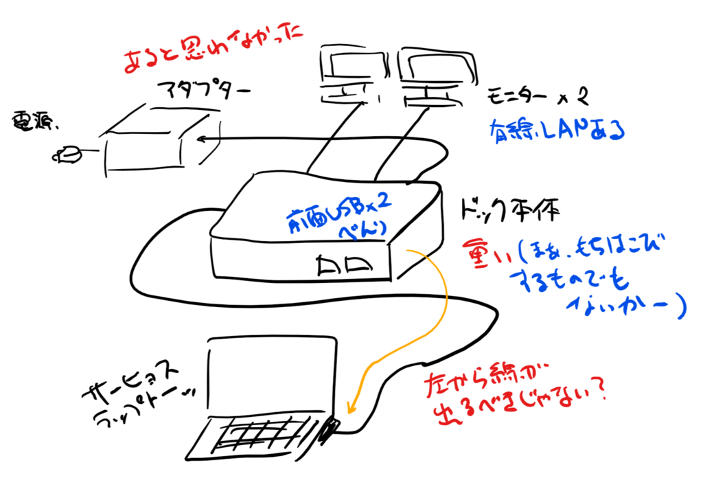

実家（千葉）で使っていた Surface Dock を ゆうパック（こわれもの扱い）で愛媛へ送り、モニターや USB 機器（キーボードとマウス）を接続したのだが、反応がない。何度か抜き差しするうちにモニターの方は繋がったのだけど、USB 機器に関してはダメだった。給電はされるものの（スマートフォンの充電などは可能）、OS から認識はされない。

マイクロソフト コミュニティを覗いてみたところ同様のトラブルが報告されていたが、根本的な解決は示されていなかった。

<iframe src="https://hatenablog-parts.com/embed?url=https%3A%2F%2Fanswers.microsoft.com%2Fja-jp%2Fsurface%2Fforum%2Fall%2F%E3%83%89%E3%83%83%E3%82%AD%E3%83%B3%E3%82%B0%2F6ff7f5c8-5469-4057-820d-e39aefdf4380%3Fauth%3D1" title="ドッキングステーション経由でUSB機器が認識されない" class="embed-card embed-webcard" scrolling="no" frameborder="0" style="display: block; width: 100%; height: 155px; max-width: 500px; margin: 10px 0px;"></iframe><cite class="hatena-citation"><a href="https://answers.microsoft.com/ja-jp/surface/forum/all/ドッキング/6ff7f5c8-5469-4057-820d-e39aefdf4380?auth=1">answers.microsoft.com</a></cite>

キーボードは Surface Book 2 本体の USB ポートに挿し、マウスは Bluetooth 接続のものを使うことで、とりあえずは問題を回避できているけれど……困ったことだ。

ちなみに、買ったのは 2017/8/18 らしい。1年半でダメになるなら、少し高い買い物（定価 27,432 円）だなと思う。

<iframe src="https://hatenablog-parts.com/embed?url=https%3A%2F%2Fblog.daruyanagi.jp%2Fentry%2F2017%2F08%2F24%2F060000" title="Surface Laptop＋ドックで3画面生活はじめました - だるろぐ" class="embed-card embed-blogcard" scrolling="no" frameborder="0" style="display: block; width: 100%; height: 190px; max-width: 500px; margin: 10px 0px;"></iframe><cite class="hatena-citation"><a href="https://blog.daruyanagi.jp/entry/2017/08/24/060000">blog.daruyanagi.jp</a></cite>

