
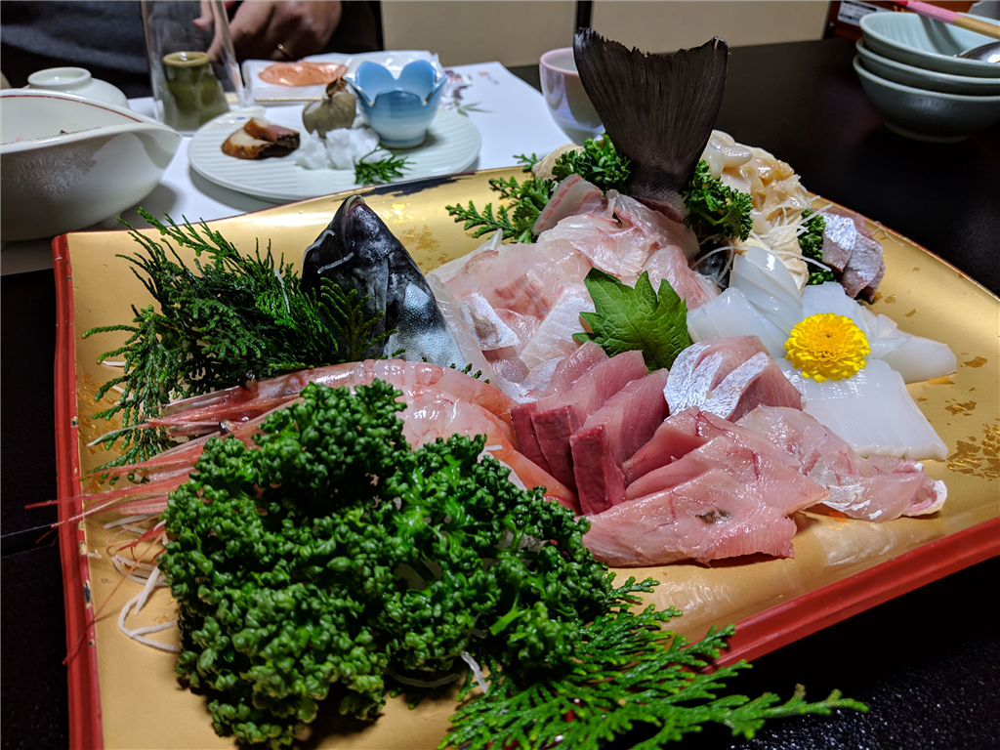

12月29日、始発の新幹線で小田原から米原へ向かう。米原で N 氏と Y 氏と合流し、富山県は氷見に向かうためだ。久しぶりのブリ旅行だぜ！　今年は大漁だそうで、期待できそう。

<figure class="figure-image figure-image-fotolife" title="8年前の氷見。そういえばこの時も雪がすごくて、タイヤにチェーンを装着してました">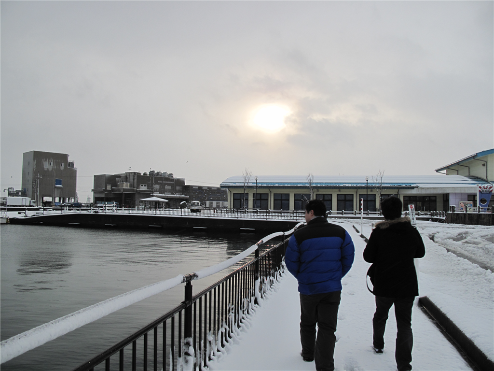<figcaption>8年前の氷見。そういえばこの時も雪がすごくて、タイヤにチェーンを装着してました</figcaption></figure>

実はむかしは結構氷見に行っていたのだけど、今回は本当に久しぶり。昔の写真をあさってみたところ、前回行ったのは 2010年12月25日 らしいから、8年前だな。時が過ぎるのは一瞬だわ。前回は高岡まで電車で行って、そこで拾ってもらったのだけど、まだ北陸新幹線もない時代だからだいぶ時間がかかったはず。どうやって高岡までたどり着いたのか、さっぱり覚えていないのだけど……。

この日は帰省ラッシュと被っていて、小田原からの新幹線は指定席がとれなかった。名古屋からは乗り換えで席が取れたのだけど、それまではデッキでスーツケースに座り、Kindle を読んで過ごした。朝早かったから本当は寝たかったのだけど……名古屋から米原はそんなに時間がかからないので、あまりゆっくりできなかったし。関ヶ原のあたりはやはり雪がすごくて、「北陸道、クルマでちゃんと通れるかなぁ」と少し心配になる。まぁ、ちゃんと通れたんだが。

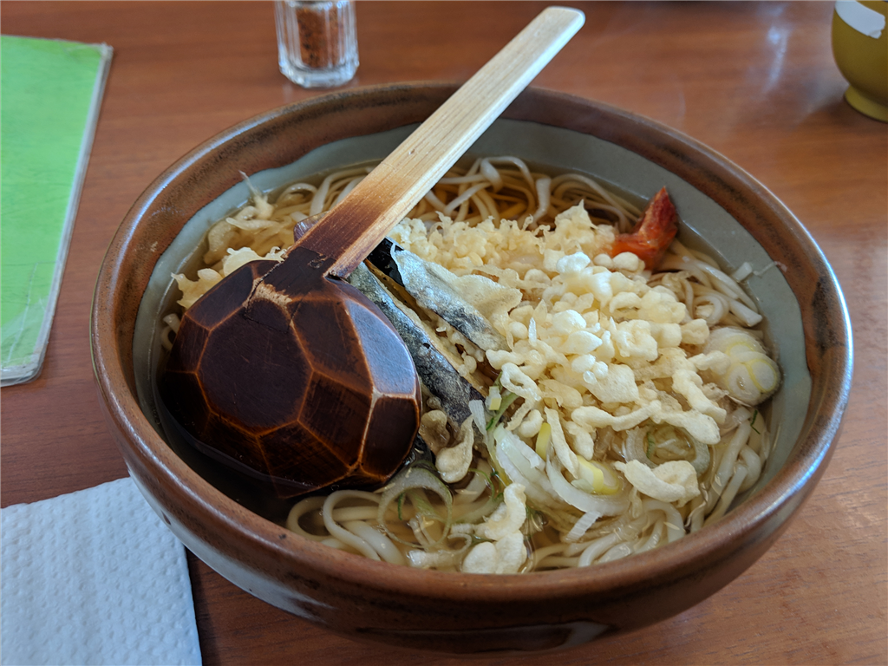

お昼ご飯は、氷見の道の駅で食べた。氷見は寒ブリが有名だけど（あとはホタルイカ？）、実はおうどんもおいしい。あまりヘヴィなものを食べると夕ご飯の寒ブリがおなかに入らないというのもあり、お昼ご飯は氷見うどんにした。細めでつるっとのどごしがいいので、冷たいのをいただくのが個人的には好きなのだけど、このクッソ寒いなか冷たいのを食べるのは厳しい。今回は暖かいのをチョイスしたが、これはこれで全然ありだった。おいしかったです。

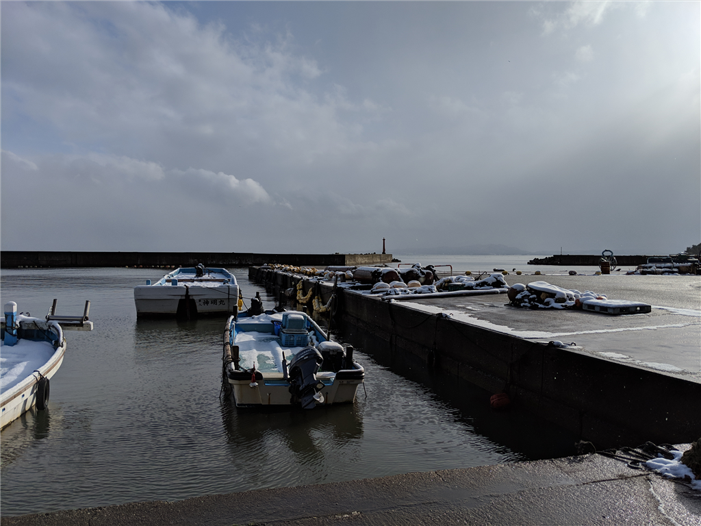

そのあとは宿に向かったけど、「早すぎるわ、4時にこい」みたいなことを言われたのであたりを散策した。とりあえず、近場にあった大境洞窟住居跡というのを訪ねる。

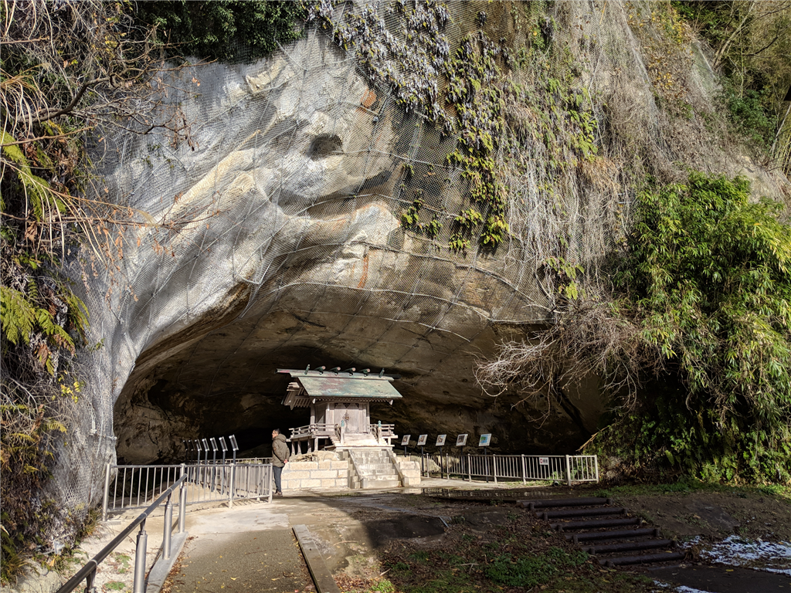 

<blockquote cite="https://www.info-toyama.com/spot/21036/">

日本で初めて調査された洞窟遺跡。波浪の浸食により形成された自然洞窟と言われ、1918年に縄文時代から続く6層の住宅跡が発見されました。多数の土器や石器が出土し、弥生時代を中心に20体以上の人骨も発見されています。この発掘によって、縄文文化と弥生文化の新旧が明らかになったほか、弥生人骨の発見で、弥生期の抜歯の風習や顔面装飾（頭骨に赤い塗料のついたもの）に注目が集まりました。国指定史跡となっています。

<cite><a href="https://www.info-toyama.com/spot/21036/">&#x5927;&#x5883;&#x6D1E;&#x7A9F;&#x4F4F;&#x5C45;&#x8DE1;&#xFF5C;&#x89B3;&#x5149;&#x30B9;&#x30DD;&#x30C3;&#x30C8;&#xFF5C;&#x3068;&#x3084;&#x307E;&#x89B3;&#x5149;&#x30CA;&#x30D3;</a></cite>
</blockquote>

もしかしたら高校で日本史を選んだりするとお勉強するのかもしれんけど、自分は知らなかった。

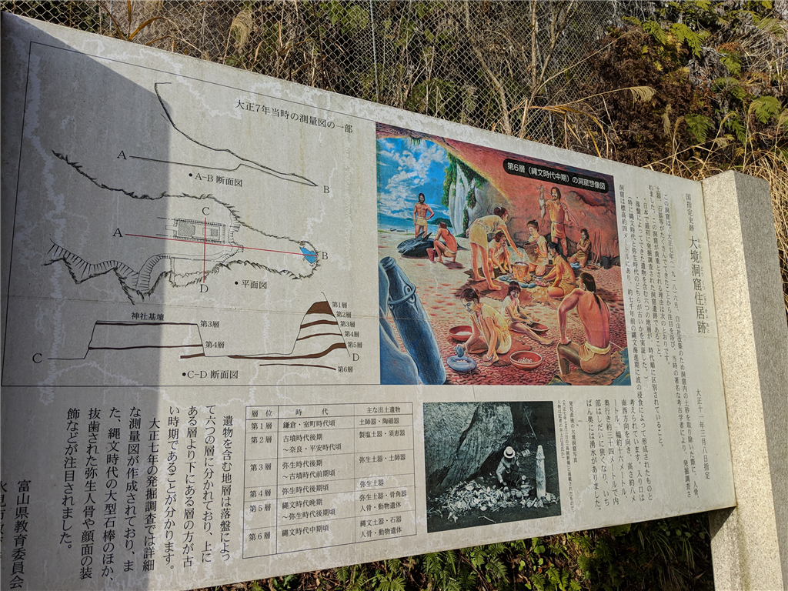

ようわからんけど、定期的に落盤して、その時代の生活の様子がタイムカプセルのように封じ込められたみたいだな。なぜ、人類はいい感じの洞窟を見つけては居座り、落盤に巻き込まれてしまうのか。まぁ、とにかく意外にお勉強になって面白かった。ここから眺める海の先にはうっすらと対岸がうつっていて、それが蜃気楼かどうかおっさん同士で議論したりして過ごした。

で、宿に帰ってお待ちかねの夕食タイム！　ぶっちゃけ食うのに夢中で写真を撮るのを忘れていたんだが、ブリの刺身、ブリのあら煮、ブリ大根、ブリの照り焼き...…ブリのフルコースをブリブリ食べた。

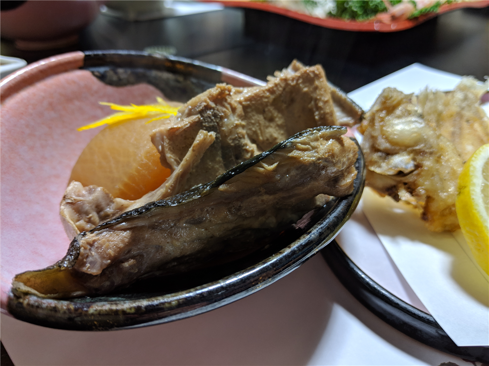

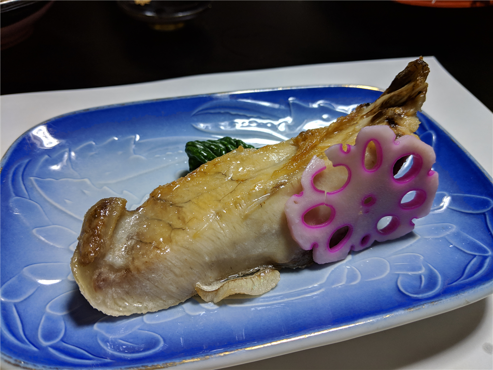

残念ながら、海が時化てたせいかブリのしゃぶしゃぶはダメだったけど、代わりにカニを入れてお鍋もした。もちろん、氷見うどん付きで！

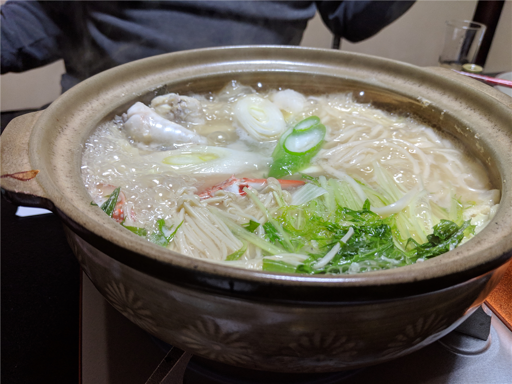

あと、調子に乗って刺身の盛り合わせのお代わりを頼み……（運のよいことに1人前ちょいはあった

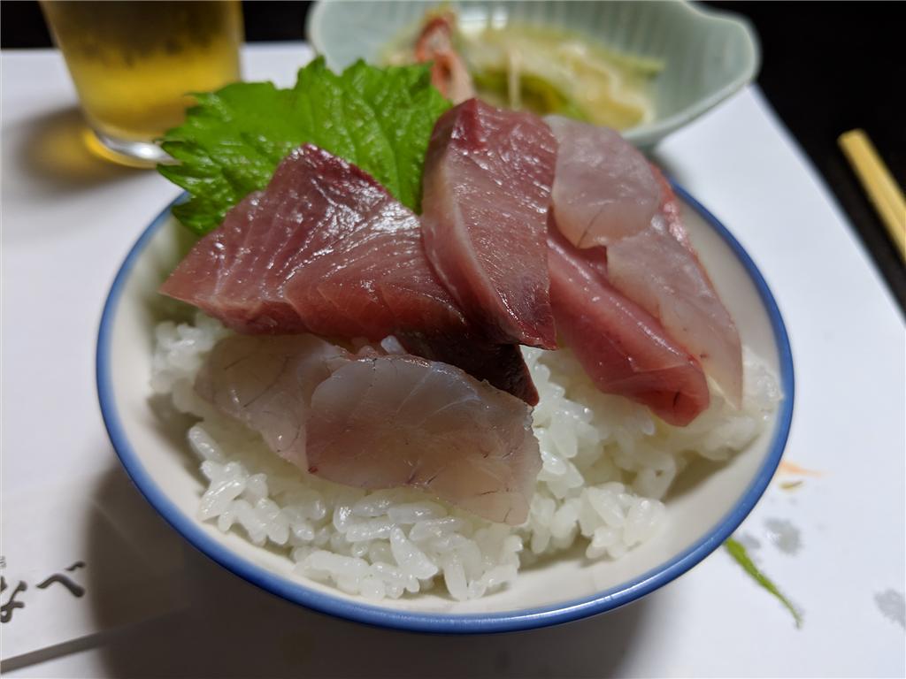

海鮮丼を作って食べた。オイシカッタデス...…。お風呂も入って、10時ぐ間ぐらい寝て、最高にリフレッシュできました。

<iframe src="https://hatenablog-parts.com/embed?url=https%3A%2F%2Fhimi-watanabe.com%2F" title="氷見民宿わたなべ | 氷見　民宿わたなべ" class="embed-card embed-webcard" scrolling="no" frameborder="0" style="display: block; width: 100%; height: 155px; max-width: 500px; margin: 10px 0px;"></iframe><cite class="hatena-citation"><a href="https://himi-watanabe.com/">himi-watanabe.com</a></cite> 

<h3>追伸</h3>

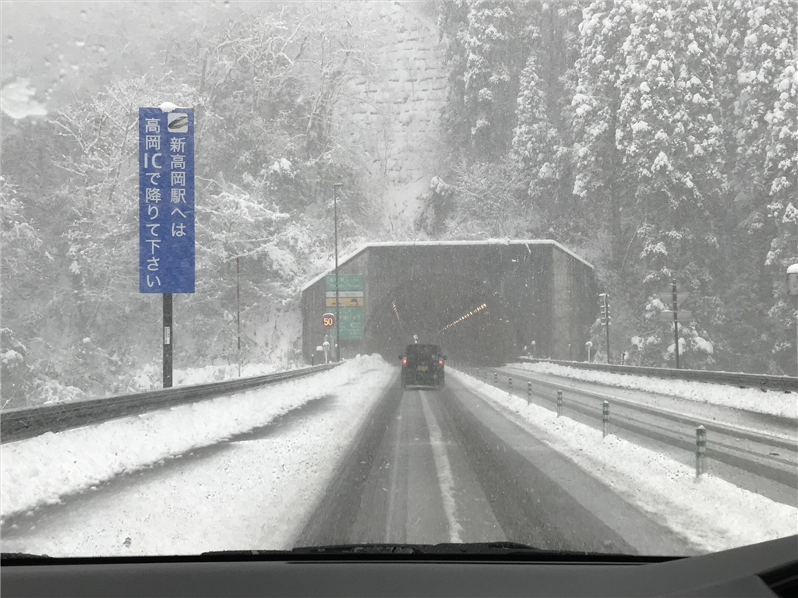

帰りも結構やばかったです。1年以上ぶりに運転したけど、ちょい怖かった（

ほんとは地元の一之宮で御朱印もらいたかったけど……まぁ、また今度！

