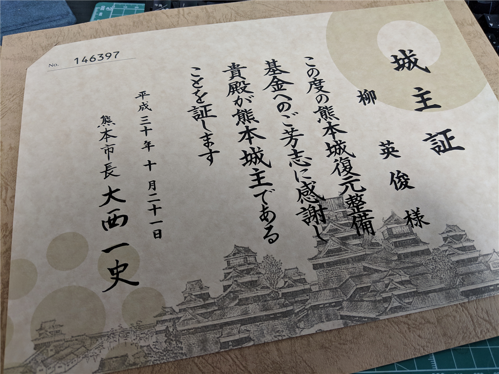
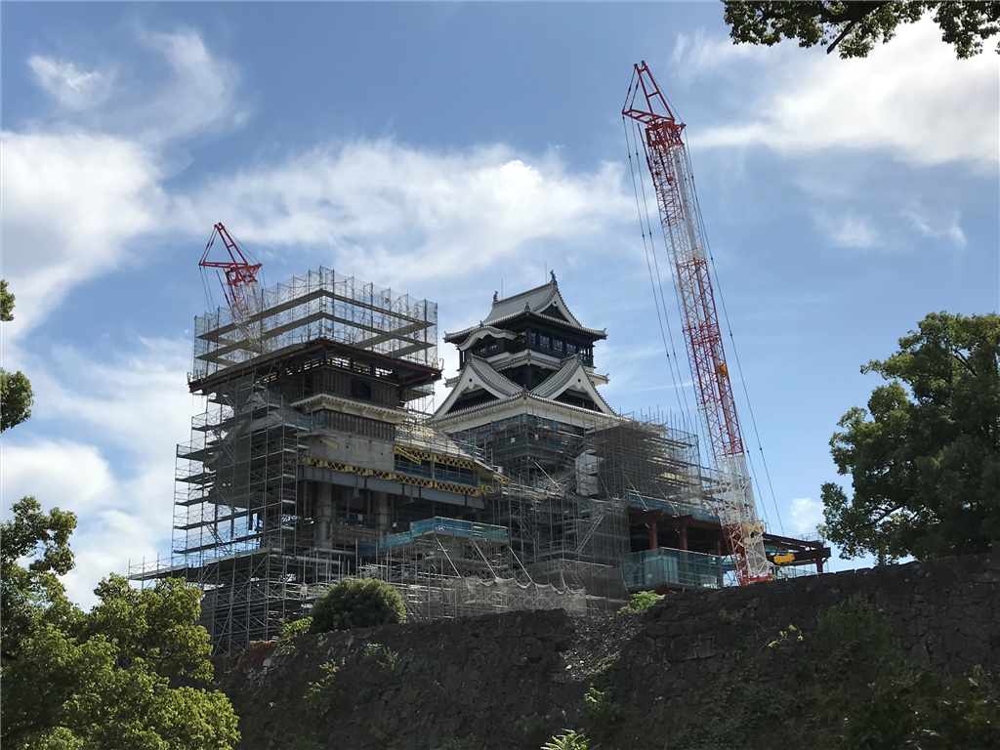

昨年、プロ生熊本に参加した折、また熊本城で1万円を寄付してきました。その城主証がこの日到着。人生で2年ぶり2回目の熊本城主です。

<iframe src="https://hatenablog-parts.com/embed?url=https%3A%2F%2Fblog.daruyanagi.jp%2Fentry%2F2017%2F02%2F25%2F121159" title="熊本城を手に入れた - だるろぐ" class="embed-card embed-blogcard" scrolling="no" frameborder="0" style="display: block; width: 100%; height: 190px; max-width: 500px; margin: 10px 0px;"></iframe><cite class="hatena-citation"><a href="https://blog.daruyanagi.jp/entry/2017/02/25/121159">blog.daruyanagi.jp</a></cite>

前回はいろいろおまけが入っていた気がするのですが（ワンピースグッズなどなど）、今回は証書と1年間有効な「復興城主手形」（協賛店舗で特典を受けられる）のみの構成。2回目だからかな？　でも、使いもしないグッズを入れるぐらいであれば、そのお金でカワラの一枚にでも役立ててほしいし、全然オッケー。前回の申告では寄付控除に入れるのを忘れてたみたいなので、今回は忘れないようにしないと……。

それはそうと、前に見た熊本城はロボットの合体中みたいでカッコよかった。まだまだ先は長そうだけど、事故にだけは気を付けて頑張ってほしいですね。

