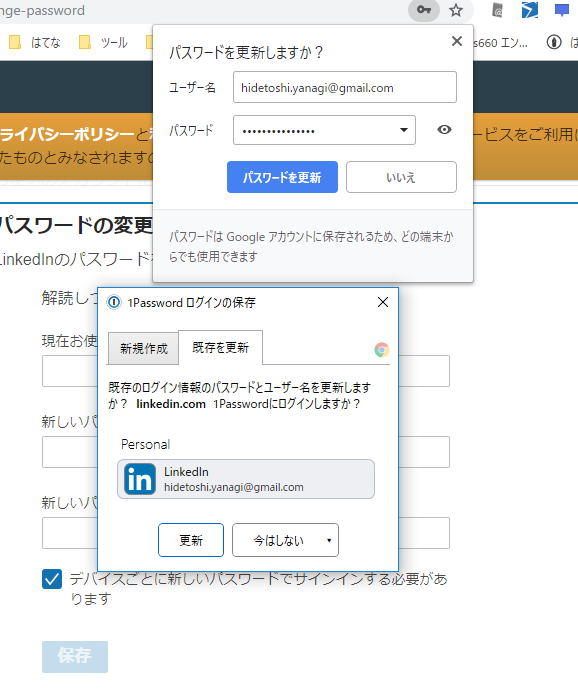
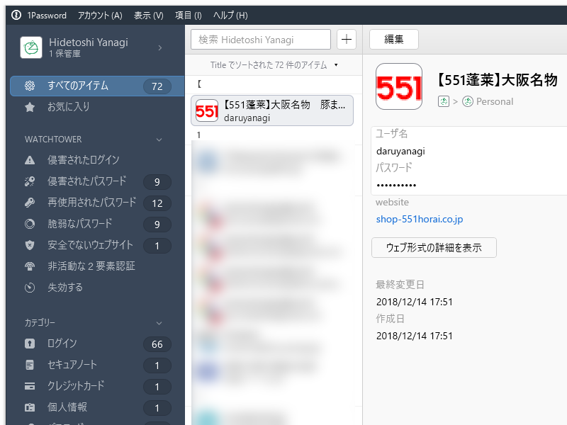

今月はセキュリティの見直しを行うことにした。まずは、パスワードの管理。1Password の Watchtower 機能でダメなログイン情報を調べるとわんさか出てきた（同じドメインのログイン情報が重複して登録されていたので、実際はそんなに多くはない）ので、これを一つずつ潰す。

ちなみに、うちは ID とパスワードの組み合わせを使い回すことはないけれど、

<ul>
<li>ID の使い回し（daruyanagi）</li>
<li>パスワードの使い回し（数種類）</li>
</ul>
は個別にやってたりする。ザっと言うと、

<ul>
<li><b>ID としてニックネームを付けられる場合</b>：daruyanagi にして強いパスワードを作る</li>
<li><b>ID がメールアドレス固定の場合</b>：そのサービス専用のメールアドレス（"［サービス名から適当に］@daruyanagi.jp"）を作って、パスワードは覚えやすい奴を使い回し。サービスごとにメアドを作っとくと、楽天から漏れたとかすぐわかる</li>
</ul>
みたいな感じ。でも、前者はともかく、後者のやり方だと Watchtower  に「侵害されたパスワード」「再使用されたパスワード」がたくさん出てきて気持ち悪い。また、古いパスワードは大文字小文字を混ぜてなかったので「脆弱」だと指摘される。いい加減、「脆弱」な奴だけでも対処すべきだろう。やられてからでは遅いしな。

んで、ちまちまとパスワードの再登録をしていたのだけど――サービスごとパスワード再設定のやり方が異なるのは本当に面倒くさいな。

<ul>
<li><b>現在のパスワードと新しいパスワード（×2）を入力させるやつ</b>：一番楽だけど、たまにユーザー名が空の新規ログイン情報として Chrome が覚えてしまう</li>
<li><b>メールでパスワード変更フォームの URL を送ってくる</b>：クロネコヤマト</li>
<li><b>パスワードの確認の際、2回目を手入力させる</b>（コピペ不可）：マジかよ……</li>
<li><b>パスワード管理ツールとうまく連携できない</b>：古いサイトあるある</li>
<li><b>アカウントの管理画面がそもそもわからん</b>：エンバカデロ。ググらないとわからんかった。</li>
<li><b>リンクをクリックすると PWA アプリに</b>：PWA アプリ上でログイン情報を管理できない、パスワード管理ツールと連携できない</li>
</ul>
<figure class="figure-image figure-image-fotolife" title="まぁ、リンクをコピーしてブラウザーに入れればいいんだけど！"><figcaption>まぁ、リンクをコピーしてブラウザーに入れればいいんだけど！</figcaption></figure>

<ul>
<li><b>PC からパスワードを変更できない</b>：LINE。アプリから変更できるときは、PC で 1Password にエントリ＆新パスワードを作って、端末でコピー＆ペーストする</li>
<li><b>メールアドレスの入力欄が @ で二分割</b>：カメラのキタムラ（テスト送信機能があるのはいいけど、オートフィルと相性悪い）</li>
<li><b>パスワードの文字数制限が妙に厳しい</b>：エディオン、おめぇだよ！</li>
</ul>
 

<ul>
<li><b>パスワードの変更 UI が住所・電話番号と同居</b>：Value-Domain。しかも、保存ボタンを押すと“住所を正しく入れろ”だのとバリデーションエラーが出る（登録時は緩かったがあとで制限が厳しくなったパターン）</li>
<li><b>しかも、末尾にある［同意チェック］しないとパスワードが変えられない</b>：エディオン、おめぇだよ！</li>
</ul>

あと、パスワードを変更するときは、新しく生成したパスワードを保存しておくべき。Chrome の場合、パスワードの生成 → 入力 → マスクされたパスワードを選択 すると生成したパスワードを見ることができるので、それをクリップボードへコピーしておく。

パスワードを更新すると、ブラウザー（Chrome）のパスワード管理機能とパスワード管理ツール（うちは 1password）の両方でパスワードの更新 UI が出ると思うのだけど、ときどき片方もしくは両方が出ない場合がある。もし保存しそこなったらえらいことだ。

まぁ、Chrome のパスワード生成機能を使っておけば、すくなくとも Chrome 側には保存されると思うけれど。

あと、使わないサービスはアカウントを消してしまいたかったんだが、消し方がわからんサービスも多かった。アカウントの作成、ログイン、パスワードの変更、削除、ログアウトのエンドポイントは共通化されてほしいな。なんか国際的な検査機関を作って、ガイドラインに沿ったアカウント処理をしているサイトには「ぐっどろぐいんなさいと」みたいな認証を与えるとかして、インセンティブ付けして......まぁ、ダメなサイトはずっとダメだろうけど、「認証のあるサービスはアカウント情報の管理がしやすい！」ってなれば、アカウントを作るか作らないかの基準にはなると思う。細かいことは、もっと頭のいい人が考えてくれ。

まだいくつか残ってるけど、これはイントラで使ってる奴だからあまり問題にはならない気がするので、とりあえず全部できた感じ。がんばった！

<h3>パスワードの棚卸の副次効果</h3>

<ul>
<li>パスワード管理ツールに重複して登録されていたログイン情報のお掃除：これが結構多い……</li>
<li>不要なサービスを特定し、アカウントを削除できた</li>
<li>忘れてたサービスを思い出せた：ヘッドフォンを買ったときに付けたクロネコ延長保証サービス</li>
<li>ピーチポイントが切れそうなの思い出した</li>
</ul>
たまにはやるもんだな。

