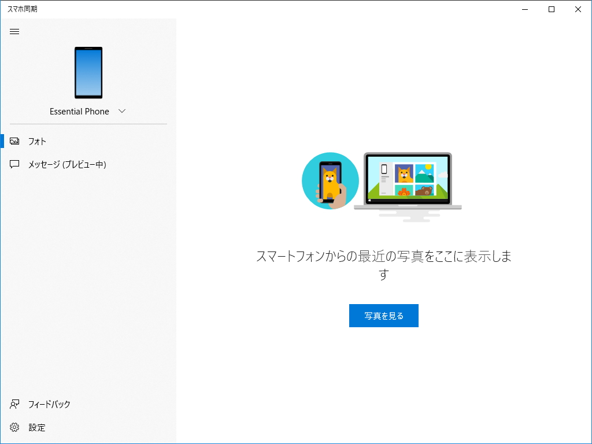
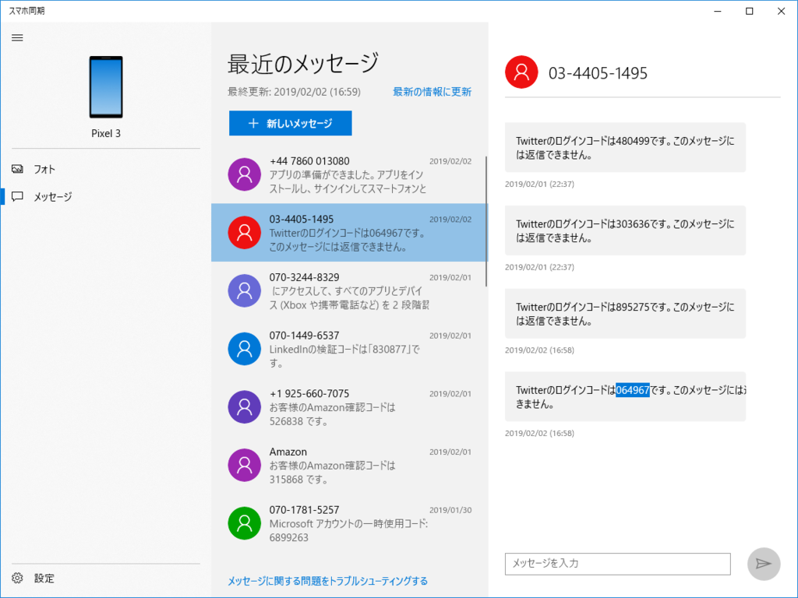
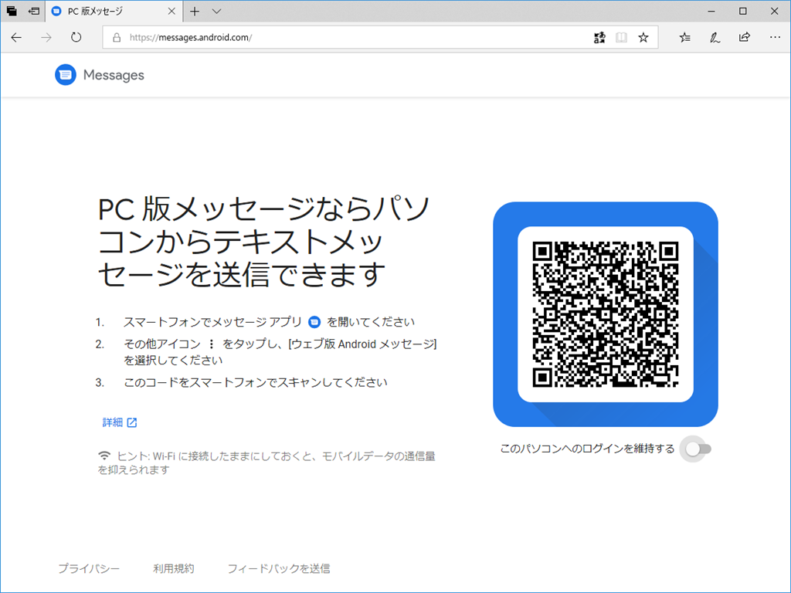
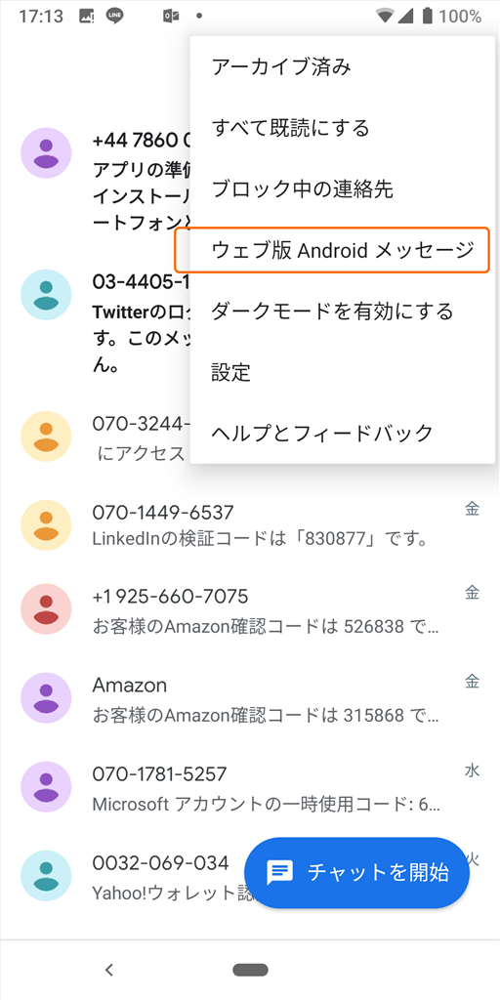
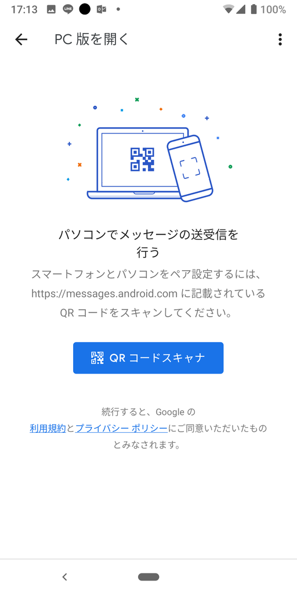

「Windows 10 October 2018 Update」（RS5、バージョン 1809）には「スマホ同期」アプリというのが搭載されている。これは、その前のバージョンの「April 2018 Update」からも使えるのだが（ストアからインストールしてね）、<i>スマホの写真や SMS が PC から見れて便利</i>なツールだといわれている。

<iframe src="https://hatenablog-parts.com/embed?url=https%3A%2F%2Fforest.watch.impress.co.jp%2Fdocs%2Fserial%2Fyajiuma%2F1146647.html" title="新しいWindows 10の目玉機能「スマホ同期」を試す ～April 2018 Updateでも利用可能／スマホで最近撮った写真やスクリーンショット、SMSへPCからアクセス！【やじうまの杜】" class="embed-card embed-webcard" scrolling="no" frameborder="0" style="display: block; width: 100%; height: 155px; max-width: 500px; margin: 10px 0px;"></iframe><cite class="hatena-citation"><a href="https://forest.watch.impress.co.jp/docs/serial/yajiuma/1146647.html">forest.watch.impress.co.jp</a></cite>

実際それが便利なのか、非常に疑問なところではあるのだけど、1点だけ、便利だと断言できるシーンが一つだけある。

スマホを使った二段階認証プロセスを行う場合だ。

自分なんかは、うっかりスマホをコートやカバンのなかに入れたままにしたまま PC に向かうことが少なくないのだが、そんなときに SMS で二段階認証のコードがスマホに送られてくると、大変めんどくさい。パパっと PIN をいれて次に進みたいのに、その手を休め、コートのポケットをまさぐったり、カバンをひっくり返したりといったことを余儀なくされる。

そこで、「スマホ同期」アプリの出番なんですよ。こいつがあれば、PC からリモートで SMS が読めるし、コピペで PIN コードを入力できる。

というより、最近は SMS で認証コードしか受け取っていない。

難点を言えば、iOS に対応していないことだろうか。Android でしか利用できない。また、Android 遣いなら <a href="https://messages.android.com/">https://messages.android.com/</a> を使う方がいいかもしれない。

<figure class="figure-image figure-image-fotolife" title="PC ブラウザーで Android スマホの SMS を読めるやつ"><figcaption>PC ブラウザーで Android スマホの SMS を読めるやつ</figcaption></figure>

<figure class="figure-image figure-image-fotolife" title="Message アプリのメニューからカメラを起動して、Web ページの QR コードを読むだけでセットアップ完了"> <figcaption>Message アプリのメニューからカメラを起動して、Web ページの QR コードを読むだけでセットアップ完了</figcaption></figure>

どっちにしろ便利だから、こういうのは一つセットアップしておくとおすすめ。「でも、それ、二段階認証の意味なくない？」って気もしないでもないが。

