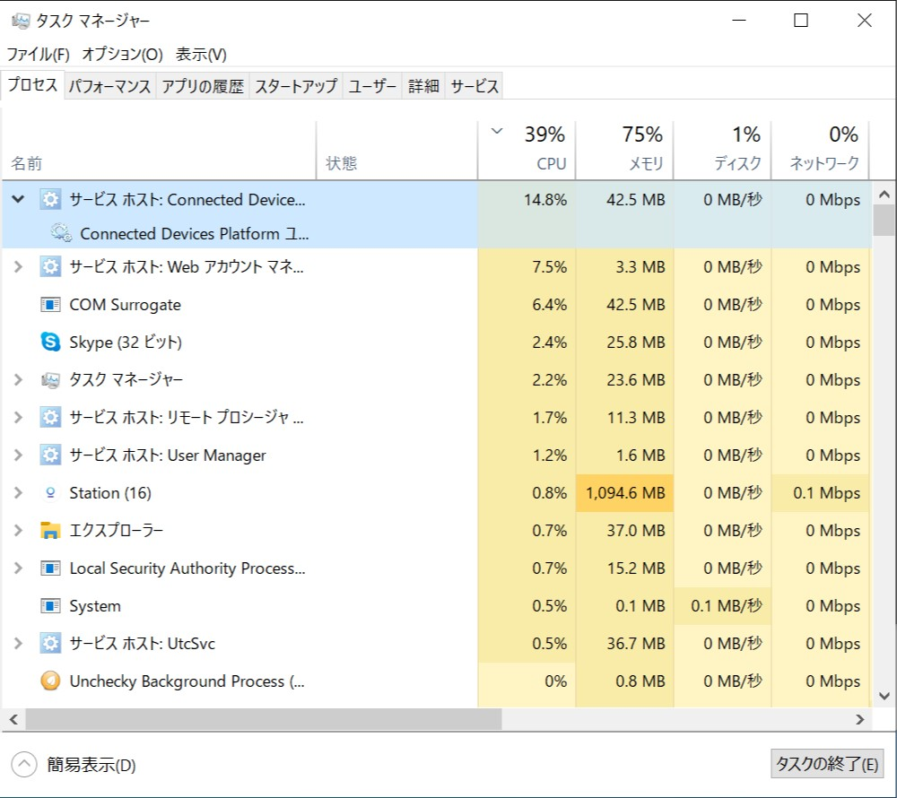
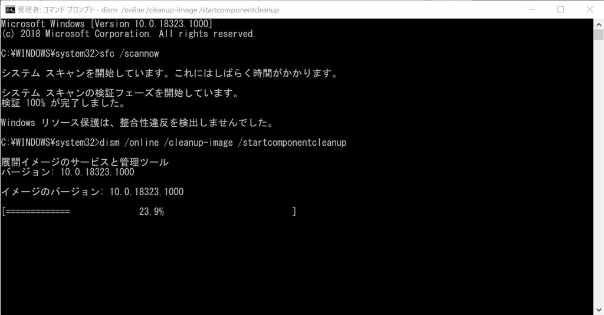
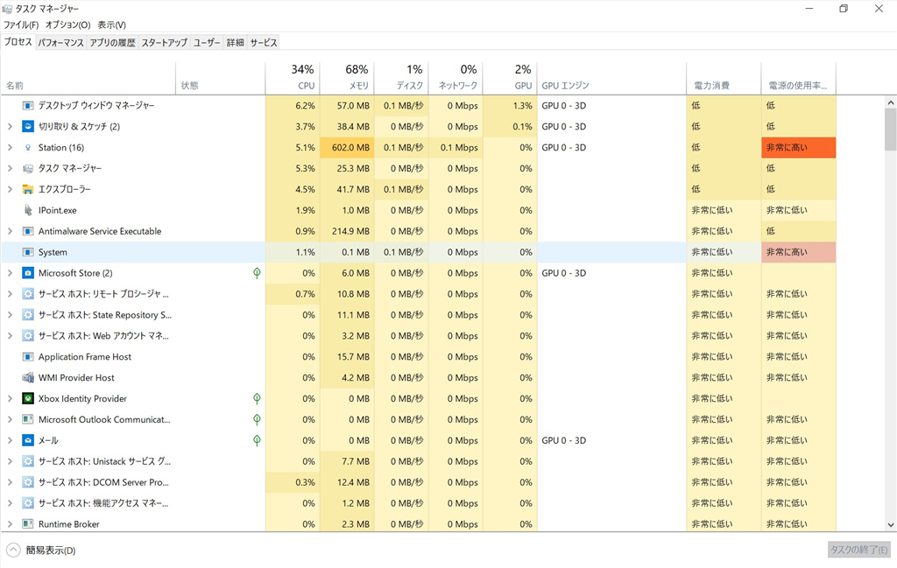

Windows 19H1（Fast、Build 18323）で Connected Devices プラットフォーム というサービスがずっと CPU を食っていたので対処。

<iframe src="https://hatenablog-parts.com/embed?url=https%3A%2F%2Fanswers.microsoft.com%2Fen-us%2Fwindows%2Fforum%2Fall%2Fconnected-devices-platform-excessive-cpu-usage%2F4e4093f7-1790-4277-bc19-07f01871c246%3Fauth%3D1" title="Connected Devices Platform: Excessive CPU Usage" class="embed-card embed-webcard" scrolling="no" frameborder="0" style="display: block; width: 100%; height: 155px; max-width: 500px; margin: 10px 0px;"></iframe><cite class="hatena-citation"><a href="https://answers.microsoft.com/en-us/windows/forum/all/connected-devices-platform-excessive-cpu-usage/4e4093f7-1790-4277-bc19-07f01871c246?auth=1">answers.microsoft.com</a></cite>

Microsoft Community でそれらしき解決策が載っていたので、今回はその通りにした。

Cmd.exe を<b>管理者権限で</b>起動し、以下のコマンドを入力（大文字小文字は関係ない）。

<pre class="code" data-lang="" data-unlink>Sfc.exe /ScanNow
Dism.exe /Online /Cleanup-Image /StartComponentCleanup
Dism.exe /Online /Cleanup-Image /RestoreHealth</pre>
んで、一応 OS を再起動する。

とりあえず収まった気がする。

